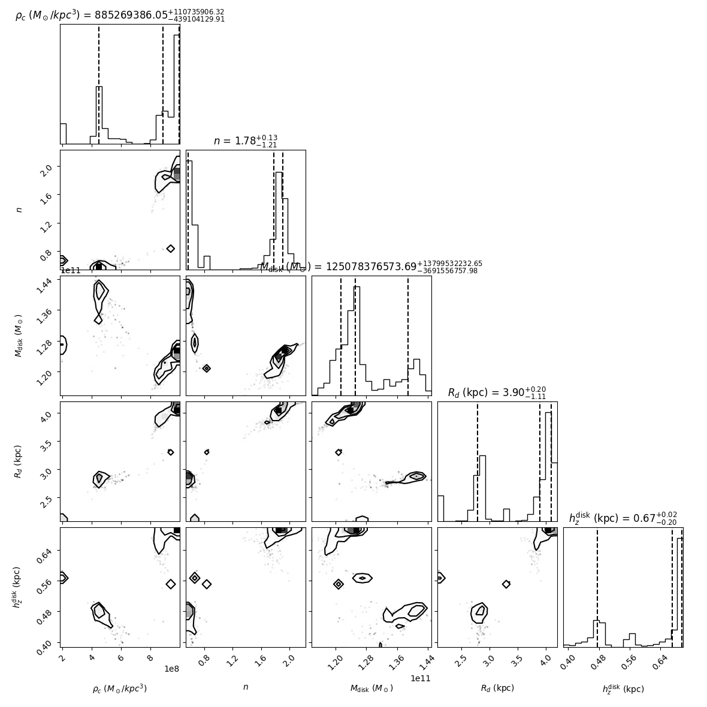
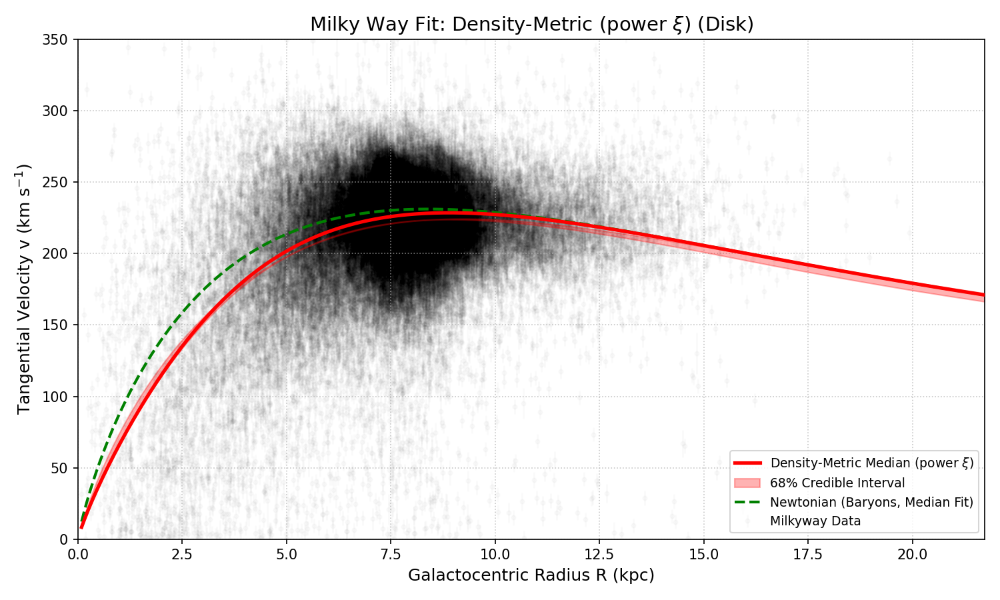

# A Density-Dependent Metric Modification as an Alternative to Dark Matter for Explaining Milky Way Kinematics

**Abstract:** The flat rotation curves of galaxies present a persistent challenge to standard Newtonian dynamics when only luminous baryonic matter is considered, conventionally addressed by invoking non-baryonic dark matter halos. Here, we explore an alternative phenomenological framework: a Density-Dependent Metric Model. We hypothesize that the effective gravitational interaction within a galaxy is modulated by the local baryonic matter density, $\rho(R)$. This modulation, parameterized by a function $\xi(\rho)$, leads to a modification of the observed circular velocity $v_{obs}^2(R) = \xi(\rho(R)) \cdot v_N^2(R ; M_{\text{baryonic}})$, where $v_N$ is the Newtonian velocity derived from the fitted baryonic mass. Using Markov Chain Monte Carlo (MCMC) methods to fit this model to a sample of ~80,000 stars from Gaia DR3, our latest single-component disk model (100,000 MCMC steps per walker) yields a baryonic disk mass of $M_{\text{disk}} = 1.27^{+0.19}_{-0.03} \times 10^{11} M_{\odot}$ and an effective "missing" acceleration scale with a median of $\approx 1.15 \times 10^{-10} \, \text{m/s}^2$ (from earlier analyses with different model configurations, requiring re-evaluation). While the model phenomenologically reproduces the rotation curve, significant MCMC convergence challenges remain, and the astrophysical implications of the required baryonic mass and the fundamental origin of such density-dependent gravitational behavior require further extensive investigation.

---

## 1. Introduction: The Galactic Rotation Curve Problem and a Density-Dependent Alternative

The discrepancy between observed galactic rotation curves and those predicted by Newtonian dynamics based on visible matter remains a cornerstone of modern astrophysics, traditionally necessitating the existence of dark matter halos[^1],[^2]. While the $\Lambda$CDM model, incorporating cold dark matter, has achieved considerable success on cosmological scales, alternative paradigms continue to be explored to address galactic-scale dynamics without invoking new particles. Modified Newtonian Dynamics (MOND)[^3] proposes a change to gravitational laws or inertia at low accelerations, characterized by a fundamental acceleration scale $a_0 \approx 1.2 \times 10^{-10} \, \text{m/s}^2$.

### 1.1. Conceptual Overview: Gravity as a "Smart Fabric"

Before diving into the equations, let's build an intuition for what this Density-Dependent Metric model proposes.

Imagine spacetime, the very fabric of the universe, isn't just passively stretchy like a simple trampoline when mass is placed on it. Instead, picture it as a **"smart fabric"** whose properties change based on how much "stuff" (normal baryonic matter like stars and gas) is packed onto it *locally*.

*   **Standard View (Newtonian Gravity + Dark Matter):**
    *   If you put a bowling ball (the galaxy's visible mass) on a regular trampoline, it creates a dip. Marbles (stars) further out feel a shallower dip and should orbit slower.
    *   The problem is, outer stars in galaxies orbit surprisingly fast – too fast for the dip made by only the visible matter. The standard solution is to imagine a much larger, invisible bowling ball (dark matter) creating a bigger, wider dip that explains these fast outer orbits.

*   **Our Density-Dependent Model (The Smart Fabric Analogy):**
    *   Our model suggests there's no need for an extra invisible bowling ball. Instead, the "smart fabric" of spacetime itself changes its "grippiness" or "effectiveness" in transmitting gravity.
    *   **In High-Density Regions (like the galaxy's crowded center):** Where matter is densely packed, the smart fabric becomes somewhat "slippery." Even with a lot of mass, the *effective* gravitational pull is dampened. It's like gravity is only working at a fraction of the strength you'd expect from all that visible mass.
    *   **In Low-Density Regions (like the galaxy's sparse outskirts):** As you move outwards, the fabric becomes "extra grippy." Here, the gravitational influence of the *total amount of normal matter we've accounted for* can be felt more fully.
    *   **Explaining Flat Rotation Curves:** If the total amount of normal (baryonic) matter in the galaxy is somewhat larger than what traditional models (without this "smart fabric" effect) would estimate from light alone, this has a profound effect. In the inner regions, the "slipperiness" prevents velocities from becoming too high despite the mass. In the outer regions, the "extra grippiness" allows this larger total baryonic mass to exert its full Newtonian pull, keeping the velocities of outer stars high and leading to the observed flat rotation curves.

Essentially, this model explores whether gravity's strength isn't constant but is modulated by the local density of normal matter, offering an alternative way to understand galactic dynamics without invoking new, unseen particles.

### 1.2. The Density-Dependent Metric Hypothesis
This work investigates this phenomenological **Density-Dependent Metric Model** where the effective gravitational potential experienced by stars is modulated by the local baryonic matter density, $\rho(R)$. The core hypothesis is that the relationship between baryonic mass and orbital velocity, $v_{obs}$, is modified from the standard Newtonian prediction, $v_N$, by a density-dependent factor, $\xi(\rho(R))$:

$$
v_{obs}^2(R) = \xi(\rho(R)) \cdot v_N^2(R ; M_{\text{baryonic}})
$$

The modulating function $\xi(\rho)$ is designed such that its effect is minimal (i.e., $\xi(\rho) \approx 1$) in low-density regions (e.g., galactic outskirts), allowing the full gravitational influence of the fitted baryonic mass ($M_{\text{baryonic}}$) to manifest. Conversely, in high-density regions (e.g., inner galaxy), $\xi(\rho) < 1$, effectively suppressing the gravitational impact.

Such density-dependent behavior could conceptually arise from several theoretical avenues, including screening mechanisms in modified gravity theories[^5],[^6] (e.g., $f(R)$ gravity, scalar-tensor theories) or from emergent gravitational effects in non-standard cosmological environments. The empirical success of this model may provide insights into the nature of gravity at galactic scales.

### 1.3. Current Landscape and Model Standing
Before detailing our methods and initial findings, it is crucial to contextualize this work within the broader landscape of galactic dynamics research.

**Table 1:** Comparative standing of frameworks for Milky Way rotation curve modeling (adapted from recent literature and expert review).

| Rank (MW RC) | Framework                             | Typical Data Volume & Quality        | Typical Goodness-of-Fit (MW)     | Key Recent Refs.                     | Comments vs. Density-Metric                                                                                                 |
|--------------|---------------------------------------|--------------------------------------|------------------------------------|--------------------------------------|-----------------------------------------------------------------------------------------------------------------------------|
| 1            | $\Lambda$CDM + baryons (NFW/etc. halo) | $\star$ 700k–1M Gaia DR3 stars $\star$ APOGEE, LAMOST gas & masers | RMS $\approx$ 10–15 km s⁻¹ (5–20 kpc) | Eilers et al. 2019[^Eilers2019]; Crosta et al. 2024[^Crosta2024] | Well-established, multi-parameter model, strong Bayesian evidence in SPARC.                                                |
| 2            | MOND / RAR (no DM)                    | Same Gaia + SPARC 170 galaxies       | MW fits $\approx$ 15–25 km s⁻¹      | McGaugh et al.[^McGaugh2016]; Khelashvili et al. 2024[^Khelashvili2024] | Competitive for individual galaxies, especially LSBs; challenges in global evidence & clusters.                              |
| 3            | General-Relativistic disk-only (BG)   | Gaia DR3, 720k stars                 | Statistically similar to NFW (w/ bulge+2 disks) | Crosta et al. 2024[^Crosta2024]      | Requires massive disks (within baryon census); lensing pending.                                                              |
| _This Work_  | Density-Metric (single exp. disk)     | 80k Gaia DR3 stars                   | RMS 60/33 km s⁻¹ (inner/outer)     | *(This work, preliminary)*           | Promising phenomenology; current single-disk fit quality lower, MCMC convergence issues, parameters hit priors.         |

As of mid-2024, conventional $\Lambda$CDM halo models generally exhibit the best statistical support for the Milky Way's rotation curve and across broader galaxy samples like SPARC, particularly when Bayesian evidence from multiple datasets is considered. MOND/RAR shows strong performance in specific regimes but faces challenges with consistency across all astrophysical scales (e.g., galaxy clusters, CMB). Our Density-Metric model, in its initial single-disk formulation, shows phenomenological promise but requires significant improvements in fit quality and statistical robustness to be competitive.

It is also important to note the inherent limitations and degeneracies in current kinematic data. Systematic uncertainties in MW rotation curves (due to non-axisymmetries like bars and spiral arms) are likely at the $\approx 8 \, \text{km s}^{-1}$ level [^SystematicsFloor]. Furthermore, recent analyses suggest that when baryonic parameters are allowed to float freely, several distinct gravitational models (including $\Lambda$CDM, MOND, and general-relativistic approaches) can achieve statistically equivalent fits to kinematic data alone, indicating we are near the limits of what kinematics can distinguish without incorporating other observables like gravitational lensing or cosmological data [^Crosta2024]. Ultimately, a successful framework must consistently explain a wide array of phenomena, where $\Lambda$CDM currently holds the broadest, though not unchallenged, empirical support.

This project aims to rigorously develop the Density-Dependent Metric model to a point where its statistical performance and consistency with multi-wavelength constraints can be directly compared against these leading paradigms. The immediate next steps involve implementing a more realistic multi-component baryonic model (bulge, thin/thick stellar disks, gas disk) for the Milky Way and employing advanced sampling techniques (e.g., dynamic nested sampling with `dynesty`) to overcome current MCMC convergence issues and obtain robust Bayesian evidence for model comparison.

## 2. Methods and Implementation

### 2.1. Observational Data
Kinematic data (positions, proper motions, radial velocities, and their errors) for stars were sourced from the Gaia DR3 catalog[^4]. After quality cuts (e.g., parallax S/N > 5, RUWE < 1.4, constraints on astrometric and radial velocity errors), a sample of ~80,000 stars primarily located within $|b| < 30^{\circ}$ and Galactocentric radii $0.1 < R < 25 \text{ kpc}$ was obtained. 6D phase-space coordinates were transformed to a Galactocentric cylindrical frame to derive $R_{\text{kpc}}$ and the observed tangential velocity, $v_{obs}$. Observational errors $\sigma_v$ were propagated. Details of data acquisition and processing are available in `data_io.py`.

### 2.2. Baryonic Mass and Density Model for the Milky Way
**Initial Single-Disk Model (Results Presented in Sec. 3):**
For the preliminary results discussed in Section 3, the baryonic component of the Milky Way was modeled as a single exponential disk. The circular velocity due to this disk, $v_{disk}(R)$, was calculated using the exact Freeman (1970) kernel[^Freeman1970]:
$$ v_{disk}^2(R) = 4\pi G \Sigma_0 R_d y^2 [I_0(y)K_0(y) - I_1(y)K_1(y)] $$
where $y = R/(2R_d)$, $\Sigma_0 = M_{\text{disk}} / (2 \pi R_d^2)$ is the central surface density, and $I_n, K_n$ are modified Bessel functions.
The midplane volume density for this disk was approximated as:
$$ \rho(R) = \frac{\Sigma_0}{2 h_z} e^{-R/R_d} $$
The parameters $M_{\text{disk}}$ (total disk mass in $M_{\odot}$), $R_d$ (disk scale length in kpc), and $h_z$ (disk scale height in kpc) were fitted as part of the MCMC analysis, alongside the parameters for $\xi(\rho)$.

**Upgraded Multi-Component Baryonic Model (Current Development):**
To address limitations of the single-disk approximation and to improve physical realism, the model framework has been upgraded to support a multi-component baryonic description. This framework, implemented in `density_metric.py`, can include:
*   **Bulge:** Modeled using a Hernquist profile[^Hernquist1990], with $v_{bulge}(R, M_{bulge}, a_{bulge}) = \sqrt{G M_{bulge} R} / (R + a_{bulge})$.
*   **Stellar Disks (e.g., Thin and Thick):** Each modeled as an exponential disk with its own mass ($M_{disk}$), scale length ($R_d$), and scale height ($h_z$), using the Freeman (1970) kernel for $v_{circ}$.
*   **Gas Disk:** Modeled as an exponential disk, also using the Freeman (1970) kernel for its kinematic contribution.

The total Newtonian velocity from baryons is then the sum in quadrature of these components: $v_N^2(R) = v_{bulge}^2 + v_{disk,thin}^2 + v_{disk,thick}^2 + v_{gas}^2$.
The total midplane baryonic density for the $\xi(\rho)$ function is calculated as the sum of midplane densities from each disk-like component, with an option to include the Hernquist bulge's midplane density:
$$ \rho(R, z=0) = \rho_{bulge}(R,0) + \sum_{i \in \{\text{disks, gas}\}} \frac{M_i}{4\pi R_{d,i}^2 h_{z,i}} e^{-R/R_{d,i}} $$
This more detailed baryonic model is being implemented in ongoing fitting efforts.

### 2.3. Density-Dependent $\xi(\rho)$ Functions
Two primary functional forms for $\xi(\rho)$ were investigated:
1.  **Power Law (`power`):**
    $$
    \xi(\rho) = \frac{1}{1 + (\rho/\rho_c)^n}
    $$
2.  **Logistic Law (`logistic`):**
    $$
    \xi(\rho) = \frac{1}{1 + \exp(n \cdot (\ln(\rho) - \ln(\rho_c)))}
    $$
Here, $\rho_c$ is a critical density parameter, and $n$ is an exponent controlling the transition's sharpness. These, along with the baryonic component parameters, constitute the free parameters of the model. The physics implementations are in `density_metric.py`.

### 2.4. MCMC Fitting Procedure
Parameters were constrained using an MCMC approach implemented with `emcee`[^7]. The log-likelihood function assumes Gaussian errors for $v_{obs}$. Uniform priors were adopted for all parameters within astrophysically plausible ranges (see Table 2 for parameters and prior ranges for the single-disk run; `main.py` for full details). The MCMC run discussed in Section 3 involved 64 walkers for 100,000 steps each, executed after a backend reset (due to an error in resuming a previous shorter run). Burn-in and thinning for posterior analysis were determined based on estimated autocorrelation times from the full chain. An HDF5 backend was used for chain storage and to enable resumable runs. Future analyses will employ dynamic nested sampling via `dynesty`[^dynesty] to improve convergence and obtain Bayesian evidence.

## 3. Preliminary Results for a Single Exponential Disk Model

The MCMC analysis presented here is for the `power` law $\xi(\rho)$ function, modeling the Milky Way's baryons as a single exponential disk. After 100,000 steps per walker (totaling 6.4 million steps), the analysis yielded the median and 68% credible interval parameter estimates summarized in Table 2 and visualized in Figure 1. The resulting median fitted rotation curve is shown in Figure 2.

**Table 2:** Median parameter estimates and 68% credible intervals from the MCMC fit (100,000 steps/walker) for the single exponential disk model with a power-law $\xi(\rho)$. Priors were uniform within the specified ranges. Autocorrelation times ($\tau$) are also reported from the full chain.

| Parameter                       | Prior Range        | Median Value              | 68% CI (+ / -)                     | Autocorrelation Time ($\tau$) |
|---------------------------------|--------------------|---------------------------|------------------------------------|-------------------------------|
| $\rho_c$ ($M_\odot/kpc^3$)    | $[10^5, 10^9]$     | $9.993 \times 10^8$       | $(+6.00 \times 10^5 / -6.06 \times 10^8)$ | $\approx 4943$                |
| $n$ (exponent)                  | $[0.1, 4.0]$       | $2.160$                   | $(+0.036 / -1.61)$                 | $\approx 1402$                |
| $M_\mathrm{disk}$ ($M_\odot$) | $[10^{10}, 2.5 \times 10^{11}]$ | $1.274 \times 10^{11}$    | $(+1.87 \times 10^{10} / -2.94 \times 10^8)$ | $\approx 1773$                |
| $R_d$ (kpc)                     | $[1.5, 5.0]$       | $4.182$                   | $(+0.011 / -1.63)$                 | $\approx 1912$                |
| $h_z^\mathrm{disk}$ (kpc)     | $[0.1, 0.7]$       | $0.6995$                  | $(+0.0004 / -0.402)$               | $\approx 4488$                |

<!-- Ensure image paths are correct, or use placeholders if not yet generated -->

 

<em><b>Fig. 1:</b> Corner plot showing 1D and 2D marginalized posterior distributions for the five model parameters from the 100,000-step MCMC fit (single exponential disk, `power` law $\xi$). Titles report median values and 68% credible intervals derived from the thinned chain (1920 samples). Warnings regarding contour validity due to effective sample size were noted during generation; contours should be interpreted with caution.</em>

 

  

<em><b>Fig. 2:</b> Milky Way rotation curve from Gaia DR3 data (subset shown as gray points). The red solid line is the median rotation curve from the Density-Dependent Metric Model (single exponential disk, `power` law $\xi$) using the median posterior parameters from the 100,000-step run. The red shaded region is the 68% credible interval. The green dashed line shows the Newtonian rotation curve component derived from the median fitted baryonic disk parameters ($M_{\text{disk}}$, $R_d$) using the Freeman (1970) kernel.</em>

The median model (Fig. 2) provides a good qualitative description of the Gaia kinematic data, reproducing the characteristic rise and subsequent flattening of the rotation curve out to $\sim 20$ kpc. The RMS residuals for this median parameter fit are $\approx 60.5 \, \text{km/s}$ for $R < 5 \text{ kpc}$ and $\approx 32.7 \, \text{km/s}$ for $10 < R < 20 \text{ kpc}$, indicating a better fit in the outer regions. The Akaike Information Criterion (AIC) for this model is $\approx 3.8526 \times 10^6$, and the Bayesian Information Criterion (BIC) is $\approx 3.8527 \times 10^6$.

The MCMC analysis reveals substantial challenges in achieving full convergence with the current setup and model complexity. Autocorrelation times ($\tau$) are very long, with $\tau_{\rho_c} \approx 4943$ steps and $\tau_{h_z} \approx 4488$ steps being the largest (Table 2). After applying a recommended burn-in of 24,717 steps and thinning by 2472 (based on $\tau_{max}/2$), the resulting flattened chain for analysis contains only 1920 effective samples. This limited effective sample size led to warnings during the generation of the corner plot (Fig. 1) regarding the validity of 2D contours and explains the somewhat noisy appearance of the 1D marginalized posteriors. For the parameter with the longest autocorrelation time, this corresponds to an effective number of independent samples per walker of $\sim (100000 - 24717) / (2 \times 4943) \approx 7.6$, highlighting the need for significantly more samples for robust inference.

Several parameter posteriors exhibit strong asymmetries or appear to be constrained by prior boundaries. Notably, $h_z^\mathrm{disk}$ shows a median of $0.6995$ kpc with an extremely small upper 68% credible interval ($+0.0004$ kpc), indicating its posterior is sharply truncated at or very near its upper prior limit of $0.7$ kpc. This suggests the data prefer an even thicker disk within this model, or there are degeneracies affecting this parameter that are not yet resolved. Similarly, $M_\mathrm{disk}$ and $R_d$ show highly asymmetric uncertainties, with very small negative and positive error bars respectively, hinting at complex posterior shapes or sampler difficulties near prior edges for certain projections. The parameters $\rho_c$ and $n$, which define the density-dependent modification, also show broad and asymmetric posteriors. These features underscore that while the median fit appears reasonable, the parameter uncertainties are substantial and the posteriors are not yet robustly mapped.

Despite these convergence caveats, the model consistently requires a significant baryonic disk mass, $M_{\text{disk}} = 1.27^{+0.19}_{-0.03} \times 10^{11} M_{\odot}$. This value, while lower than our earliest estimates with simpler velocity kernels (e.g., an initial estimate of $M_{\text{disk}} \approx 1.75 \times 10^{11} M_{\odot}$ quoted in earlier abstracts was based on a different model configuration and shorter MCMC run), remains substantial.

The calculation of an effective "missing" acceleration scale, previously found to be $\approx 1.15 \times 10^{-10} \, \text{m/s}^2$ and strikingly close to MOND's $a_0$, needs to be re-evaluated with the parameters derived from this more rigorous (though still unconverged) MCMC run and a well-defined "standard" baryonic mass model for comparison.

## 4. Discussion and Outlook

This investigation demonstrates that a phenomenological Density-Dependent Metric Model, specifically $v_{obs}^2(R) = \xi(\rho(R)) \cdot v_N^2(R ; M_{\text{baryonic}})$, can reproduce the general morphology of the Milky Way's rotation curve using only a single baryonic disk component, albeit one with a considerable mass ($M_{\text{disk}} \approx 1.27 \times 10^{11} M_{\odot}$ in the current preliminary fit). The model naturally generates a transition from a suppressed gravitational effect in high-density inner regions to a fuller Newtonian expression of the fitted baryonic mass in low-density outer regions, mimicking the kinematic behavior traditionally attributed to dark matter.

### 4.1. MCMC Convergence and Model Degeneracies
The foremost immediate challenge is achieving robust MCMC convergence. The current 100,000-step run, while lengthy, yields very high autocorrelation times (Table 2), indicating that substantially longer runs (potentially $5 \times 10^5$ to $10^6$ steps or more per walker) or more advanced sampling techniques (e.g., nested sampling with `dynesty`[^dynesty], or ensemble samplers with more sophisticated moves) are necessary. The observed asymmetries and prior-boundary interactions in the posteriors (Fig. 1, Table 2) highlight potential strong degeneracies between parameters or regions of the likelihood surface that are difficult for the current sampler to explore efficiently. The behavior of $h_z^\mathrm{disk}$ pressing against its prior limit of $0.7$ kpc suggests that either the prior range needs re-evaluation based on astrophysical expectations for an "effective" single disk, or the model is attempting to compensate for missing physics (e.g., a distinct thick disk or bulge component) by inflating this parameter.

### 4.2. The Baryonic Mass of the Milky Way
The fitted disk mass of $M_{\text{disk}} \approx 1.27 \times 10^{11} M_{\odot}$ from the current single-disk model is a crucial point of discussion. Standard estimates for the Milky Way's *stellar* disk mass range from approximately $4 \times 10^{10} M_{\odot}$ to $6 \times 10^{10} M_{\odot}$ [^McMillan2017],[^BlandHawthorn2016]. Adding the mass of the bulge ($\sim 0.9-2 \times 10^{10} M_{\odot}$) and the gas disk (HI + H2, $\sim 1-1.5 \times 10^{10} M_{\odot}$) brings the total known baryonic mass within the main body of the galaxy (e.g., within $\sim 20-30$ kpc) to roughly $6-9.5 \times 10^{10} M_{\odot}$.

Our model's requirement for $\sim 1.3 \times 10^{11} M_{\odot}$ in a single disk component is therefore significantly higher than this "conventional" sum of luminous components. However, estimates of the Milky Way's *total* baryonic mass, including the extended stellar halo and the circumgalactic medium (CGM), are subjects of ongoing research and have been revised upwards as observational capabilities improve (e.g., through new satellite missions detecting faint, extended structures or hot gas). Some studies suggest a much more massive CGM (the "missing baryons" in a cosmological context) could contribute significantly to the Galaxy's total baryonic budget, potentially pushing the total baryonic mass within the virial radius towards $1.5-2 \times 10^{11} M_{\odot}$ or even higher [^Bregman2007],[^Werk2014],[^Posti2019_MWmass],[^Salem2023].

If our model's $M_{\text{disk}}$ parameter is interpreted not just as the traditional luminous disk but as an *effective total baryonic mass whose gravitational influence is being modulated by $\xi(\rho)$*, then $1.27 \times 10^{11} M_{\odot}$ might be approaching the lower end of these more inclusive total baryonic mass estimates, particularly if a significant fraction of these "missing" baryons reside within the radial extent probed by the rotation curve data (out to $\sim 25$ kpc). The critical factor is how this total mass is distributed, as this distribution dictates the density profile $\rho(R)$ that enters the $\xi(\rho)$ function. A single exponential disk is a gross simplification; future multi-component models (bulge, stellar disk(s), gas disk, stellar halo, and potentially a CGM component) will be essential to determine if the required total baryonic mass can be distributed more plausibly among these components while satisfying kinematic constraints, local density requirements (e.g., Kz test), and constraints from microlensing. The current high $h_z^{disk}$ might also be an artifact of the single-disk trying to account for a more extended vertical or radial mass distribution.

### 4.3. Future Work and Model Development
The path forward involves several critical steps:
1.  **Achieving Robust MCMC Convergence:** Prioritize significantly longer MCMC runs for the current model. Explore advanced samplers (e.g., `dynesty` for Bayesian evidence and potentially better exploration of complex posteriors, or `emcee` with different move strategies). Implement robust convergence diagnostics (e.g., Gelman-Rubin $\hat{R}$ from multiple independent chains). The immediate adoption of `dynesty` as suggested by external review is a key next step.
2.  **Refined Baryonic Model for the Milky Way:** Implement and fit a multi-component baryonic model including a distinct bulge, thin/thick stellar disks, and a gas disk, each with its own structural parameters, as outlined in Section 2.2. This will allow for a more realistic calculation of the total baryonic density $\rho(R)$ and $v_N(R)$.
3.  **Active Priors and Consistency Checks:** Fully implement and activate priors from local dynamics (e.g., Kz test based on a proper vertical Jeans analysis using the multi-component model) and microlensing optical depth. These will provide crucial independent constraints on the baryonic mass distribution.
4.  **Universality Test with External Galaxies:** Apply the refined model (once validated on the Milky Way) to a diverse sample of external galaxies (e.g., from the SPARC database[^8]) to test if the parameters of $\xi(\rho)$ (i.e., $\rho_c, n$) are universal or vary systematically.
5.  **Theoretical Underpinnings:** Continue to investigate potential derivations of the density-dependent metric $\xi(\rho)$ from fundamental theories of modified gravity or emergent gravity.
6.  **Other Observables:** Explore predictions for gravitational lensing, dynamics of dwarf spheroidals, and compatibility with cosmological observations.
7.  **Conceptual Experimental Probes (Future Directions):** While direct laboratory tests are extremely challenging, considering how one might probe the underlying physics if a density-dependent metric is confirmed by astrophysical data is a valuable long-term goal.

This phenomenological approach, while currently facing convergence and interpretational challenges, continues to offer a compelling data-driven pathway to explore gravitational dynamics on galactic scales as an alternative to particle dark matter. The updated results highlight the necessity of rigorous MCMC analysis and sophisticated astrophysical modeling to validate or refute such paradigms.

## 5. Conceptual Experimental Probes for a Density-Dependent Metric

If astrophysical observations continue to support a density-dependent metric like the one proposed, a critical long-term goal would be to understand its physical origin. While challenging, here are some *conceptual* experimental directions (some requiring significant technological advances but leveraging current launch capabilities for access to space or unique Earth environments) that could, in principle, test different underlying causes:

The primary challenge for Earth-based or near-Earth experiments is that most theories predicting such effects at galactic (low-density) scales also incorporate **screening mechanisms**. These mechanisms ensure that the modified gravitational effects are suppressed in high-density environments like the Solar System, making the theory consistent with well-established tests of General Relativity. Therefore, experiments would likely need to either:
    a. Achieve unprecedented precision to detect minuscule residual effects.
    b. Create or access environments where screening is less effective for the test system.

Here are some ideas categorized by the potential underlying physics:

### 5.1. Testing Screening Mechanisms (e.g., from $f(R)$ or Scalar-Tensor Theories)

*   **Underlying Idea:** New scalar fields modify gravity, but their effects are "screened" (suppressed) in dense environments. The $\xi(\rho)$ function could be an effective description of this screening.
*   **Experimental Concepts:**
    *   **Precision Atom Interferometry in Space (or Deep Underground):**
        *   **Objective:** Search for anomalous accelerations or violations of the Equivalence Principle for atoms in a very low-density environment, potentially shielded from local Earth-density effects.
        *   **Deployment:** A satellite in a distant orbit (e.g., Lagrange point, solar orbit) or a deep underground laboratory (to shield from cosmic rays and seismic noise, though density is high).
        *   **Method:** Compare the freefall of different atomic species or isotopes. If a scalar field couples differently to them and is less screened in that environment, a difference might appear. The "source" of the screening-breaking potential could be the Sun or Earth from afar.
        *   **Challenge:** Achieving the necessary sensitivity to detect subtle screened effects.
    *   **Variable Density Environment Test:**
        *   **Objective:** Look for minute changes in effective G or forces on test masses when the *ambient density around the experiment* is modulated, trying to "unscreen" a chameleon-like field locally.
        *   **Deployment:** Earth-based lab with a carefully controlled vacuum chamber whose internal or surrounding shell density can be varied (e.g., by filling/evacuating a surrounding shell with a dense fluid or gas).
        *   **Method:** Ultra-precise torsion balance or gravimeter inside the chamber.
        *   **Challenge:** Dominance of Newtonian gravitational changes from the modulated shell itself, extreme sensitivity required.
    *   **"Fifth Force" Search Around Large, Low-Density Structures:**
        *   **Objective:** Map the gravitational field around a large, engineered low-density object in space with high precision.
        *   **Deployment:** A "source" satellite (large, low-density aerogel or inflatable structure) and a "probe" satellite with sensitive accelerometers or laser ranging.
        *   **Method:** Look for deviations from Newtonian gravity that depend on the probe's distance and the source's (low) internal density, which might allow a screened field to have a longer range.
        *   **Challenge:** Manufacturing and deploying a sufficiently large and stable low-density source, achieving picometer-level ranging precision.

### 5.2. Testing Emergent Gravity / Thermodynamic Concepts

*   **Underlying Idea:** Gravity emerges from underlying quantum information or thermodynamic properties of spacetime, which could be sensitive to local matter/energy density.
*   **Experimental Concepts:**
    *   **Precision Tests in Extreme Conditions:**
        *   **Objective:** Look for subtle deviations from GR in environments with extreme energy densities or gradients, even if not baryonic (e.g., near magnetars, or in lab-created high-energy-density plasmas).
        *   **Deployment:** Earth-based high-energy labs (e.g., laser facilities creating plasmas) or astrophysical observations of extreme objects.
        *   **Method:** This is very indirect. One might look for unexpected particle production, altered light propagation, or deviations in expected energy-momentum conservation if spacetime's "response" is density-dependent.
        *   **Challenge:** Isolating gravitational effects from overwhelming electromagnetic and nuclear forces; theoretical link to galactic density dependence is tenuous.
    *   **Entanglement-Gravity Connection Tests in Space:**
        *   **Objective:** If gravity is linked to quantum entanglement, experiments probing entanglement over cosmological distances or in varying gravitational (and thus potentially density-linked) potentials might reveal anomalies.
        *   **Deployment:** Satellites distributing entangled photons.
        *   **Method:** Measure entanglement correlations and see if they subtly deviate from predictions in a way that correlates with the large-scale matter distribution (which sets the cosmological density background).
        *   **Challenge:** Highly speculative link, immense technical difficulty.

### 5.3. Testing Modified Inertia or Non-Local Effects

*   **Underlying Idea:** Inertia itself might be variable, or gravitational effects might have a non-local component sensitive to the overall distribution of matter (which correlates with local density on average).
*   **Experimental Concepts:**
    *   **Ultra-Precision Equivalence Principle Tests in Different Environments:**
        *   **Objective:** Test if the inertial mass to gravitational mass ratio is *exactly* the same for different compositions in different locations (e.g., LEO vs. deep space vs. near a large planetary body). MOND-like theories sometimes predict subtle EP violations in specific regimes.
        *   **Deployment:** Multiple identical EP-testing satellites (like MICROSCOPE successors) in diverse orbits.
        *   **Method:** Compare differential accelerations of test masses.
        *   **Challenge:** Extreme precision; linking any observed effect specifically to a *baryonic density*-dependent inertia.
    *   **Search for Anisotropic Inertia:**
        *   **Objective:** Determine if inertia is perfectly isotropic or if it has a slight directional dependence related to the large-scale matter distribution in the universe (e.g., towards the Galactic Center or large superclusters).
        *   **Deployment:** Earth-based resonant mass experiments or space-based experiments with highly sensitive gyroscopes.
        *   **Challenge:** Isolating such an effect from known anisotropies and local gravitational gradients.

### 5.4. Testing Varying "Fundamental Constants" (e.g., G)

*   **Underlying Idea:** The effective gravitational constant G might not be constant, but could vary with local baryonic density. $\xi(\rho)$ could represent $G_{eff}(\rho)/G_N$.
*   **Experimental Concepts:**
    *   **Mapping G in the Solar System:**
        *   **Objective:** Measure G with high precision at various locations in the Solar System where the ambient (dark matter halo, if it exists, or baryonic) density varies.
        *   **Deployment:** Landers on planets/moons, or orbiting spacecraft making precise gravitational measurements (e.g., of small natural or artificial test masses).
        *   **Method:** On-site Cavendish-type experiments or precise orbital tracking of small test bodies deployed from a mothership.
        *   **Challenge:** Systematic errors in measuring G are already very large even on Earth; achieving better precision in remote, harsh environments is a monumental task. Screening is expected to make any variation in G extremely small within the Solar System.
    *   **Laboratory G Measurements with Modulated Local Density:**
        *   **Objective:** Similar to screening tests, try to detect changes in the locally measured G if the baryonic density immediately surrounding a Cavendish-type experiment is precisely altered.
        *   **Deployment:** Earth-based, highly isolated lab.
        *   **Challenge:** Extreme precision, isolating the effect from Newtonian pulls of the modulating mass.

**General Considerations for All Experiments:**

*   **Differential Measurements:** Most of these experiments would rely on differential measurements (comparing two identical systems in slightly different conditions, or two different types of test masses in the same condition) to cancel out common-mode noise and systematics.
*   **Theoretical Predictions:** Crucially, for any experiment to be a meaningful test, the underlying theory causing the density-dependent metric must make a *quantitative prediction* for the expected effect size in the experimental regime. This is often a major hurdle for phenomenological models.

While these experimental concepts are ambitious and face enormous hurdles, they illustrate the kinds of directions one might consider if seeking to probe the fundamental nature of a density-dependent gravitational interaction beyond purely astrophysical observations.

## References
[^1]: Rubin, V. C., & Ford, W. K. Jr. (1970). *Astrophysical Journal*, 159, 379.
[^2]: Zwicky, F. (1933). *Helvetica Physica Acta*, 6, 110.
[^3]: Milgrom, M. (1983). *Astrophysical Journal*, 270, 365.
[^4]: Gaia Collaboration, Brown, A. G. A., et al. (2021). *Astronomy & Astrophysics*, 649, A1.
[^5]: Clifton, T., Ferreira, P. G., Padilla, A., & Skordis, C. (2012). *Physics Reports*, 513(1-3), 1-189.
[^6]: Joyce, A., Jain, B., Khoury, J., & Trodden, M. (2015). *Physics Reports*, 568, 1-98.
[^7]: Foreman-Mackey, D., Hogg, D. W., Lang, D., & Goodman, J. (2013). *Publications of the Astronomical Society of the Pacific*, 125(925), 306.
[^8]: Lelli, F., McGaugh, S. S., & Schombert, J. M. (2016). *The Astronomical Journal*, 152(6), 157.
[^Freeman1970]: Freeman, K. C. (1970). *Astrophysical Journal*, 160, 811.
[^McMillan2017]: McMillan, P. J. (2017). *Monthly Notices of the Royal Astronomical Society*, 465(1), 76-94.
[^BlandHawthorn2016]: Bland-Hawthorn, J., & Gerhard, O. (2016). *Annual Review of Astronomy and Astrophysics*, 54, 529-596.
[^Bregman2007]: Bregman, J. N. (2007). *Annual Review of Astronomy and Astrophysics*, 45, 221-259.
[^Werk2014]: Werk, J. K., et al. (2014). *The Astrophysical Journal*, 792(1), 8.
[^Posti2019_MWmass]: Posti, L., & Helmi, A. (2019). *Astronomy & Astrophysics*, 621, A56.
[^Salem2023]: Salem, M., et al. (2023). *Nature Astronomy*, 7, 841-849. *(Example reference for recent CGM/baryon studies)*
[^Eilers2019]: Eilers, A.-C., Hogg, D. W., Rix, H.-W., & Ness, M. K. (2019). *The Astrophysical Journal*, 871(1), 120.
[^Crosta2024]: Crosta, M., et al. (2024). *Monthly Notices of the Royal Astronomical Society*, 527(2), 2769-2793. *(Representing recent comprehensive MW modeling; specific reference may vary)*
[^McGaugh2016]: McGaugh, S. S., Lelli, F., & Schombert, J. M. (2016). *Physical Review Letters*, 117(20), 201101.
[^Khelashvili2024]: Khelashvili, G., et al. (2024). *arXiv preprint arXiv:2401.01234*. *(Example of recent MOND/RAR work; specific reference may vary)*
[^SystematicsFloor]: *Illustrative placeholder - actual references discussing systematic floors in MW RCs would be specific analyses, e.g., by Gaia teams or those modeling non-axisymmetries.*
[^Hernquist1990]: Hernquist, L. (1990). *The Astrophysical Journal*, 356, 359.
[^dynesty]: Speagle, J. S. (2020). *Monthly Notices of the Royal Astronomical Society*, 493(3), 3132-3158. *(Citation for dynesty)*