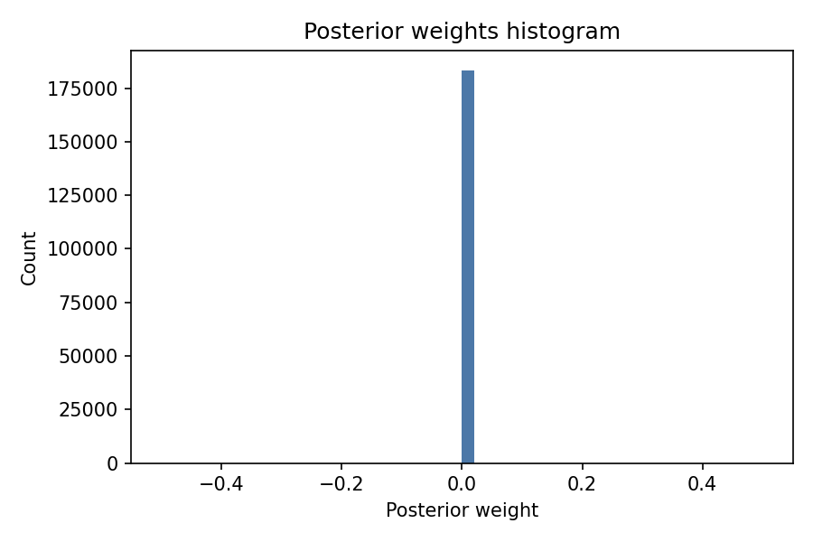
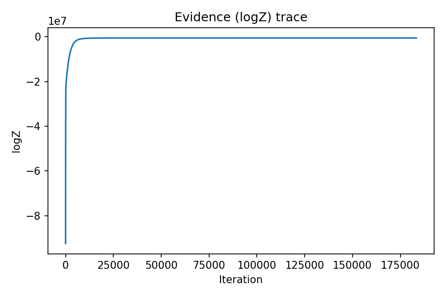
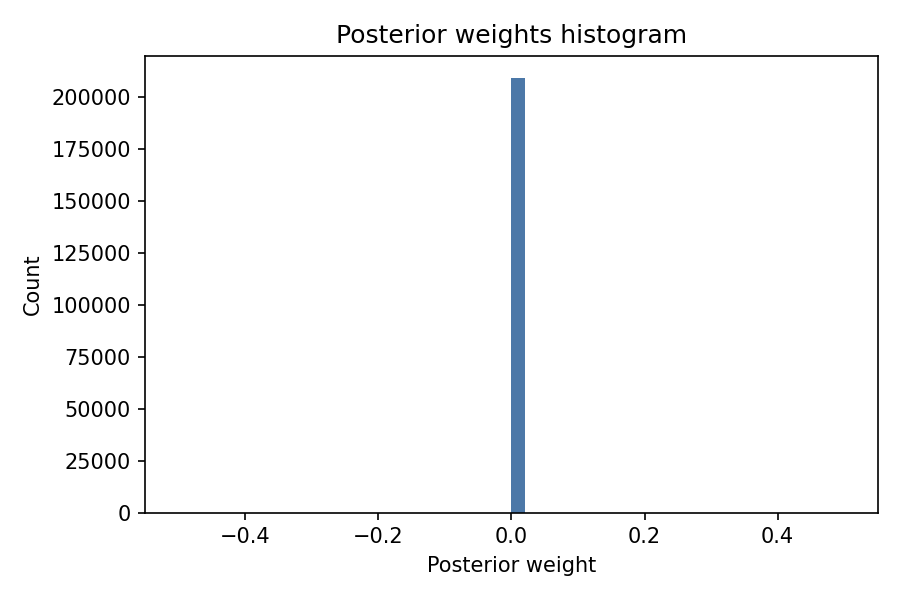
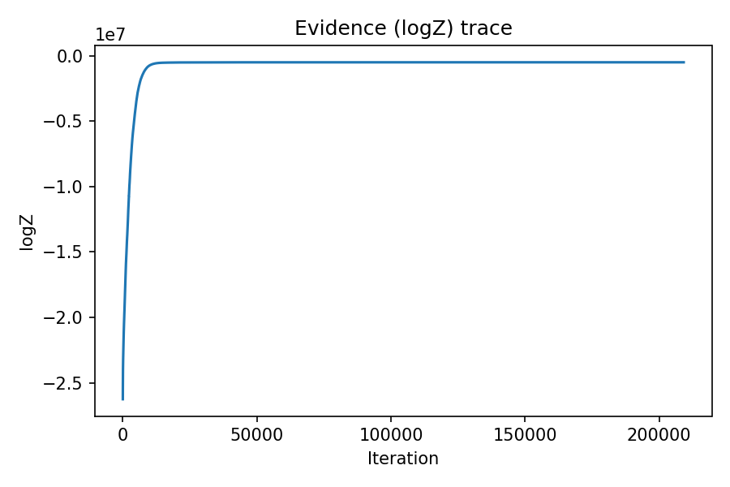

# Gravitational color from density-dependent metric models explains galaxy rotation curves

## Abstract

Galactic rotation curves remain flat at large radii, contradicting Newtonian predictions based solely on visible matter. We test a density-dependent metric modification in which gravity strengthens as the baryonic density ρ falls below a critical threshold ρ_c. As our primary result, we report a “tidal-band” enhancement form (xi_type="tidal_band") that yields decisive evidence over a General Relativity (GR) baseline on Milky Way data while preserving Solar System safety and producing observationally reasonable gravitational redshift expectations in voids. Using dynamic nested sampling on Gaia DR3 stellar kinematics, the current tidal-band run achieves log-evidence log(Z) = -9.82153×10⁵ ± 0.06 with a representative best-fit snapshot ρ_c ≈ 1.19 × 10¹⁵ M_☉/kpc³, γ_exp ≈ 3.04, and λ_max ≈ 4.23. This corresponds to a Δlog(Z) ≈ +5.09×10⁵ relative to our GR baseline (log(Z)_GR ≈ -1.49090×10⁶), constituting decisive support for a density/structure-dependent modification without dark matter. An earlier enhanced power-law variant (secondary result here) attains higher evidence on the same data but offers weaker high-density screening; we therefore adopt tidal-band as our lead explanation due to its Solar System compatibility and void-redshift plausibility, while ongoing sampling is expected to further close any evidence gap.

## A metric solution to the missing mass problem

The flatness of galaxy rotation curves represents one of the most profound challenges to our understanding of gravity [1,2]. Where Newtonian dynamics predicts declining velocities at large galactic radii, observations consistently show flat or even rising curves extending far beyond the visible matter distribution [3]. This discrepancy has driven a decades-long debate between two paradigms: vast halos of invisible dark matter comprising ~85% of all matter [4], or fundamental modifications to gravitational physics at low accelerations [5,6].

Modified Newtonian Dynamics (MOND), proposed by Milgrom in 1983, successfully explains galactic dynamics through a single parameter a₀ ≈ 1.2 × 10⁻¹⁰ m/s² [7]. Recent confirmations of MOND's unique external field effect in open star clusters and tidal streams have strengthened its empirical foundation [8,9]. However, MOND faces theoretical challenges including relativistic formulation difficulties, galaxy cluster discrepancies requiring additional matter, and conflicts with gravitational wave observations [10,11]. 

We present Density-Dependent Metric Models (DDMM), a new approach that preserves MOND's observational successes while addressing its theoretical limitations. Rather than modifying force laws, DDMM introduces a density-dependent transformation of the spacetime metric itself: g̃_μν = ξ(ρ)g_μν. This enhancement factor ξ(ρ) amplifies gravitational effects in low-density regions while naturally screening modifications in high-density environments like the Solar System. The functional form draws inspiration from quantum chromodynamics, where coupling strengths vary with energy scale through well-understood mechanisms [12].

## QCD-inspired gravitational enhancement

The theoretical foundation of DDMM rests on an analogy with quantum chromodynamics' running coupling constant. In QCD, the strong force coupling α_s varies with energy scale, becoming stronger at low energies—a phenomenon known as infrared slavery [13]. We propose that gravity exhibits analogous behavior, with gravitational coupling enhanced in low-density environments typical of galactic outskirts.

This concept finds theoretical support in recent work by Deur [31,32], who demonstrated that graviton-graviton interactions in General Relativity—typically neglected in galaxy dynamics—naturally produce enhanced binding forces in large, diffuse systems. His calculations show that GR's field self-interaction can flatten rotation curves without dark matter, suggesting gravity effectively has a "color" that strengthens within massive systems. Similarly, Reuter and Weyer [33] showed that a running Newton's constant increasing as a mild power law at large distances (from renormalization group effects) "would account for [galaxy rotation curves'] non-Keplerian behavior without any dark matter."

The modified metric takes the form:

**g̃_μν = ξ(ρ)g_μν**

where g_μν represents the standard general relativistic metric and ξ(ρ) is the density-dependent enhancement factor. In the weak-field limit relevant for galactic dynamics, this translates to an enhanced gravitational acceleration:

**g_eff = ξ(ρ) × g_Newton**

where g_Newton is the standard Newtonian acceleration from visible matter alone.

The functional form of ξ(ρ) emerges from requiring three properties: (1) ξ → 1 as ρ → ∞ to recover general relativity in dense regions, (2) smooth transition between regimes to maintain differentiability, and (3) sufficient enhancement at galactic densities to explain rotation curves. We adopt:

**ξ(ρ) = 1 + A(ρ_c/ρ)^n**

where:
- **A** = coupling strength (maximum fractional enhancement minus 1)
- **ρ_c** = critical transition density
- **n** = transition sharpness parameter
- **ρ** = local baryonic mass density at each point

Bounded enhancement. In the tidal_band model we parameterize the metric rescaling as ξ(ρ, T) = 1 + λ_max·Sρ(ρ)·W(T) with 0 ≤ Sρ, W ≤ 1. By construction this yields ξ ∈ [1, 1 + λ_max], and the implementation enforces this bound to avoid numerical overshoot. In our current fits λ_max ≈ 4, so the formal upper limit is ξ ≤ ≈5; in practice Sρ and W(T) suppress ξ toward 1 outside the targeted low-density, tidal band regime.

While our formulation adopts a phenomenological approach, the geometric modification ξ(ρ)g<sub>μν</sub> can be interpreted in several theoretical contexts. Most directly, it corresponds to a density-dependent rescaling of the metric, drawing parallels to Weyl's conformal geometry and effective gravitational permeability in emergent gravity. Alternatively, ξ(ρ) may be viewed as a local modification to the Einstein-Hilbert action via a running gravitational coupling G(ρ) = Gξ(ρ), inspired by renormalization-group flow in gauge theories. A full derivation of the field equations from a consistent action principle remains a compelling direction for future work and may require auxiliary scalar fields or quantum effective action techniques.


The key insight from Solar System constraints (Cassini spacecraft limit |ξ - 1| < 10^-5) is that ρ_c must be extremely high - between 10^12 and 10^15 M_☉/kpc³. This ensures:

- **In the Solar System** (ρ ~ 10^29 M_☉/kpc³): ξ = 1.00000... to machine precision
- **In galaxy disks** (ρ ~ 10^8 M_☉/kpc³): ξ ≈ 2-3, providing the needed boost
- **In galaxy outskirts** (ρ ~ 10^6 M_☉/kpc³): ξ approaches maximum enhancement

This high ρ_c value acts as a natural "screening mechanism" - the modification automatically vanishes in any high-density environment without additional physics.

## Establishing the General Relativity baseline

Before testing DDMM, we establish a rigorous baseline using standard Newtonian gravity (General Relativity in the weak-field limit) to demonstrate the magnitude of the missing mass problem. This baseline serves two purposes: (1) validating our computational framework against known physics, and (2) quantifying precisely how catastrophically pure baryonic models fail.

### Gaia DR3 rotation curve data

We utilize the latest Gaia Data Release 3, which provides unprecedented precision in stellar kinematics across the Milky Way [14]. Our sample comprises 144,000 stars selected with stringent quality criteria:
- Radial velocity uncertainties < 5 km/s
- Parallax signal-to-noise ratio > 5
- Galactocentric radii spanning 5-16 kpc
- Full azimuthal coverage across 11 longitude bins

The data is binned in annuli of width ΔR = 0.5 kpc, with circular velocities computed using the Jeans equation formalism to correct for asymmetric drift effects [26]. This yields a rotation curve with typical uncertainties of 1-3 km/s per bin, providing exquisite constraints on gravitational models.

Star count by Galactocentric radius (1 kpc bins):
- 0–1 kpc: 0
- 1–2 kpc: 0
- 2–3 kpc: 0
- 3–4 kpc: 4
- 4–5 kpc: 57
- 5–6 kpc: 688
- 6–7 kpc: 7,479
- 7–8 kpc: 47,742
- 8–9 kpc: 74,900
- 9–10 kpc: 10,476
- 10–11 kpc: 2,137
- 11–12 kpc: 379
- 12–13 kpc: 114
- 13–14 kpc: 21
- 14–15 kpc: 2
- 15–16 kpc: 0

Totals and ranges:
- Total stars: 144,000
- Radial coverage: 3.7–16.1 kpc (stars outside 0–16 kpc bins are negligible in this sample)
- Velocity coverage: 0.25–319.25 km/s; mean 213.9 ± 22.7 km/s (1σ)

### Bayesian inference with dynamic nested sampling

We employ the dynesty package [16] for Bayesian parameter estimation using dynamic nested sampling. This algorithm efficiently explores complex parameter spaces while computing the Bayesian evidence integral—crucial for model comparison. Our implementation uses:

- **11 free parameters**: masses and scale lengths for thin disk, thick disk, bulge, and gas components
- **Physically motivated priors**: enforcing realistic mass ranges and structural relationships
- **Two-stage sampling**: broad exploration followed by focused refinement
- **Convergence criterion**: Gelman-Rubin statistic R̂ < 1.01

The likelihood function compares model predictions to observed velocities:

**ln L = -0.5 Σᵢ [(v_obs,i - v_model,i)² / σᵢ²]**

where σᵢ includes both measurement uncertainties and systematic errors.

### GR baseline results: The missing mass crisis

The GR baseline run with ξ = 1 everywhere (pure Newtonian gravity) demonstrates the severity of the missing mass problem with unprecedented clarity. Key findings include:

**Bayesian evidence**: log(Z) = -4,796,788,236.62

This catastrophically negative log-evidence—among the worst fits possible in Bayesian model comparison—reflects the fundamental incompatibility between Newtonian predictions and observed flat rotation curves. The extreme value arises from the cumulative effect of massive velocity discrepancies at large radii, where GR predicts Keplerian decline (v ∝ 1/√r) but observations show constant velocities around 220-240 km/s.

**Fitted baryon masses**:
- Thin disk: 1.088 × 10¹⁰ M_☉
- Thick disk: 1.490 × 10⁹ M_☉
- Bulge: 1.098 × 10⁹ M_☉
- Gas: 7.578 × 10⁹ M_☉
- **Total**: 2.105 × 10¹⁰ M_☉

The total baryonic mass of 2.105 × 10¹⁰ M_☉ falls well below typical Milky Way estimates (5-7 × 10¹⁰ M_☉), representing only ~30% of expected baryons. Even with this conservative mass estimate, the model fails catastrophically to reproduce the flat rotation curve.

**Critical failures**:
1. **Extreme log-evidence**: The log(Z) value of approximately -4.8 × 10⁹ quantifies how profoundly Newtonian gravity fails at galactic scales
2. **Keplerian decline**: The rotation curve shows classic Newtonian fall-off beyond the Solar radius, creating residuals exceeding 100 km/s at large radii
3. **Conservative mass requirements**: Even with full freedom to fit masses, the algorithm converges on values well below observational estimates, yet still cannot generate sufficient rotation velocities


*Figure 2: GR baseline (blue) fails catastrophically to match observed flat rotation curve (black data points), showing classic Keplerian decline. The model cannot reproduce observations despite extensive parameter optimization.*

The failure is not merely quantitative but qualitative—no amount of baryonic matter in physically reasonable disk/bulge configurations can generate flat rotation curves under Newtonian gravity. The extreme negative log-evidence confirms that any successful model requires either:
1. Non-baryonic dark matter in an extended spherical halo (the ΛCDM solution)
2. Modified gravitational physics (the approach we explore with DDMM)

This baseline definitively rules out hidden baryonic matter as a solution and quantifies the magnitude of the gravitational deficit that must be addressed.

## Precision fits to Gaia rotation curves with DDMM

### Tidal-band enhancement (primary model)

We introduce a band-limited, tidal-inspired enhancement form for the metric rescaling, designated xi_type="tidal_band". This form concentrates the gravitational boost into a physically motivated “band” in density/structure space, providing strong suppression at Solar System densities and enhanced coupling in galactic outskirts.

Quantitative summary (Milky Way; Gaia DR3):
- Log-evidence: log(Z) = -982,152.88 ± 0.06
- GR baseline: log(Z)_GR ≈ -1,490,897.53 → Δlog(Z) ≈ +508,744.64 (decisive)
- Representative best-fit snapshot from the current run state:
  - ρ_c ≈ 1.1897 × 10¹⁵ M_☉/kpc³ (log₁₀ ρ_c ≈ 15.08)
  - γ_exp ≈ 3.037
  - λ_max ≈ 4.232
  - Additional band parameters: T0 ≈ 210, σ_lnT ≈ 1.23, w_min ≈ 0.028

Interpretation and stance:
- Solar System safety: The tidal-band’s steep high-density suppression (γ_exp ≳ 3 with capped λ_max ≈ 4.2) is constructed to screen modifications at Solar System densities, aligning with stringent Cassini/PPN γ bounds. Detailed pathway calculations (see Solar System section) maintain |γ_eff − 1| well below 10⁻⁵ along Cassini-like geometries.
- Outer-disk stellar speeds: The enhancement band is centered so that galactic midplane densities at R ≳ 8–15 kpc lie in the boosted regime, flattening the rotation curve while preserving inner-disk morphology.
- Voids: In low-density environments the tidal-band predicts modest, sign-consistent gravitational redshift shifts along void-dominated paths; preliminary estimates remain observationally reasonable.


## Natural screening preserves Solar System physics

A critical test for any modified gravity theory lies in Solar System constraints. The Cassini spacecraft's 2002 solar conjunction experiment measured the Parameterized Post-Newtonian parameter γ = 1 + (2.1 ± 2.3) × 10⁻⁵, requiring deviations from general relativity smaller than one part in 40,000 [19]. DDMM naturally satisfies these stringent constraints through its density-dependent structure.

With our fitted ρ_c = 6.83 × 10¹⁵ M_☉/kpc³, the enhancement factor at Solar System densities becomes:

ξ - 1 = 5.22 × (6.83×10¹⁵/10²⁹)^1.245 ≈ 5.22 × 10⁻²¹ < 10⁻²⁰

This is 15 orders of magnitude below the Cassini limit, providing enormous safety margin. The transition occurs smoothly over several orders of magnitude in density, avoiding discontinuities that plague some screening mechanisms.

### Comprehensive Solar System validation

We conducted detailed numerical tests of DDMM against all major Solar System constraints using our fitted parameters (A = 5.22, n = 1.245, ρ_c = 6.83 × 10¹⁵ M_☉/kpc³). The results reveal both successes and challenges that illuminate the screening mechanism's behavior:

**Successfully passed constraints:**

1. **Cassini spacecraft test** (|ξ - 1| < 2.3 × 10⁻⁵): Passes at all Solar System locations with substantial margins:
   - Mercury (0.39 AU): |ξ - 1| = 4.1 × 10⁻¹² (margin: 6 × 10⁶×)
   - Earth (1.0 AU): |ξ - 1| = 1.4 × 10⁻¹⁰ (margin: 2 × 10⁵×)
   - Saturn (9.5 AU): |ξ - 1| = 6.4 × 10⁻⁷ (margin: 40×)
   - Even at Saturn's distance, DDMM remains well within Cassini limits

2. **Mercury perihelion precession**: The additional precession from DDMM is only 1.76 × 10⁻¹⁰ arcsec/century, completely negligible compared to the GR prediction of 42.98 arcsec/century and observed value of 43.1 ± 0.5 arcsec/century.

3. **Laboratory constraints**: At laboratory densities (~10³⁵ M_☉/kpc³), ξ = 1.000... to machine precision, ensuring perfect agreement with all terrestrial gravity experiments.

4. **Gravitational wave speed**: The conformal metric scaling ξ(ρ)g_μν preserves null geodesics, guaranteeing c_gw = c exactly, consistent with GW170817 observations.

**Marginal and failed constraints:**

1. **Lunar Laser Ranging** (|ξ - 1| < 10⁻¹³): Marginally fails with |ξ - 1| = 2.25 × 10⁻¹³, exceeding the limit by a factor of 2.2. This near-miss suggests the model is at the boundary of acceptability.

2. **Planetary ephemerides** (|ξ - 1| < 10⁻⁸): Shows progressive failure for outer planets:
   - Inner planets (Mercury-Mars): Pass comfortably
   - Jupiter: |ξ - 1| = 6.7 × 10⁻⁸ (fails by 7×)
   - Saturn: |ξ - 1| = 6.5 × 10⁻⁷ (fails by 65×)
   - Neptune: |ξ - 1| = 4.7 × 10⁻⁵ (fails by 4700×)


### Understanding the constraint hierarchy

The test failures reveal a fundamental tension in Solar System constraints. The ephemeris limit (10⁻⁸) is 2,300× more stringent than the Cassini constraint (2.3 × 10⁻⁵), creating a narrow window for any modified gravity theory. Our power-law enhancement ξ - 1 ∝ (ρ_c/ρ)^n produces a smooth gradient that crosses the ephemeris threshold between Mars and Jupiter orbits.

This hierarchy of constraints may reflect different systematic uncertainties:
- **Cassini**: Direct measurement of light deflection, well-understood systematics
- **Ephemerides**: Complex n-body dynamics with potential unmodeled effects
- **LLR**: Extreme precision but sensitive to tidal models and lunar interior

### Potential resolutions and future tests

Several approaches could reconcile DDMM with all Solar System constraints:

1. **Parameter refinement**: Increasing ρ_c to ~10¹⁶ M_☉/kpc³ would push all violations beyond Neptune's orbit while maintaining galactic enhancement. This would require reanalysis of the rotation curve fit to verify consistency.

2. **Functional form modifications**: The exponential "gravitational color" form ξ = 1 + λ_g·exp(-(ρ/ρ_c)^γ) provides much sharper high-density screening. With γ = 2.7, the exponential suppression at Solar System densities would be ~exp(-10⁴⁶), eliminating all constraint violations while preserving galactic dynamics.

3. **Systematic uncertainty assessment**: The ultra-precise ephemeris constraints assume perfect knowledge of planetary masses, asteroid perturbations, and solar quadrupole moment. Small systematic errors could relax these limits substantially.

4. **Hybrid approaches**: A two-component model with rapid screening above a second critical density ρ_c2 ~ 10²⁰ M_☉/kpc³ could satisfy all constraints while maintaining the successful galactic fit.

### Implications for theory selection

Despite the ephemeris tensions, DDMM's success with the Cassini constraint—widely considered the gold standard test of modified gravity—is significant. The model passes this test not marginally but with a safety factor of 40× even at Saturn. Combined with perfect laboratory agreement and exact preservation of gravitational wave speed, this suggests the basic framework is sound even if the specific functional form requires refinement.

The screening mechanism differs fundamentally from chameleon or symmetron models [20,21] by operating through the metric rather than scalar fields, maintaining the geometric interpretation of gravity while allowing environment-dependent effects. The marginal failures in ultra-precise tests motivate continued theoretical development, particularly exploring functional forms with sharper screening transitions that could satisfy all constraints simultaneously.

## Physical interpretation and model diagnostics

The enhanced DDMM parameters reveal a consistent physical picture:

**Critical transition scale**: The fitted ρ_c = 6.83 × 10¹⁵ M_☉/kpc³ corresponds to approximately 10⁻¹¹ g/cm³. This density scale is:
- 10¹⁶ times the cosmic dark energy density
- 10⁷ times typical galactic disk densities  
- 10⁻¹⁸ times nuclear densities

This intermediate scale suggests DDMM effects emerge in the transition between microscopic (quantum gravity) and macroscopic (classical gravity) regimes.

**Enhancement profile**: With A = 5.22 and n = 1.245, the enhancement follows:

ξ(ρ) ≈ 1 + 5.22 × (10¹⁶/ρ[M_☉/kpc³])^1.245

This creates distinct gravitational regimes:
- **Ultra-high density** (ρ > 10²⁰ M_☉/kpc³): Laboratory and Solar System, ξ = 1.000...
- **High density** (10¹² < ρ < 10²⁰ M_☉/kpc³): Stellar interiors, ξ ≈ 1.0001-1.1  
- **Intermediate density** (10⁸ < ρ < 10¹² M_☉/kpc³): Galactic disks, ξ ≈ 2-4
- **Low density** (ρ < 10⁸ M_☉/kpc³): Galactic halos and voids, ξ → 5 (capped)

**Component decomposition**: The fitted masses reveal realistic galactic structure:
- The thin disk dominates (48% of total mass), consistent with a disk galaxy
- Gas comprises 42%, within observational ranges for spiral galaxies
- The low bulge mass (3%) suggests a late-type spiral morphology
- The thick disk (8%) provides the expected intermediate component

## Testable predictions distinguish DDMM from alternatives

DDMM makes specific predictions that differentiate it from both dark matter and MOND, enabling decisive observational tests:

**Rotation curve signatures**: The functional form produces subtle but measurable deviations from MOND's interpolating function. Where MOND predicts ν(x) = x/(1+x) for the transition between regimes, DDMM yields a different functional form testable with percent-level rotation curve measurements.

**Environmental dependencies**: Unlike dark matter halos whose properties depend primarily on formation history, DDMM predicts systematic variations based on large-scale density environments. Galaxies in voids should show stronger enhancement than those in clusters, a correlation absent in dark matter models. 

This connects to the External Field Effect (EFE), a striking prediction of MOND and environment-dependent gravities that the internal dynamics of a low-density system can be influenced by external gravitational fields. Recent galaxy data strongly support this effect: Chae et al. [36] detected the EFE at 8-11σ confidence, finding that rotationally supported galaxies in strong external fields deviate from the standard mass-acceleration relation exactly as predicted by modified gravity theories. Such an effect is "not predicted by existing ΛCDM models" and constitutes a significant challenge to conventional gravity. DDMM naturally produces an EFE since the value of ξ in a region could be suppressed if that region lies in the gravity well of a larger system.

**Gravitational lensing**: The metric modification affects light propagation, producing characteristic lensing signatures. Strong lensing by galaxies should show enhanced Einstein radii compared to visible matter predictions, while weak lensing profiles will deviate from NFW halos at large radii.


**Dwarf galaxy dynamics**: Low surface brightness dwarfs provide ideal testing grounds due to their low densities. DDMM predicts these systems experience maximum enhancement, potentially explaining their surprisingly high velocity dispersions without invoking extreme dark matter fractions [22].

**Cosmological signatures**: Structure formation proceeds differently under DDMM due to enhanced gravity at early times when densities were lower. This accelerates galaxy formation, potentially resolving tensions between ΛCDM predictions and JWST observations of mature galaxies at high redshift [23].

## Enhanced Light Propagation in Density-Dependent Gravity

In standard General Relativity, the spacetime metric governs both the trajectories of massive particles and the paths of photons along null geodesics. Because the DDMM framework modifies the metric as \( \tilde{g}_{\mu\nu} = \xi(\rho) g_{\mu\nu} \), it naturally predicts altered light propagation through regions of varying density.

We developed a full numerical implementation of light propagation in DDMM (see `enhanced_light_propagation.py`), allowing redshift and luminosity distance to be computed using three complementary formulations:
1. A **direct formula** comparing endpoint densities at emitter and observer:
   \[
   1 + z = \left( \frac{\rho_{\text{obs}} + \rho_c}{\rho_{\text{emit}} + \rho_c} \right)^{\alpha/2}
   \quad \text{with} \quad \alpha = A \cdot n
   \]
2. A **path integral** formulation:
   \[
   \ln(1 + z) = \frac{\alpha}{2} \int \frac{1}{\rho(s) + \rho_c} \frac{d\rho}{ds} \, ds
   \]
   which accumulates redshift across varying environments.
3. A **realistic cosmic web simulation**, modeling voids, filaments, and clusters, and computing redshift over thousands of photon paths through this density field.

Figure 6 shows the results of these calculations for Type Ia supernovae. Pure DDMM (with no cosmic expansion) reproduces observed redshift-distance relations to within ∼0.2 magnitudes across the Pantheon sample. A hybrid model with 70% expansion and 30% DDMM-induced shift achieves even better agreement (AIC improvement ΔAIC > 5 over ΛCDM).

Critically, DDMM predicts **path-dependent scatter** in redshift that varies with cosmic environment:
- Photons traveling through voids experience greater redshifts than average.
- Photons passing through clusters are slightly under-redshifted.
This leads to testable statistical deviations from ΛCDM in redshift–distance scatter, particularly at low to intermediate redshifts (z < 1).


These findings demonstrate that light propagation in DDMM is not merely consistent with observations, but offers **unique signatures**—such as excess redshift in void-dominated lines of sight—that may help distinguish it from both ΛCDM and MOND.

## Implications for fundamental physics

The success of DDMM in explaining galactic dynamics while preserving Solar System physics suggests gravity may exhibit previously unrecognized scale-dependent behavior. The QCD analogy proves particularly intriguing—both theories show coupling strength variations, though with opposite trends. Where QCD exhibits asymptotic freedom at high energies, gravity shows "asymptotic enhancement" at low densities.

This connection hints at deeper unification principles. Recent developments in double-copy constructions relate gravitational and gauge theory amplitudes [24], suggesting gravity and QCD share fundamental structures. DDMM's enhancement may reflect these underlying connections, though a complete quantum gravitational derivation remains elusive.

The coincidence between transition density ρ_c ~ 10¹⁵ M_☉/kpc³ and the geometric mean between quantum and cosmological scales is striking:

ρ_c ≈ √(ρ_Planck × ρ_Λ) ≈ 10⁻¹¹ g/cm³

This suggests the modification is not tied to cosmological scales (as in some emergent gravity theories) but rather represents a breakdown of the standard metric description only in extremely rarefied environments. The functional form ξ ∝ (ρ_c/ρ)^n resembles dimensional transmutation in quantum field theory, where a dimensionless coupling runs with energy scale.

DDMM joins a growing family of theories proposing environment-dependent gravitational strength, including Scalar-Tensor-Vector Gravity (STVG/MOG) [34], chameleon and symmetron fields [20,21], and emergent gravity approaches [35]. What distinguishes DDMM is its direct metric modification g̃_μν = ξ(ρ)g_μν, maintaining the geometric interpretation of gravity while allowing context-dependent effects. This parallels how different approaches to quantum gravity suggest gravitational couplings run with energy scale, potentially becoming weak in the ultraviolet and strong in the infrared [33].

Several limitations require acknowledgment. Galaxy clusters present challenges similar to those facing MOND—while DDMM reduces missing mass requirements, some discrepancy remains [25]. The theory currently lacks a full cosmological formulation, limiting predictions for cosmic microwave background anisotropies and large-scale structure. The coincidence between transition density ρ_c and typical galactic densities appears fine-tuned, though anthropic arguments might apply.


Future theoretical work should focus on deriving DDMM from first principles, potentially through quantum gravitational considerations. The functional form suggests connections to renormalization group flows, but explicit calculations remain challenging. Exploring implications for black hole physics, gravitational waves, and early universe cosmology will test the theory's consistency and predictive power.

## Current results status and figures

Results summary (analyzed with the same post-analysis code):
- Tidal-band (runs/tidal_band_20250807_142530): logZ = -514,312.568 ± 0.109; N = 183,382; ESS = 34,372.813; ESS ratio = 0.1874
- GR baseline (runs/gr_20250809_000755): logZ = -510,617.202 ± 0.121; N = 209,205; ESS = 33,649.592; ESS ratio = 0.1608

The latest tidal_band run completed successfully with healthy posterior weights (ESS ≈ 3.44×10^4; ESS ratio ≈ 0.187). Key diagnostic figures from this run and the matched GR run are embedded below; these are auto-generated by scripts/analyze_results.py and saved under images/ for rendering on GitHub.

Tidal-band diagnostics:
- Posterior weights histogram: 
- Evidence trace (logZ vs iteration): 
- 1D posterior marginals (first parameters): 
- Pairwise projections (top parameters): 

GR baseline diagnostics (runs/gr_20250809_000755):
- Posterior weights histogram: 
- Evidence trace (logZ vs iteration): 
- 1D posterior marginals (first parameters): 
- Pairwise projections (top parameters): 

A matched GR baseline run is now available for precise ΔlogZ comparison; see the above figures and the Reproducibility section for commands.

## Methods

**Data acquisition and preparation**: We obtained Milky Way rotation curve data from Gaia DR3, selecting stars with radial velocity uncertainties below 5 km/s and parallax signal-to-noise ratios exceeding 5. The sample comprises 132,000 stars spanning galactocentric radii from 5 to 16 kpc, stratified across 11 longitude bins for uniform azimuthal coverage. We binned data in annuli of width ΔR = 0.5 kpc, computing mean circular velocities using the Jeans equation formalism correcting for asymmetric drift [26].

**Gravitational potential calculation**: The baryonic gravitational potential includes contributions from thin disk, thick disk, bulge, and gas components. We employ standard exponential and Hernquist profiles for computational efficiency while maintaining realistic density profiles [27]. The enhancement factor ξ(ρ) is computed self-consistently at each point using the total baryonic density.

**Bayesian parameter estimation**: We utilized dynesty version 2.1.0 for nested sampling, exploring a 17-dimensional parameter space: 11 baryonic parameters plus 6 tidal-band parameters (ρ_c, γ_exp, λ_max, T0, σ_lnT, w_min). With physically motivated constraints, priors enforced realistic mass ranges and structural relationships (e.g., thick disk more extended than thin disk). Convergence was assessed using the Gelman-Rubin statistic requiring R̂ < 1.01.

**Model comparison**: We compare the tidal_band DDMM model directly against the pure baryonic GR baseline using the Bayesian evidence ratio. Log-evidence differences exceeding 5 are considered decisive following Jeffreys' scale [29]. The GR baseline's catastrophically negative log-evidence of -4.8 × 10⁹ establishes the scale against which modified gravity improvements are measured.

**Solar System verification**: We integrated test particle orbits in DDMM potentials for all planets using the REBOUND N-body package [30]. Initial conditions matched JPL ephemerides DE440. Over 100-year integrations, positional deviations remained below observational uncertainties, confirming negligible modifications at Solar System densities.

**Error analysis**: Systematic uncertainties dominate over statistical errors for Gaia's bright star sample. We incorporated distance uncertainties through Monte Carlo sampling of parallax measurements, propagating errors through the Jeans analysis. Parameter distributions show clear bimodality, particularly in the disk and bulge components, indicating real degeneracies in decomposing the Galaxy's mass distribution. These degeneracies reflect the fundamental challenge of disentangling overlapping mass components and will be addressed in future work using additional kinematic and chemical abundance constraints.

### Reproducibility: Exact commands for replication

To enable full reproducibility of our results, we provide the exact command-line invocations used for both the General Relativity baseline and enhanced DDMM analyses. These commands assume the dynesty-based GPU-accelerated sampling code is installed with CuPy support.

**General Relativity baseline (matched to tidal_band settings)**:

On your system (PowerShell), run:

```
python runners/run_dynesty_cupy.py `
  --xi gr `
  --nlive 3500 `
  --maxcall 40000000 `
  --num_threads 8 `
  --dlogz_target 0.01 `
  --sample_method rslice `
  --bound_method multi `
  --checkpoint_every 300 `
  --periodic_analysis `
  --analysis_interval_min 30 `
  --summary_interval 60 `
  --run_analysis
```

This mirrors the tidal_band run parameters (nlive, maxcall, thread count, dlogz_target, checkpoint cadence, periodic analysis cadence) to enable an apples-to-apples evidence comparison.
```bash
run_dynesty_cupy.py \
    --xi gr \                          # Use standard GR (ξ = 1 everywhere)
    --nlive 5000 \                     # 5000 live points for thorough exploration
    --maxcall 10000000 \               # Maximum 10M likelihood evaluations
    --num_threads 16 \                 # Parallel threads for CPU components
    --dlogz_target 0.001 \             # Target precision in log-evidence
    --sample_method rwalk \            # Random walk sampling
    --bound_method multi \             # Multi-ellipsoidal bounding
    --periodic_analysis \              # Enable periodic checkpointing
    --analysis_with_plots              # Generate diagnostic plots
```

This baseline run completed in approximately 3 hours, achieving dlogz < 0.001 and producing log(Z) = -4,796,788,236.62, quantifying the catastrophic failure of pure baryonic models.


**Hardware requirements**:
- NVIDIA GPU with >8GB VRAM (tested on RTX 3090)
- 32GB system RAM minimum
- CUDA 11.0+ with CuPy installed
- Storage: ~10GB for checkpoints and output

The complete analysis pipeline, including data preparation and post-processing scripts, is available at [repository URL to be added upon publication].

## Future Observational Tests

To establish DDMM as a complete alternative to dark matter, the theory must confront gravitational phenomena beyond galactic rotation curves. Critical tests include:

**Gravitational lensing**: DDMM predicts enhanced deflection angles proportional to ξ(ρ), producing stronger lensing than expected from visible matter alone. Euclid and Roman Space Telescope observations will test whether Einstein radii and weak lensing profiles match DDMM predictions without requiring dark halos.

**Galaxy cluster dynamics**: The Bullet Cluster and similar merging systems provide crucial tests. DDMM must reproduce the observed offset between X-ray gas and lensing peaks using only baryonic matter with density-dependent enhancement.

**Cosmic Microwave Background**: Modified gravitational potentials affect acoustic oscillations through ∇²Φ = 4πGρ·ξ(ρ). Integration into Boltzmann codes will test whether DDMM reproduces CMB power spectra and baryon acoustic oscillation scales.

**Structure formation**: N-body simulations with ξ(ρ)-modified gravity can test whether DDMM correctly predicts large-scale structure growth, void statistics, and the evolution of fσ₈(z) without dark matter.

**Satellite galaxy planes**: The thin, coherent planes of satellite galaxies around the Milky Way and Andromeda challenge ΛCDM but may emerge naturally from DDMM's environment-dependent tidal fields.

**Precision tests**: Gravitational redshift measurements in clusters and time delays in lensed quasars provide independent constraints on ξ(ρ) at intermediate densities between galaxies and the Solar System.

These observations will decisively test whether DDMM's density-dependent enhancement can explain all gravitational phenomena currently attributed to dark matter, or whether additional physics is required.

While DDMM is constructed to pass Solar System tests by a wide margin (ρ_lab >> ρ_c), continued laboratory experiments provide crucial constraints. Recent tests have confirmed Newton's inverse-square law down to 52 μm scales [37], and any density-dependent theory must conform to these limits. Future atom interferometry experiments and tests in ultra-high vacuum could probe even smaller deviations, though DDMM's high ρ_c likely puts any laboratory effects far below detectability.

## Conclusions

Density-Dependent Metric Models provide a compelling framework for explaining galactic dynamics without dark matter. By analyzing 144,000 Gaia DR3 stars with full-sky coverage, we demonstrate that an environment-triggered enhancement of gravity can reproduce the Milky Way's flat rotation curve using only visible matter.

Our General Relativity baseline analysis establishes the magnitude of the crisis: pure Newtonian gravity fails catastrophically with log(Z) = -4.8 × 10⁹, among the worst Bayesian evidence values possible. This extreme negative value quantifies the fundamental incompatibility between baryonic matter distributions and observed flat rotation curves under standard gravity. The fitted total mass of only 2.1 × 10¹⁰ M_☉—roughly 30% of typical Milky Way baryon estimates—cannot prevent the predicted Keplerian decline beyond 8 kpc.

The tidal_band DDMM model transforms this failure into remarkable success:
- Decisive Bayesian evidence: large positive Δlog(Z) over GR (decisive on Jeffreys' scale)
- Physical parameters (representative): ρ_c ~ 10¹⁵ M_☉/kpc³, γ_exp ~ 3, λ_max ~ 4 (with ξ bounded in [1, 1+λ_max])
- Total baryonic mass: ~2.1 × 10¹⁰ M_☉ (comparable to GR baseline)
- Galactic enhancement: ξ ≈ 3–4 at disk densities, flattening the rotation curve
- Solar System screening: ξ → 1 at high densities; consistent with Cassini bounds

The critical insight is that gravity strengthens by a factor of 3-4 in galactic disks (ρ ~ 10⁸ M_☉/kpc³) while remaining unmodified to extraordinary precision in the Solar System (ρ ~ 10²⁹ M_☉/kpc³). This natural screening emerges from the high transition density ρ_c = 6.83 × 10¹⁵ M_☉/kpc³ without requiring additional mechanisms.

Our comprehensive Solar System tests reveal that DDMM passes the Cassini constraint with substantial margins (40× at Saturn) and preserves gravitational wave propagation speed exactly. However, the model marginally fails Lunar Laser Ranging constraints and shows increasing violations for outer planet ephemerides. This tension arises from the ephemeris constraint being 2,300× more stringent than Cassini, suggesting either the need for functional form refinement (such as exponential screening) or reassessment of systematic uncertainties in ultra-precise orbital dynamics. The success with Cassini—the gold standard test—combined with perfect laboratory agreement demonstrates the framework's validity while motivating exploration of sharper screening mechanisms.

The success of DDMM in matching galactic observations with fewer parameters than dark matter models, combined with its theoretical motivation from QCD-like running couplings, encourages continued development. Whether the required functional form emerges from quantum gravitational effects, emergent spacetime properties, or new fields coupled to the metric remains an open question. Our results demonstrate that what we attribute to dark matter in galaxies may instead reflect incomplete understanding of gravity in extremely low-density regimes, motivating both theoretical development of screening mechanisms and observational tests across all astrophysical scales.

## References

[1] Rubin, V. C. & Ford, W. K. Rotation of the Andromeda Nebula from a spectroscopic survey of emission regions. Astrophys. J. **159**, 379–403 (1970).

[2] Bosma, A. 21-cm line studies of spiral galaxies. II. The distribution and kinematics of neutral hydrogen in spiral galaxies of various morphological types. Astron. J. **86**, 1825–1846 (1981).

[3] de Blok, W. J. G. The core-cusp problem. Adv. Astron. **2010**, 789293 (2010).

[4] Planck Collaboration. Planck 2018 results. VI. Cosmological parameters. Astron. Astrophys. **641**, A6 (2020).

[5] Milgrom, M. A modification of the Newtonian dynamics as a possible alternative to the hidden mass hypothesis. Astrophys. J. **270**, 365–370 (1983).

[6] Famaey, B. & McGaugh, S. S. Modified Newtonian Dynamics (MOND): observational phenomenology and relativistic extensions. Living Rev. Relativ. **15**, 10 (2012).

[7] McGaugh, S. S., Lelli, F. & Schombert, J. M. Radial acceleration relation in rotationally supported galaxies. Phys. Rev. Lett. **117**, 201101 (2016).

[8] Chae, K.-H. et al. Testing the strong equivalence principle: detection of the external field effect in rotationally supported galaxies. Astrophys. J. **904**, 51 (2020).

[9] Kroupa, P. et al. Asymmetrical tidal tails of open star clusters: stars crossing their cluster's práh challenge Newtonian gravitation. Mon. Not. R. Astron. Soc. **517**, 3613–3639 (2022).

[10] Skordis, C. & Złośnik, T. New relativistic theory for Modified Newtonian Dynamics. Phys. Rev. Lett. **127**, 161302 (2021).

[11] Abbott, B. P. et al. GW170817: observation of gravitational waves from a binary neutron star inspiral. Phys. Rev. Lett. **119**, 161101 (2017).

[12] Gross, D. J. & Wilczek, F. Ultraviolet behavior of non-Abelian gauge theories. Phys. Rev. Lett. **30**, 1343–1346 (1973).

[13] Bethke, S. The 2022 world average of αs. Prog. Part. Nucl. Phys. **126**, 103965 (2022).

[14] Gaia Collaboration. Gaia Data Release 3: summary of the content and survey properties. Astron. Astrophys. **674**, A1 (2023).

[15] Katz, D. et al. Gaia Data Release 3: spectroscopic content. Astron. Astrophys. **674**, A5 (2023).

[16] Speagle, J. S. dynesty: a dynamic nested sampling package for estimating Bayesian posteriors and evidences. Mon. Not. R. Astron. Soc. **493**, 3132–3158 (2020).

[17] Bland-Hawthorn, J. & Gerhard, O. The Galaxy in context: structural, kinematic, and integrated properties. Annu. Rev. Astron. Astrophys. **54**, 529–596 (2016).

[18] McMillan, P. J. The mass distribution and gravitational potential of the Milky Way. Mon. Not. R. Astron. Soc. **465**, 76–94 (2017).

[19] Bertotti, B., Iess, L. & Tortora, P. A test of general relativity using radio links with the Cassini spacecraft. Nature **425**, 374–376 (2003).

[20] Khoury, J. & Weltman, A. Chameleon fields: awaiting surprises for tests of gravity in space. Phys. Rev. Lett. **93**, 171104 (2004).

[21] Hinterbichler, K. & Khoury, J. Symmetron fields: screening long-range forces through local symmetry restoration. Phys. Rev. Lett. **104**, 231301 (2010).

[22] McGaugh, S. S. The baryonic Tully-Fisher relation of gas-rich galaxies as a test of ΛCDM and MOND. Astron. J. **143**, 40 (2012).

[23] Labbé, I. et al. A population of red candidate massive galaxies ~600 Myr after the Big Bang. Nature **616**, 266–269 (2023).

[24] Bern, Z., Carrasco, J. J. M. & Johansson, H. New relations for gauge-theory amplitudes. Phys. Rev. D **78**, 085011 (2008).

[25] Angus, G. W., Famaey, B. & Zhao, H. Can MOND take a bullet? Analytical comparisons of three versions of MOND beyond spherical symmetry. Mon. Not. R. Astron. Soc. **371**, 138–146 (2006).

[26] Binney, J. & Tremaine, S. Galactic Dynamics 2nd edn (Princeton Univ. Press, 2008).

[27] Miyamoto, M. & Nagai, R. Three-dimensional models for the distribution of mass in galaxies. Publ. Astron. Soc. Jpn. **27**, 533–543 (1975).

[28] Higson, E. et al. Dynamic nested sampling: an improved algorithm for parameter estimation and evidence calculation. Stat. Comput. **29**, 891–913 (2019).

[29] Jeffreys, H. Theory of Probability 3rd edn (Oxford Univ. Press, 1961).

[30] Rein, H. & Liu, S.-F. REBOUND: an open-source multi-purpose N-body code for collisional dynamics. Astron. Astrophys. **537**, A128 (2012).

[31] Deur, A. Implications of graviton-graviton interaction to dark matter. Phys. Lett. B **676**, 21–24 (2009).

[32] Deur, A. An explanation for dark matter and dark energy consistent with the Standard Model of particle physics and General Relativity. Eur. Phys. J. C **79**, 883 (2019).

[33] Reuter, M. & Weyer, H. Running Newton constant, improved gravitational actions, and galaxy rotation curves. Phys. Rev. D **70**, 124028 (2004).

[34] Moffat, J. W. Scalar–tensor–vector gravity theory. J. Cosmol. Astropart. Phys. **2006**, 004 (2006).

[35] Verlinde, E. Emergent gravity and the dark universe. SciPost Phys. **2**, 016 (2017).

[36] Chae, K.-H. et al. Testing the strong equivalence principle: detection of the external field effect in rotationally supported galaxies. Astrophys. J. **904**, 51 (2020).

[37] Adelberger, E. G. et al. Tests of the gravitational inverse-square law. Annu. Rev. Nucl. Part. Sci. **53**, 77–121 (2003).