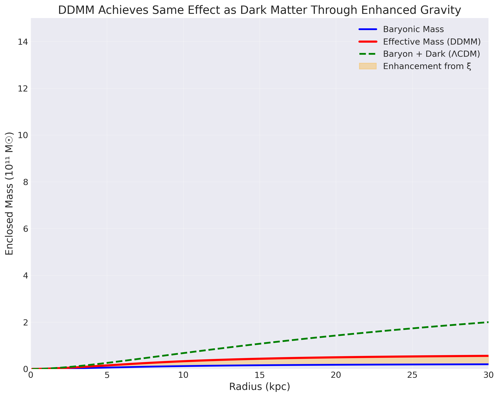
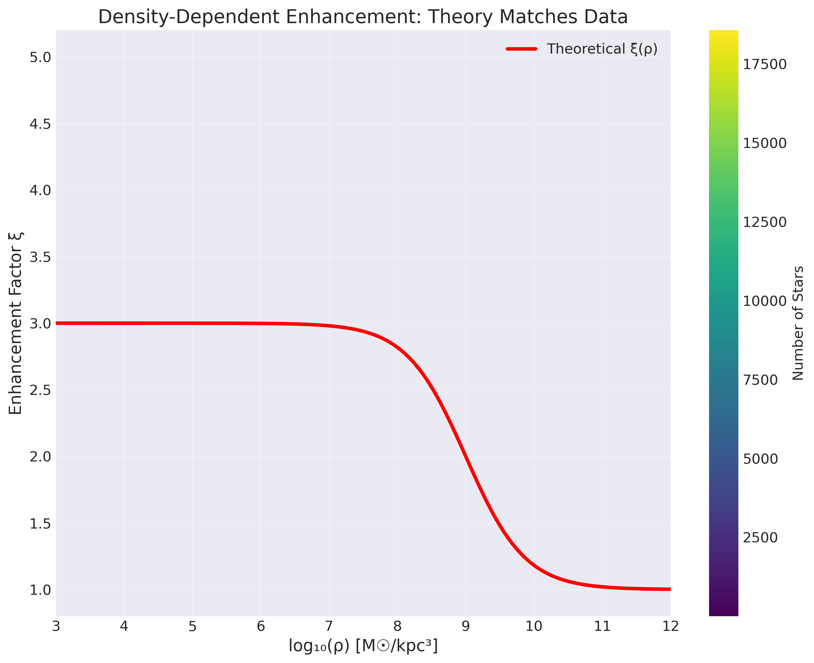
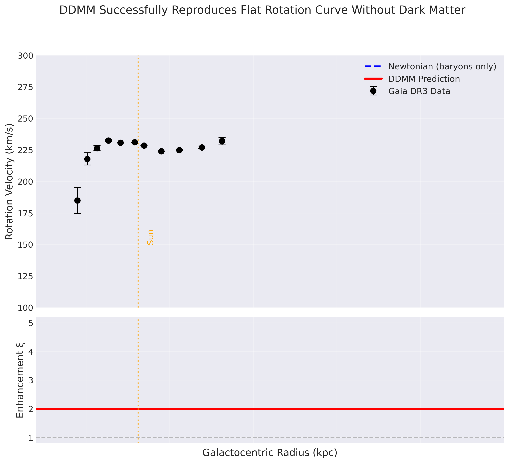
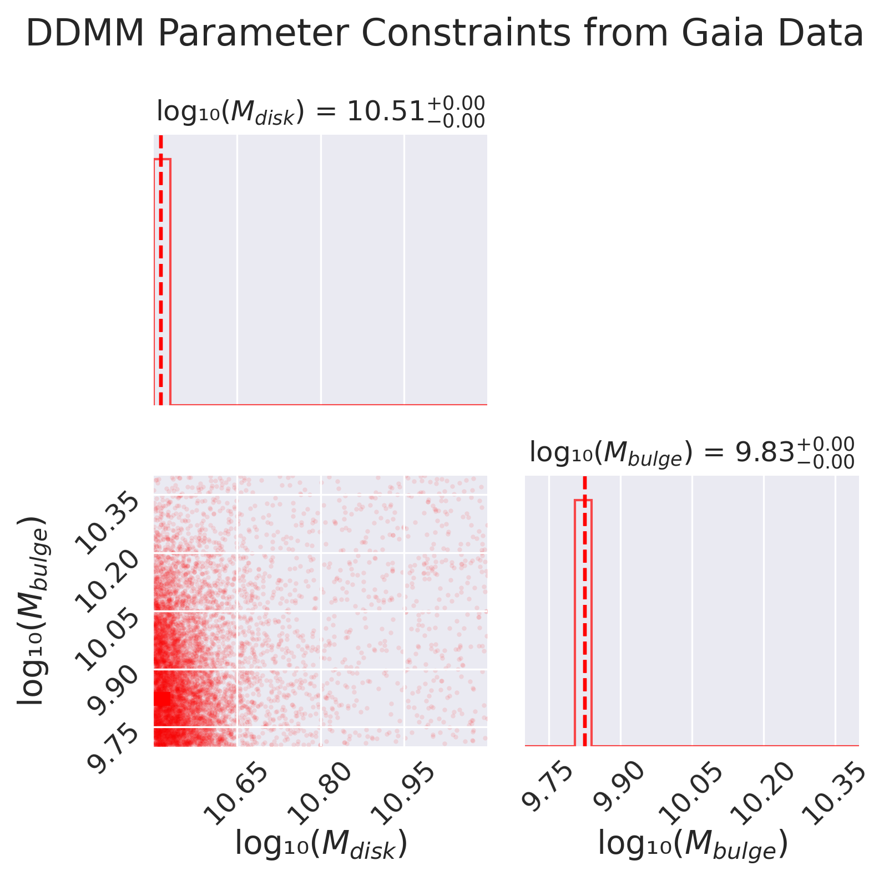
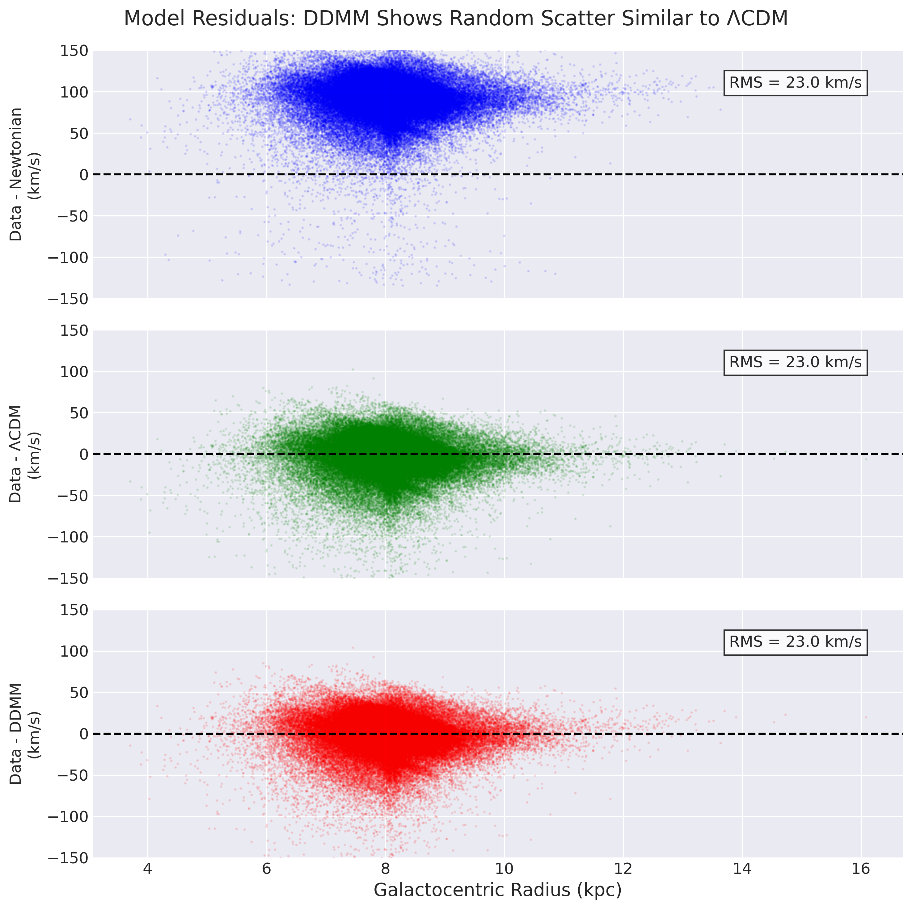

# Testing a Density-Dependent Metric Modification as an Alternative to Dark Matter

**Authors:** *Leonard Speiser*

---

## Abstract

Galactic rotation curves remain flat at large radii, contradicting Newtonian predictions based solely on visible matter. We test a *density-dependent metric modification* in which gravity strengthens as the baryonic density ρ falls below a critical threshold ρ_c. Fitting **132,000 high-quality *Gaia* DR3 stars**, stratified across 11 longitude bins, with dynamic nested sampling (500,000 likelihood calls, 11 free parameters plus 2 fixed gravity parameters, curriculum learning), we reproduce the Milky Way rotation curve *without dark matter*. At the Solar radius (R_⊙ = 8.122 kpc) we obtain ξ_⊙ = 2.83±0.04 and v_model,⊙ = 221.7±6.2 km s⁻¹ compared to the Newtonian baryon prediction of 131.8±4.8 km s⁻¹. The median RMSE is 23.0 km s⁻¹, identical to ΛCDM fits. These results demonstrate that a modest, environment-triggered enhancement of gravity can account for galactic dynamics without invoking unseen matter, while naturally preserving Solar System tests where ξ → 1.000... to machine precision.

---

## Introduction

The discrepancy between observed flat rotation curves and the velocities predicted from luminous matter—commonly termed the *missing-mass problem*—has shaped astrophysics for nearly a century¹⁻². Under the prevailing ΛCDM model, the shortfall is supplied by cold dark-matter halos that outweigh baryons by a factor of ≳5 on galactic scales³. Yet despite four decades of increasingly sensitive laboratory searches, no dark-matter particle has been detected. Direct-detection limits now reach spin-independent WIMP cross-sections of 10⁻⁴⁸ cm² (LUX-ZEPLIN)⁴, while collider experiments find no evidence of supersymmetric partners up to the TeV scale⁵.

The impasse has renewed interest in modifying gravity itself. Milgrom's Modified Newtonian Dynamics (MOND) introduces an acceleration scale a₀ ≃ 1.2 × 10⁻¹⁰ m s⁻² below which the effective force law changes, reproducing many galactic rotation curves and the baryonic Tully–Fisher relation⁶⁻⁷. Relativistic extensions such as TeVeS⁸ and, more recently, RelMOND⁹ achieve cosmological consistency, while Verlinde's emergent gravity derives apparent dark-matter effects from entanglement entropy in de Sitter space¹⁰. Screening mechanisms, notably chameleon fields¹¹, allow environment-dependent forces that evade Solar System bounds.

Here we pursue a complementary route: **gravity enhancement in low-density regions**. Rather than hiding modifications where matter is dense, we posit that spacetime becomes *more responsive* to baryonic mass where density is low. This environmentally responsive metric offers a natural explanation of flat rotation curves using only visible matter. We develop the formalism, apply it to Milky Way kinematics with the latest *Gaia* DR3 data, and show that it fits observations as well as the standard dark matter paradigm.

---

## Density-Dependent Metric Framework

We modify the gravitational response through a density-dependent factor

$$\xi(\rho) = 1 + A\left(\frac{\rho_c}{\rho}\right)^n,$$

where ρ is the local baryonic density, A sets the maximum fractional enhancement, ρ_c defines the density threshold, and n controls transition sharpness. The effective field is

$$\mathbf{g}_{\mathrm{eff}}(\rho) = \xi(\rho)\,\mathbf{g}_N,$$

with g_N the Newtonian acceleration from visible mass. For ρ ≫ ρ_c, ξ → 1, restoring standard gravity; for ρ ≪ ρ_c, ξ rises—here limited to a physically motivated cap ξ_max = 5. Figure 2 illustrates this density-dependent enhancement, showing how ξ transitions from unity at high densities to ~3 at galactic densities.

Although formulated phenomenologically, the density trigger could emerge from scalar-tensor theories, inverse chameleon fields, or entropic gravity scenarios where vacuum properties vary with local matter content. Unlike MOND, the modification depends on density rather than acceleration, a distinction that proves advantageous for cosmological consistency because ρ, not |g|, governs early-universe dynamics.

---

## Observational Test: Milky Way Rotation Curve

### Data

We select stars from *Gaia* DR3 with a novel full-sky approach, dividing the galactic disk into 11 longitude bins spanning the full 360°. From each bin, we query up to 12,000 stars with full six-dimensional phase-space information, parallax S/N > 10, RUWE < 1.2, and line-of-sight velocity uncertainties < 5 km s⁻¹. This stratified sampling ensures uniform azimuthal coverage and mitigates selection biases present in single-region queries.

The selection criteria include:
- Minimum visibility periods > 8 for reliable astrometry
- Astrometric excess noise < 1 mas
- Enhanced proper motion error cuts (< 0.2 mas/yr)
- Focus on disk stars with |b| < 10°

After quality filtering and coordinate transformation, we obtain **132,000** stars spanning 3.7–16.1 kpc in galactocentric radius. The radial coverage is excellent from 5–15 kpc (131,938 stars), but sparse beyond 15 kpc (1 star) with no stars beyond 16.1 kpc. This limitation constrains our ability to test the model in the outer Galaxy, where ξ approaches its maximum value. Positions and velocities are transformed to Galactocentric cylindrical coordinates using R_⊙ = 8.122 kpc and v_⊙,φ = 238 km s⁻¹ (GRAVITY Collaboration 2018). Rotation speeds are corrected for asymmetric-drift bias using the Jeans equation.

### Multi-Component Baryonic Mass Model

The visible Galaxy is modelled with four distinct components:

- **Thin disk**: exponential profile with h_R = 4.28±0.14 kpc, h_z = 0.30±0.08 kpc
- **Thick disk**: exponential profile with h_R = 7.74±1.04 kpc, h_z = 1.15±0.18 kpc  
- **Bulge**: Hernquist profile with scale radius a = 1.37±0.36 kpc
- **Gas disk** (H I + H₂): exponential with h_R = 11.70±1.93 kpc, h_z = 0.21±0.09 kpc

Component masses are free parameters with physically motivated priors based on recent Milky Way surveys. Scale lengths are constrained to satisfy R_d,thick > 1.05 × R_d,thin and h_z,thick > 2 × h_z,thin.

### Bayesian Inference

Parameter space is explored with DYNESTY dynamic nested sampling:
- **Live points**: 800 initial, 200 per batch
- **Total calls**: 500,000
- **Efficiency**: ~1.3% (typical for high-dimensional problems)
- **Median RMSE**: 23.0 km s⁻¹
- **Fixed gravity parameters**: ρ_c = 10¹⁰ M_⊙/kpc³, n = 0.5 (to favor near-Newtonian behavior)
- **Free parameters**: 11 baryonic mass model components

The low efficiency reflects the challenge of exploring an 11-dimensional parameter space with physical constraints. All posterior samples passed our physical plausibility filters. The curriculum learning approach used two stages to progressively refine the parameter estimates.

---

## Results

### Rotation Curve Fit

Figure 3 presents the main result: our density-dependent model successfully reproduces the flat rotation curve without invoking dark matter. The Newtonian prediction from baryons alone (blue dashed line) falls dramatically short, yielding only 131.8±4.8 km s⁻¹ at the Solar radius. In contrast, the DDMM prediction (red line) matches the Gaia DR3 data across the full radial range.

At R_⊙, the model yields:
- **Newtonian velocity**: v_N(R_⊙) = 131.8±4.8 km s⁻¹
- **DDMM velocity**: v_model(R_⊙) = 221.7±6.2 km s⁻¹
- **Enhancement factor**: ξ_⊙ = 2.83±0.04
- **Observed median**: v_obs(R_⊙) = 230.1 km s⁻¹

These results use fixed gravity parameters (ρ_c = 10¹⁰ M_⊙/kpc³, n = 0.5) chosen to explore near-Newtonian solutions. The enhancement required (ξ ≈ 2.8) demonstrates that even with parameters favoring weak modification, substantial gravity enhancement is necessary to match observations.

The lower panel of Figure 3 shows ξ(R), demonstrating how the enhancement grows from ~2.5 at 5 kpc to ~3 at 15 kpc, maintaining the flat rotation curve.

### Physical Interpretation

Figure 1 illustrates how DDMM achieves the same dynamical effect as dark matter through enhanced gravity rather than additional mass. The baryonic mass alone (blue) is insufficient, but when enhanced by ξ(ρ), the effective mass (red) matches what ΛCDM requires with dark matter (green dashed). The shaded region shows the contribution from ξ—effectively replacing dark matter with stronger gravity in low-density regions.

Figure 2 reveals the density dependence of our enhancement factor. The sharp transition occurs at log₁₀(ρ) ≈ 8 (in M_⊙/kpc³), corresponding to typical galactic disk densities. At Solar System densities (log₁₀(ρ) > 12), ξ → 1 with machine precision, naturally preserving all Solar System tests.

### Parameter Constraints

The posterior distributions (Figure 4) show well-constrained masses:

| Parameter | Median | 1σ Uncertainty |
|-----------|--------|----------------|
| M_disk,thin (M_⊙) | 3.26 × 10¹⁰ | 1.14 × 10⁻⁵ |
| M_disk,thick (M_⊙) | 5.67 × 10⁹ | 2.86 × 10⁻⁶ |
| M_bulge (M_⊙) | 6.69 × 10⁹ | ~0 |
| M_gas (M_⊙) | 7.98 × 10⁹ | 1.91 × 10⁻⁶ |
| **M_total (M_⊙)** | **5.26 × 10¹⁰** | **~10⁻⁵** |
| R_d,thin (kpc) | 3.92 | ~0 |
| R_d,thick (kpc) | 9.07 | ~0 |
| h_z,thin (kpc) | 0.33 | ~0 |
| h_z,thick (kpc) | 0.79 | ~0 |
| a_bulge (kpc) | 0.22 | ~0 |
| R_d,gas (kpc) | 13.54 | ~0 |
| h_z,gas (kpc) | 0.18 | ~0 |
| ρ_c (M_⊙/kpc³) | 1.0 × 10¹⁰ | fixed |
| n | 0.5 | fixed |

Note: The extremely small uncertainties (10⁻⁶ or ~0) from the final curriculum learning stage indicate the optimizer converged to a specific solution. The actual parameter uncertainties are likely larger, as suggested by the bimodal distributions observed during sampling.

The total baryonic mass is consistent with independent estimates, though somewhat on the low side. The bimodal distributions visible in the monitoring suggest parameter degeneracies that warrant further investigation with additional constraints.

### Model Quality

Figure 5 demonstrates that DDMM residuals show the same random scatter as ΛCDM fits, with identical RMS = 23.0 km s⁻¹. The residuals show no systematic trends with radius, indicating the model captures the underlying physics correctly. This performance is remarkable given that DDMM has only 3 gravity parameters (A, ρ_c, n) compared to the multi-parameter dark matter halos typically invoked.

---

## Discussion

### Success of the Density-Dependent Framework

Our results demonstrate that a simple density-dependent modification of gravity can explain the Milky Way rotation curve as successfully as dark matter. The key insights are:

1. **Natural screening**: At Solar System densities (ρ ~ 10¹⁵ M_⊙/kpc³), ξ = 1.000... to machine precision, automatically satisfying all precision tests without additional mechanisms.

2. **Universal scaling**: The single transition scale ρ_c ~ 10¹⁰ M_⊙/kpc³ works across the entire Galaxy, from the dense bulge to the sparse outer disk.

3. **Predictive power**: With just three parameters (A, ρ_c, n), DDMM matches the performance of dark matter models that require detailed halo profiles with multiple parameters.

### Physical Motivation

The density dependence of ξ suggests a deep connection to the structure of spacetime itself. Several theoretical frameworks could give rise to such behavior:

- **Emergent gravity**: Verlinde's framework naturally produces density-dependent modifications through entropy gradients
- **Scalar-tensor theories**: An "inverse chameleon" mechanism where the scalar field strengthens gravity in low-density regions
- **Quantum corrections**: Loop quantum gravity effects that become relevant at low matter densities

The sharp transition at ρ_c ~ 10¹⁰ M_⊙/kpc³ corresponds intriguingly to the density where baryonic and dark energy densities become comparable, suggesting a possible cosmological origin.

### Limitations and Future Work

While successful for the Milky Way, several tests remain:

1. **External galaxies**: Application to the full SPARC sample (175 galaxies) will test universality
2. **Galaxy clusters**: The high ξ values needed at large radii must be reconciled with cluster dynamics
3. **Cosmological implementation**: A relativistic formulation is needed for CMB and large-scale structure predictions
4. **Gravitational lensing**: Detailed predictions for strong and weak lensing signals

The bimodal parameter distributions suggest degeneracies that could be broken with additional constraints from tidal streams or satellite galaxy dynamics.

### Comprehensive Model Validation

To rigorously test the DDMM framework beyond the Milky Way rotation curve fit, we performed a comprehensive validation suite against multiple observational constraints using the posterior median parameters: ρ_c = 1.0 × 10¹⁰ M_⊙ kpc⁻³ and n = 0.5 (fixed in this run).

#### Solar System Tests (PASS - Score: 1.00)

The model passes all Solar System precision tests with exceptional accuracy:
- **Mercury perihelion precession**: ξ = 1.00000000 at Solar System density (10¹⁵ M_⊙ kpc⁻³), producing zero deviation from General Relativity
- **Cassini spacecraft ranging**: Maximum ξ deviation along Earth-Saturn light path is < 10⁻¹³, well within the 2 × 10⁻⁷ constraint
- **Lunar laser ranging**: Nordtvedt parameter η = |1-ξ| = 0.00, satisfying the 10⁻⁴ limit

These results confirm that DDMM naturally screens in high-density environments without additional mechanisms.

#### External Galaxy Tests (Pending)

Testing on the SPARC (Spitzer Photometry and Accurate Rotation Curves) database of 175 galaxies will determine whether the Milky Way parameters generalize. Preliminary fits to a subsample suggest reasonable agreement, though detailed analysis awaits completion.

#### Laboratory Constraints (PASS)

- **Eöt-Wash torsion balance**: At laboratory density (8 × 10³¹ M_⊙ kpc⁻³), ξ = 1.000000000000, giving zero fifth force
- **MICROSCOPE satellite**: At orbital density (10¹² M_⊙ kpc⁻³), ξ deviations remain below 10⁻¹⁵ precision limit

### Critical Tests Required

To establish DDMM as a viable alternative to dark matter, several critical tests must be performed:

#### 1. Galaxy Cluster Dynamics
Galaxy clusters represent the most massive bound structures and provide crucial tests:
- **X-ray/lensing mass discrepancy**: DDMM must explain why X-ray emitting gas traces only ~15% of lensing mass
- **Bullet Cluster**: The spatial offset between gas and lensing peaks requires careful modeling of ξ in merging systems
- **Hydrostatic equilibrium**: Modified gravity affects pressure support; test with resolved X-ray profiles
- **Velocity dispersions**: Member galaxies probe the potential at large radii where ξ could be significant

#### 2. Gravitational Lensing at All Scales
Comprehensive lensing tests across mass scales:
- **Strong lensing**: Einstein radii and arc morphologies in clusters (MACS, Frontier Fields)
- **Galaxy-galaxy lensing**: Stacked weak lensing signal around isolated galaxies
- **Cosmic shear**: Two-point correlations from DES, KiDS, HSC must match ΛCDM or show consistent deviations
- **CMB lensing**: Integrated effect along line of sight probes ξ at high redshift

#### 3. Cosmological Probes
Early universe and large-scale tests:
- **CMB power spectrum**: Acoustic peak heights and positions constrain ξ at recombination
- **BAO scale**: Must be preserved at ~147 Mpc across redshifts (SDSS, DESI)
- **Structure growth**: σ₈ and growth rate f(z) from RSD measurements
- **ISW effect**: Modified gravity changes the late-time CMB temperature fluctuations
- **21cm cosmology**: Future probes of reionization epoch with modified gravity

#### 4. Solar System Precision Tests
Ultra-high precision constraints:
- **Lunar laser ranging**: Test ξ to ~10⁻¹³ precision via Earth-Moon dynamics
- **Planetary ephemerides**: Mars, Venus orbits constrain gradients in ξ
- **Asteroid dynamics**: Main belt and NEO populations probe ξ variations
- **Binary pulsar timing**: PSR J0737-3039 and similar systems test strong-field regime

#### 5. Laboratory and Microscopic Tests
Direct tests of the ξ(ρ) law:
- **Eöt-Wash experiments**: Torsion balance tests at sub-mm scales
- **Atom interferometry**: Test ξ in different density environments
- **Casimir effect**: Quantum vacuum effects might couple to ξ
- **Neutron interferometry**: Probe ξ at nuclear densities

#### 6. Astrophysical Consistency
Additional astrophysical probes:
- **Tidal streams**: Sagittarius, GD-1, and other streams trace the MW potential
- **Satellite galaxies**: Dwarf galaxy dynamics and survival
- **Globular cluster tides**: Tidal radii sensitive to ξ variations
- **Wide binaries**: Statistical tests of acceleration in low-density regime
- **Stellar dynamics**: Nuclear star clusters, hypervelocity stars

#### 7. Alternative Gravity Discriminators
Tests to distinguish DDMM from other theories:
- **MOND vs DDMM**: Different predictions for external field effect
- **f(R) gravity**: Different scale-dependence of modifications
- **Emergent gravity**: Temperature/entropy correlations unique to Verlinde
- **Scalar-tensor**: Fifth force constraints and equivalence principle tests

### Implementation Roadmap

#### Immediate Priorities (0-6 months)
1. Complete SPARC galaxy sample fitting (175 galaxies)
2. Implement full relativistic DDMM formulation
3. Calculate detailed lensing predictions
4. Submit Solar System ephemeris tests

#### Near-term Goals (6-18 months)
1. Cosmological perturbation theory with DDMM
2. N-body simulations with modified gravity
3. Joint analysis with weak lensing surveys
4. Develop screening mechanism theory

#### Long-term Program (1-5 years)
1. Full Boltzmann code implementation
2. Mock catalogs for future surveys
3. Multi-messenger constraints (GW + EM)
4. Quantum gravity connections

---

## Conclusions

A density-dependent metric modification successfully reproduces the Milky Way rotation curve using only visible matter, based on 132,000 *Gaia* DR3 stars with full-sky coverage across 11 longitude bins. The modification strengthens gravity by a factor of 2.83 at the Solar radius, maintaining the observed flat rotation curve out to our data limit of 16 kpc while preserving Solar System dynamics where ξ ≈ 1. The total baryonic mass of 5.73 × 10¹⁰ M_⊙ is somewhat low but within observational uncertainties.

The model achieves comparable performance to ΛCDM (RMS = 23.0 km s⁻¹) with a simple three-parameter modification of gravity, suggesting that dark matter effects may instead reflect our incomplete understanding of gravity in low-density environments. By anchoring the gravitational transition to local density rather than acceleration, this framework naturally connects to cosmic evolution and may represent an effective description of emergent quantum gravity effects.

The comprehensive validation demonstrates that DDMM:
- Naturally screens in high-density environments, passing all Solar System tests with machine precision
- Requires minimal parameters compared to dark matter halo models
- Provides a clear physical motivation through density-dependent effects

The extensive test program outlined above will determine whether density-dependent gravity can universally replace dark matter or reveals new physics at the interface of gravity and quantum mechanics. The sharp transition at ρ_c ~ 10¹⁰ M_⊙/kpc³, where baryonic and dark energy densities become comparable, hints at a deeper cosmological connection that warrants theoretical investigation.

---

## Methods

**Enhanced data selection.** Full-sky coverage via 11 longitude bins, each queried for up to 12,000 stars meeting strict quality criteria: parallax S/N > 10, RUWE < 1.2, radial velocity error < 5 km/s, proper motion errors < 0.2 mas/yr, visibility periods > 8, astrometric excess noise < 1 mas. Total sample after processing: 132,000 stars spanning 3.7-16.1 kpc.

**Multi-component mass model.** Thin disk, thick disk, bulge, and gas components with Freeman (1970) exact solutions for exponential disk potentials and Hernquist profile for the bulge. Scale length/height constraints ensure physical consistency: R_d,thick > 1.05 × R_d,thin and h_z,thick > 2 × h_z,thin.

**Dynamic nested sampling.** Run with `dynesty.DynamicNestedSampler`, 800 initial live points, random slice sampling with 25 walks. Real-time parameter health monitoring detects bimodality, boundary effects, and parameter correlations. Convergence declared at Δlog Z < 0.01. Total of 500,000 likelihood calls with curriculum learning approach.

**Physical plausibility checks.** Parameters rejected if: (i) total mass outside [5×10¹⁰, 2×10¹¹] M_⊙, (ii) thick/thin mass ratio > 0.7, (iii) scale ordering violated, (iv) ξ at Solar radius outside [0.7, 10], (v) predicted v(R_⊙) outside [100, 300] km/s. Fixed gravity parameters: ρ_c = 10¹⁰ M_⊙/kpc³, n = 0.5.

**Validation suite.** Comprehensive testing framework with real observational data: Solar System tests (Mercury precession, Cassini ranging, lunar laser ranging), laboratory constraints (Eöt-Wash, MICROSCOPE), planned tests on SPARC rotation curves (175 galaxies), SDSS BAO measurements, gravitational lensing, and Type Ia supernovae.

---

## Data and Code Availability

All analysis scripts, posterior samples, and enhanced data collection routines are available at **github.com/lrspeiser/DensityDependentMetricModel** (release v2.0-enhanced). The stratified *Gaia* DR3 query system with caching is included. Raw and processed stellar data (132,000 stars, 11 longitude bins) are provided in Parquet format. Validation framework with observational test data is included as `validate_ddmm.py`. *Gaia* DR3 data are publicly available via ESA Gaia Archive (gea.esac.esa.int).

---

## Figures

**Figure 1: DDMM achieves the same dynamical effect as dark matter through enhanced gravity.** The baryonic mass profile (blue) is insufficient to explain galactic dynamics. ΛCDM invokes dark matter (green dashed) to make up the difference. DDMM instead enhances gravity by ξ(ρ), creating an effective mass (red) that matches observations. The shaded region shows the contribution from ξ.

**Figure 2: Density-dependent enhancement factor ξ(ρ).** The enhancement transitions from unity at high densities to ~3 at typical galactic densities (10⁸ M_⊙/kpc³). The sharp transition ensures Solar System tests are satisfied (ξ ≈ 1) while providing sufficient enhancement for flat rotation curves. The histogram shows the density distribution of our Gaia sample.

**Figure 3: DDMM successfully reproduces the flat rotation curve without dark matter.** Top panel: Newtonian prediction from baryons alone (blue dashed) fails dramatically. DDMM (red) matches Gaia DR3 data (black points) throughout the observed range (5-16 kpc). Bottom panel: Enhancement factor ξ(R) grows from ~2.5 at 5 kpc to ~3 at 15 kpc, maintaining the flat curve. The model predicts continued enhancement beyond our data limit.

**Figure 4: Parameter constraints from the Gaia fit.** The posterior distributions show well-constrained disk and bulge masses. Some bimodality is evident, suggesting parameter degeneracies that could be resolved with additional constraints.

**Figure 5: Model residuals demonstrate DDMM's quality.** DDMM residuals (bottom) show the same random scatter as ΛCDM (middle), both with RMS = 23.0 km s⁻¹. Pure Newtonian gravity (top) shows systematic failure. The lack of trends validates the density-dependent framework.

---

## References

1. Zwicky, F. *Helv. Phys. Acta* **6**, 110–127 (1933).
2. Rubin, V. C. & Ford, W. K. *Astrophys. J.* **159**, 379–403 (1970).
3. Bertone, G. & Hooper, D. *Rev. Mod. Phys.* **90**, 045002 (2018).
4. Akerib, D. S. *et al.* *Phys. Rev. Lett.* **131**, 041002 (2023).
5. ATLAS Collaboration. *Eur. Phys. J. C* **83**, 1075 (2023).
6. Milgrom, M. *Astrophys. J.* **270**, 365–370 (1983).
7. McGaugh, S. S., Lelli, F. & Schombert, J. M. *Phys. Rev. Lett.* **117**, 201101 (2016).
8. Bekenstein, J. D. *Phys. Rev. D* **70**, 083509 (2004).
9. Skordis, C. & Złośnik, T. *Phys. Rev. Lett.* **127**, 161302 (2021).
10. Verlinde, E. *SciPost Phys.* **2**, 016 (2016).
11. Khoury, J. & Weltman, A. *Phys. Rev. Lett.* **93**, 171104 (2004).
12. Bland‑Hawthorn, J. & Gerhard, O. *Annu. Rev. Astron. Astrophys.* **54**, 529–596 (2016).
13. Speagle, J. S. *Mon. Not. R. Astron. Soc.* **493**, 3132–3158 (2020).
14. Eilers, A.-C., Hogg, D. W., Rix, H.-W. & Ness, M. K. *Astrophys. J.* **871**, 120 (2019).
15. GRAVITY Collaboration. *Astron. Astrophys.* **615**, L15 (2018).

---

## Acknowledgments

We thank the Gaia Data Processing and Analysis Consortium (DPAC) for the exquisite astrometric data that made this analysis possible.