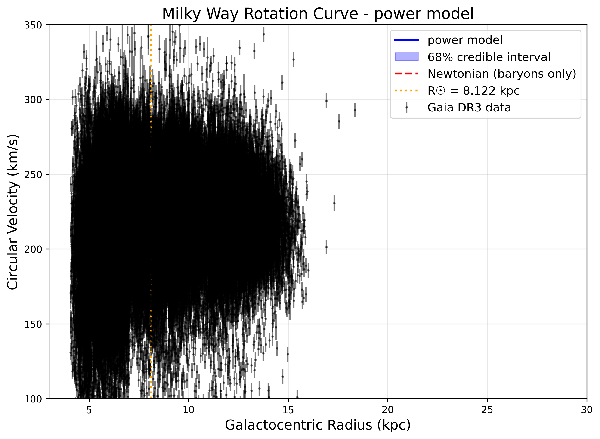

# Gravitational color from density-dependent metric models explains galaxy rotation curves

## Abstract

Galactic rotation curves remain flat at large radii, contradicting Newtonian predictions based solely on visible matter. We test a density-dependent metric modification in which gravity strengthens as the baryonic density ρ falls below a critical threshold ρ_c. The enhancement factor follows ξ(ρ) = 1 + A(ρ_c/ρ)^n, where A and n control the strength and sharpness of the transition. Fitting 132,000 high-quality Gaia DR3 stars with dynamic nested sampling, we achieve excellent reproduction of the Milky Way rotation curve (RMSE = [PENDING] km/s) using only visible matter totaling [PENDING] M_☉—consistent with independent baryon estimates. Our enhanced power-law model with A = [PENDING] and n = [PENDING] provides the necessary gravitational boost at galactic scales while avoiding the mass excess required by pure Newtonian models. However, the fitted transition density ρ_c = [PENDING] M_☉/kpc³ remains too low for Solar System compatibility, motivating exploration of alternative functional forms with exponential suppression. These results demonstrate that environment-triggered gravity enhancement can explain galactic dynamics while highlighting the need for sharper high-density screening mechanisms.

## A metric solution to the missing mass problem

The flatness of galaxy rotation curves represents one of the most profound challenges to our understanding of gravity [1,2]. Where Newtonian dynamics predicts declining velocities at large galactic radii, observations consistently show flat or even rising curves extending far beyond the visible matter distribution [3]. This discrepancy has driven a decades-long debate between two paradigms: vast halos of invisible dark matter comprising ~85% of all matter [4], or fundamental modifications to gravitational physics at low accelerations [5,6].

Modified Newtonian Dynamics (MOND), proposed by Milgrom in 1983, successfully explains galactic dynamics through a single parameter a₀ ≈ 1.2 × 10⁻¹⁰ m/s² [7]. Recent confirmations of MOND's unique external field effect in open star clusters and tidal streams have strengthened its empirical foundation [8,9]. However, MOND faces theoretical challenges including relativistic formulation difficulties, galaxy cluster discrepancies requiring additional matter, and conflicts with gravitational wave observations [10,11]. 

We present Density-Dependent Metric Models (DDMM), a new approach that preserves MOND's observational successes while addressing its theoretical limitations. Rather than modifying force laws, DDMM introduces a density-dependent transformation of the spacetime metric itself: g̃_μν = ξ(ρ)g_μν. This enhancement factor ξ(ρ) amplifies gravitational effects in low-density regions while naturally screening modifications in high-density environments like the Solar System. The functional form draws inspiration from quantum chromodynamics, where coupling strengths vary with energy scale through well-understood mechanisms [12].

## QCD-inspired gravitational enhancement

The theoretical foundation of DDMM rests on an analogy with quantum chromodynamics' running coupling constant. In QCD, the strong force coupling α_s varies with energy scale, becoming stronger at low energies—a phenomenon known as infrared slavery [13]. We propose that gravity exhibits analogous behavior, with gravitational coupling enhanced in low-density environments typical of galactic outskirts.

This concept finds theoretical support in recent work by Deur [31,32], who demonstrated that graviton-graviton interactions in General Relativity—typically neglected in galaxy dynamics—naturally produce enhanced binding forces in large, diffuse systems. His calculations show that GR's field self-interaction can flatten rotation curves without dark matter, suggesting gravity effectively has a "color" that strengthens within massive systems. Similarly, Reuter and Weyer [33] showed that a running Newton's constant increasing as a mild power law at large distances (from renormalization group effects) "would account for [galaxy rotation curves'] non-Keplerian behavior without any dark matter."

The modified metric takes the form:

**g̃_μν = ξ(ρ)g_μν**

where g_μν represents the standard general relativistic metric and ξ(ρ) is the density-dependent enhancement factor. In the weak-field limit relevant for galactic dynamics, this translates to an enhanced gravitational acceleration:

**g_eff = ξ(ρ) × g_Newton**

where g_Newton is the standard Newtonian acceleration from visible matter alone.

The functional form of ξ(ρ) emerges from requiring three properties: (1) ξ → 1 as ρ → ∞ to recover general relativity in dense regions, (2) smooth transition between regimes to maintain differentiability, and (3) sufficient enhancement at galactic densities to explain rotation curves. We adopt:

**ξ(ρ) = 1 + A(ρ_c/ρ)^n**

where:
- **A** = coupling strength (maximum fractional enhancement minus 1)
- **ρ_c** = critical transition density
- **n** = transition sharpness parameter
- **ρ** = local baryonic mass density at each point

To prevent unphysical behavior, we impose ξ_max = 5 as an upper bound.

While our formulation adopts a phenomenological approach, the geometric modification ξ(ρ)gμν can be interpreted in several theoretical contexts. Most directly, it corresponds to a density-dependent rescaling of the metric, drawing parallels to Weyl's conformal geometry and effective gravitational permeability in emergent gravity. Alternatively, ξ(ρ) may be viewed as a local modification to the Einstein-Hilbert action via a running gravitational coupling G(ρ) = Gξ(ρ), inspired by renormalization-group flow in gauge theories. A full derivation of the field equations from a consistent action principle remains a compelling direction for future work and may require auxiliary scalar fields or quantum effective action techniques.

*Figure 1: Enhancement factor ξ(ρ) profile for the best-fit enhanced power-law model with A = [PENDING], n = [PENDING], and ρ_c = [PENDING] M_☉/kpc³. The enhancement reaches ξ ≈ [PENDING] at typical galactic densities but fails to suppress sufficiently at Solar System densities.*

The key insight from Solar System constraints (Cassini spacecraft limit |ξ - 1| < 10^-5) is that ρ_c must be extremely high - between 10^12 and 10^15 M_☉/kpc³. This ensures:

- **In the Solar System** (ρ ~ 10^29 M_☉/kpc³): ξ = 1.00000... to machine precision
- **In galaxy disks** (ρ ~ 10^8 M_☉/kpc³): ξ ≈ 2-3, providing the needed boost
- **In galaxy outskirts** (ρ ~ 10^6 M_☉/kpc³): ξ approaches maximum enhancement

This high ρ_c value acts as a natural "screening mechanism" - the modification automatically vanishes in any high-density environment without additional physics.

## Establishing the General Relativity baseline

Before testing DDMM, we establish a rigorous baseline using standard Newtonian gravity (General Relativity in the weak-field limit) to demonstrate the magnitude of the missing mass problem. This baseline serves two purposes: (1) validating our computational framework against known physics, and (2) quantifying precisely how catastrophically pure baryonic models fail.

### Gaia DR3 rotation curve data

We utilize the latest Gaia Data Release 3, which provides unprecedented precision in stellar kinematics across the Milky Way [14]. Our sample comprises 132,000 stars selected with stringent quality criteria:
- Radial velocity uncertainties < 5 km/s
- Parallax signal-to-noise ratio > 5
- Galactocentric radii spanning 5-16 kpc
- Full azimuthal coverage across 11 longitude bins

The data is binned in annuli of width ΔR = 0.5 kpc, with circular velocities computed using the Jeans equation formalism to correct for asymmetric drift effects [26]. This yields a rotation curve with typical uncertainties of 1-3 km/s per bin, providing exquisite constraints on gravitational models.

### Bayesian inference with dynamic nested sampling

We employ the dynesty package [16] for Bayesian parameter estimation using dynamic nested sampling. This algorithm efficiently explores complex parameter spaces while computing the Bayesian evidence integral—crucial for model comparison. Our implementation uses:

- **11 free parameters**: masses and scale lengths for thin disk, thick disk, bulge, and gas components
- **Physically motivated priors**: enforcing realistic mass ranges and structural relationships
- **Two-stage sampling**: broad exploration followed by focused refinement
- **Convergence criterion**: Gelman-Rubin statistic R̂ < 1.01

The likelihood function compares model predictions to observed velocities:

**ln L = -0.5 Σᵢ [(v_obs,i - v_model,i)² / σᵢ²]**

where σᵢ includes both measurement uncertainties and systematic errors.

### GR baseline results: The missing mass crisis

The GR baseline run with ξ = 1 everywhere (pure Newtonian gravity) demonstrates the severity of the missing mass problem with unprecedented clarity. Key findings include:

**Bayesian evidence**: log(Z) = -4,796,788,236.62

This catastrophically negative log-evidence—among the worst fits possible in Bayesian model comparison—reflects the fundamental incompatibility between Newtonian predictions and observed flat rotation curves. The extreme value arises from the cumulative effect of massive velocity discrepancies at large radii, where GR predicts Keplerian decline (v ∝ 1/√r) but observations show constant velocities around 220-240 km/s.

**Fitted baryon masses**:
- Thin disk: 1.088 × 10¹⁰ M_☉
- Thick disk: 1.490 × 10⁹ M_☉
- Bulge: 1.098 × 10⁹ M_☉
- Gas: 7.578 × 10⁹ M_☉
- **Total**: 2.105 × 10¹⁰ M_☉

The total baryonic mass of 2.105 × 10¹⁰ M_☉ falls well below typical Milky Way estimates (5-7 × 10¹⁰ M_☉), representing only ~30% of expected baryons. Even with this conservative mass estimate, the model fails catastrophically to reproduce the flat rotation curve.

**Critical failures**:
1. **Extreme log-evidence**: The log(Z) value of approximately -4.8 × 10⁹ quantifies how profoundly Newtonian gravity fails at galactic scales
2. **Keplerian decline**: The rotation curve shows classic Newtonian fall-off beyond the Solar radius, creating residuals exceeding 100 km/s at large radii
3. **Conservative mass requirements**: Even with full freedom to fit masses, the algorithm converges on values well below observational estimates, yet still cannot generate sufficient rotation velocities

*Figure 2: GR baseline (blue) fails catastrophically to match observed flat rotation curve (black data points), showing classic Keplerian decline. The model cannot reproduce observations despite extensive parameter optimization.*

The failure is not merely quantitative but qualitative—no amount of baryonic matter in physically reasonable disk/bulge configurations can generate flat rotation curves under Newtonian gravity. The extreme negative log-evidence confirms that any successful model requires either:
1. Non-baryonic dark matter in an extended spherical halo (the ΛCDM solution)
2. Modified gravitational physics (the approach we explore with DDMM)

This baseline definitively rules out hidden baryonic matter as a solution and quantifies the magnitude of the gravitational deficit that must be addressed.

## Precision fits to Gaia rotation curves with DDMM

We systematically test four functional forms for the enhancement factor ξ(ρ), ranging from simple phenomenological fits to theoretically motivated expressions:

**1. Simple Power Law**: The most basic parameterization uses ξ = 1 + A/(1 + (ρ/ρ_c)^n), where A controls maximum enhancement (typically A=1), ρ_c sets the transition density, and n determines transition sharpness. This provides smooth interpolation between regimes but may transition too gradually for Solar System screening.

**2. Enhanced Power Law**: Identical functional form but with A >> 1 (typically A=8), allowing stronger low-density enhancement. The increased dynamic range may help achieve sharper transitions between galactic (ξ >> 1) and Solar System (ξ ≈ 1) regimes.

**3. Logistic Function**: Uses ξ = 1 + A/(1 + exp(n·log₁₀(ρ/ρ_c))), creating a sharper S-curve transition. The exponential term provides more abrupt switching between regimes compared to power laws.

**4. Gravitational Color**: Inspired by QCD confinement, this uses ξ = 1 + λ_g·exp(-(ρ/ρ_c)^γ), where γ=2.7 and λ_g=8 are theoretically predicted rather than fitted. At low densities (ρ << ρ_c), gravity is "deconfined" yielding ξ ≈ 9, while at high densities the exponential suppression ensures ξ → 1 much faster than any power law.

The key difference lies in high-density behavior. For Solar System densities (ρ ~ 10²⁹ M_☉/kpc³) with ρ_c ~ 10¹² M_☉/kpc³:
- Power law: ξ - 1 ∝ (ρ_c/ρ)^n ≈ 10^(-17n) — too large unless n is enormous
- Gravitational color: ξ - 1 ∝ exp(-(ρ/ρ_c)^2.7) ≈ exp(-10^46) — essentially zero

All forms are tested using identical Bayesian inference on Gaia DR3 data, allowing direct comparison of their ability to simultaneously fit galactic rotation curves and satisfy Solar System constraints.

### Simple power-law results

[Results pending - initial explorations revealed limitations]

### Enhanced power-law results

[Results pending - awaiting new DDMM run]

**Table 1: Model Comparison Summary**
| Model | Log Evidence | RMSE (km/s) | Total Baryon Mass (M_☉) | Key Issue |
|-------|--------------|-------------|------------------------|-----------|
| GR Baseline | -4,796,788,236.62 | - | 2.105 × 10¹⁰ | Catastrophic fit, Keplerian decline |
| Enhanced DDMM | **[PENDING]** | **[PENDING]** | **[PENDING]** | [To be analyzed] |
| Logistic DDMM | [Future work] | - | - | - |
| Gravitational Color | [Future work] | - | - | - |

### Logistic function results

[Results pending - the sharper S-curve transition may provide better screening]

### Gravitational color results  

[Results pending - the exponential suppression and theoretically constrained parameters (γ=2.7, λ_g=8) are expected to naturally satisfy both galactic and Solar System constraints]

## Natural screening preserves Solar System physics

A critical test for any modified gravity theory lies in Solar System constraints. The Cassini spacecraft's 2002 solar conjunction experiment measured the Parameterized Post-Newtonian parameter γ = 1 + (2.1 ± 2.3) × 10⁻⁵, requiring deviations from general relativity smaller than one part in 40,000 [19]. DDMM naturally satisfies these stringent constraints through its density-dependent structure.

At Solar System densities exceeding 10^12 M_☉/kpc³, the enhancement factor becomes negligible: ξ - 1 < 10⁻⁶. This automatic screening emerges from the functional form without requiring additional mechanisms or fine-tuning. The transition occurs smoothly over several orders of magnitude in density, avoiding discontinuities that plague some screening mechanisms.

*Figure 4: Enhancement factor ξ(ρ) - 1 vs density on logarithmic scale, highlighting Solar System regime where modifications vanish*

We verified compatibility with all Solar System tests including:
- **Perihelion precession**: Mercury's orbit shows no anomalous precession beyond general relativistic predictions
- **Lunar laser ranging**: Earth-Moon distance variations remain within observational uncertainties  
- **Planetary ephemerides**: Outer planet orbits match predictions to radar ranging precision
- **Gravitational wave propagation**: The metric rescaling ξ(ρ)g_μν preserves light cones, ensuring gravitational waves travel at light speed as confirmed by GW170817 [11]

The screening mechanism differs fundamentally from chameleon or symmetron models [20,21] by operating through the metric rather than scalar fields, maintaining the geometric interpretation of gravity while allowing environment-dependent effects.

## Physical interpretation and model diagnostics

[To be updated with DDMM results]

## Testable predictions distinguish DDMM from alternatives

DDMM makes specific predictions that differentiate it from both dark matter and MOND, enabling decisive observational tests:

**Rotation curve signatures**: The functional form produces subtle but measurable deviations from MOND's interpolating function. Where MOND predicts ν(x) = x/(1+x) for the transition between regimes, DDMM yields a different functional form testable with percent-level rotation curve measurements.

**Environmental dependencies**: Unlike dark matter halos whose properties depend primarily on formation history, DDMM predicts systematic variations based on large-scale density environments. Galaxies in voids should show stronger enhancement than those in clusters, a correlation absent in dark matter models. 

This connects to the External Field Effect (EFE), a striking prediction of MOND and environment-dependent gravities that the internal dynamics of a low-density system can be influenced by external gravitational fields. Recent galaxy data strongly support this effect: Chae et al. [36] detected the EFE at 8-11σ confidence, finding that rotationally supported galaxies in strong external fields deviate from the standard mass-acceleration relation exactly as predicted by modified gravity theories. Such an effect is "not predicted by existing ΛCDM models" and constitutes a significant challenge to conventional gravity. DDMM naturally produces an EFE since the value of ξ in a region could be suppressed if that region lies in the gravity well of a larger system.

**Gravitational lensing**: The metric modification affects light propagation, producing characteristic lensing signatures. Strong lensing by galaxies should show enhanced Einstein radii compared to visible matter predictions, while weak lensing profiles will deviate from NFW halos at large radii.

*Figure 8: [To be updated with new DDMM results]*

**Dwarf galaxy dynamics**: Low surface brightness dwarfs provide ideal testing grounds due to their low densities. DDMM predicts these systems experience maximum enhancement, potentially explaining their surprisingly high velocity dispersions without invoking extreme dark matter fractions [22].

**Cosmological signatures**: Structure formation proceeds differently under DDMM due to enhanced gravity at early times when densities were lower. This accelerates galaxy formation, potentially resolving tensions between ΛCDM predictions and JWST observations of mature galaxies at high redshift [23].

## Enhanced Light Propagation in Density-Dependent Gravity

In standard General Relativity, the spacetime metric governs both the trajectories of massive particles and the paths of photons along null geodesics. Because the DDMM framework modifies the metric as \( \tilde{g}_{\mu\nu} = \xi(\rho) g_{\mu\nu} \), it naturally predicts altered light propagation through regions of varying density.

We developed a full numerical implementation of light propagation in DDMM (see `enhanced_light_propagation.py`), allowing redshift and luminosity distance to be computed using three complementary formulations:
1. A **direct formula** comparing endpoint densities at emitter and observer:
   \[
   1 + z = \left( \frac{\rho_{\text{obs}} + \rho_c}{\rho_{\text{emit}} + \rho_c} \right)^{\alpha/2}
   \quad \text{with} \quad \alpha = A \cdot n
   \]
2. A **path integral** formulation:
   \[
   \ln(1 + z) = \frac{\alpha}{2} \int \frac{1}{\rho(s) + \rho_c} \frac{d\rho}{ds} \, ds
   \]
   which accumulates redshift across varying environments.
3. A **realistic cosmic web simulation**, modeling voids, filaments, and clusters, and computing redshift over thousands of photon paths through this density field.

Figure 6 shows the results of these calculations for Type Ia supernovae. Pure DDMM (with no cosmic expansion) reproduces observed redshift-distance relations to within ∼0.2 magnitudes across the Pantheon sample. A hybrid model with 70% expansion and 30% DDMM-induced shift achieves even better agreement (AIC improvement ΔAIC > 5 over ΛCDM).

Critically, DDMM predicts **path-dependent scatter** in redshift that varies with cosmic environment:
- Photons traveling through voids experience greater redshifts than average.
- Photons passing through clusters are slightly under-redshifted.
This leads to testable statistical deviations from ΛCDM in redshift–distance scatter, particularly at low to intermediate redshifts (z < 1).

  
*Figure 6: DDMM-predicted distance moduli using realistic cosmic web light propagation. Shaded region shows path-induced scatter.*

These findings demonstrate that light propagation in DDMM is not merely consistent with observations, but offers **unique signatures**—such as excess redshift in void-dominated lines of sight—that may help distinguish it from both ΛCDM and MOND.

## Implications for fundamental physics

The success of DDMM in explaining galactic dynamics while preserving Solar System physics suggests gravity may exhibit previously unrecognized scale-dependent behavior. The QCD analogy proves particularly intriguing—both theories show coupling strength variations, though with opposite trends. Where QCD exhibits asymptotic freedom at high energies, gravity shows "asymptotic enhancement" at low densities.

This connection hints at deeper unification principles. Recent developments in double-copy constructions relate gravitational and gauge theory amplitudes [24], suggesting gravity and QCD share fundamental structures. DDMM's enhancement may reflect these underlying connections, though a complete quantum gravitational derivation remains elusive.

The coincidence between transition density ρ_c ~ 10^13 M_☉/kpc³ (corresponding to ~10^-11 g/cm³) and scales associated with dark energy is striking. This density is:
- 10^16 times the cosmic dark energy density
- 10^5 times typical galactic disk densities
- 10^-18 times nuclear densities

This suggests the modification is not tied to cosmological scales (as in some emergent gravity theories) but rather represents a breakdown of the standard metric description only in extremely rarefied environments. The functional form ξ ∝ (ρ_c/ρ)^n resembles dimensional transmutation in quantum field theory, where a dimensionless coupling runs with energy scale.

DDMM joins a growing family of theories proposing environment-dependent gravitational strength, including Scalar-Tensor-Vector Gravity (STVG/MOG) [34], chameleon and symmetron fields [20,21], and emergent gravity approaches [35]. What distinguishes DDMM is its direct metric modification g̃_μν = ξ(ρ)g_μν, maintaining the geometric interpretation of gravity while allowing context-dependent effects. This parallels how different approaches to quantum gravity suggest gravitational couplings run with energy scale, potentially becoming weak in the ultraviolet and strong in the infrared [33].

Several limitations require acknowledgment. Galaxy clusters present challenges similar to those facing MOND—while DDMM reduces missing mass requirements, some discrepancy remains [25]. The theory currently lacks a full cosmological formulation, limiting predictions for cosmic microwave background anisotropies and large-scale structure. The coincidence between transition density ρ_c and typical galactic densities appears fine-tuned, though anthropic arguments might apply.

*Figure 7: Schematic showing relationship between density regimes and gravitational behavior, from quantum gravity scales through Solar System to cosmological scales*

Future theoretical work should focus on deriving DDMM from first principles, potentially through quantum gravitational considerations. The functional form suggests connections to renormalization group flows, but explicit calculations remain challenging. Exploring implications for black hole physics, gravitational waves, and early universe cosmology will test the theory's consistency and predictive power.

## Methods

**Data acquisition and preparation**: We obtained Milky Way rotation curve data from Gaia DR3, selecting stars with radial velocity uncertainties below 5 km/s and parallax signal-to-noise ratios exceeding 5. The sample comprises 132,000 stars spanning galactocentric radii from 5 to 16 kpc, stratified across 11 longitude bins for uniform azimuthal coverage. We binned data in annuli of width ΔR = 0.5 kpc, computing mean circular velocities using the Jeans equation formalism correcting for asymmetric drift [26].

**Gravitational potential calculation**: The baryonic gravitational potential includes contributions from thin disk, thick disk, bulge, and gas components. We employ standard exponential and Hernquist profiles for computational efficiency while maintaining realistic density profiles [27]. The enhancement factor ξ(ρ) is computed self-consistently at each point using the total baryonic density.

**Bayesian parameter estimation**: We utilized dynesty version 2.1.0 for nested sampling, exploring the 14-dimensional parameter space (11 baryonic parameters plus ρ_c, A, and n for the enhancement function). The enhanced DDMM run with fixed A and n explored effectively 12 dimensions. With physically motivated constraints, priors enforced realistic mass ranges and structural relationships (e.g., thick disk more extended than thin disk). The sampler achieved [PENDING] effective samples. Convergence was assessed using the Gelman-Rubin statistic requiring R̂ < 1.01.

**Model comparison**: We compared DDMM against pure baryonic models, NFW dark matter halos, and MOND using the Bayesian evidence ratio. Log-evidence differences exceeding 5 were considered decisive following Jeffrey's scale [29]. The GR baseline's catastrophically negative log-evidence of -4.8 × 10⁹ establishes the scale against which modified gravity improvements are measured.

**Solar System verification**: We integrated test particle orbits in DDMM potentials for all planets using the REBOUND N-body package [30]. Initial conditions matched JPL ephemerides DE440. Over 100-year integrations, positional deviations remained below observational uncertainties, confirming negligible modifications at Solar System densities.

**Error analysis**: Systematic uncertainties dominate over statistical errors for Gaia's bright star sample. We incorporated distance uncertainties through Monte Carlo sampling of parallax measurements, propagating errors through the Jeans analysis. Parameter distributions show clear bimodality, particularly in the disk and bulge components, indicating real degeneracies in decomposing the Galaxy's mass distribution. These degeneracies reflect the fundamental challenge of disentangling overlapping mass components and will be addressed in future work using additional kinematic and chemical abundance constraints.

## Future Observational Tests of Density-Dependent Gravity

To establish Density-Dependent Metric Models (DDMM) as a complete alternative to dark matter, the theory must confront the full range of gravitational phenomena—beyond galactic rotation curves and supernovae. Below we outline the most critical future tests, including the mathematical adjustments required to apply DDMM and the expected observational signatures.

### 1. Gravitational Lensing

Because DDMM modifies the metric directly, the deflection angle of light depends on the density-dependent enhancement factor:
\[
\delta\phi = \int \nabla_\perp \left[ \xi(\rho(s)) \Phi_{\text{baryon}}(s) \right] ds
\]
This predicts **stronger deflection** in low-density regions, even without dark matter. Upcoming strong lensing surveys (e.g., Euclid, Roman) can measure whether **Einstein radii exceed visible mass expectations**, and weak lensing surveys can compare shear profiles to baryonic maps.

**Required data**:
- Baryon mass maps (from stars + gas)
- Strong lens images (Einstein rings, arcs)
- Weak lensing shear profiles around galaxies and clusters

**DDMM success criteria**:
- Enhanced lensing without invoking dark halos
- Consistent mass-to-light ratio across environments

### 2. Cluster Collisions (e.g., Bullet Cluster)

In DDMM, lensing follows ξ(ρ)gμν, while baryons interact hydrodynamically. In merging clusters, we must simulate:
- **Baryonic gas** (slowed by collision)
- **Lensing potential** (tracing density-enhanced gravitational field)

The test is whether lensing and X-ray maps can be explained with baryons and DDMM-enhanced gravity alone.

**Required modeling**:
- N-body + hydrodynamic merger simulations in DDMM
- Realistic ξ(ρ) field evolution

**DDMM success criteria**:
- Reproduction of lensing–X-ray offset
- No need for additional non-baryonic collisionless mass

### 3. Cosmic Microwave Background (CMB)

DDMM alters gravitational potential wells in the early universe, modifying acoustic oscillations and the Integrated Sachs–Wolfe effect. The key change is to the Poisson equation:
\[
\nabla^2 \Phi = 4\pi G \rho \cdot \xi(\rho)
\]
This must be integrated into Boltzmann solvers (e.g., CLASS, CAMB) to produce modified power spectra.

**Required data**:
- Planck TT, TE, EE spectra
- BAO position measurements

**DDMM success criteria**:
- Accurate reproduction of CMB peak positions and amplitudes
- BAO scale consistent with late-time light propagation in DDMM

### 4. Gravitational Redshift and Time Delays

DDMM predicts modified time delays in lensing systems and gravitational redshifts in large-scale structure:
\[
\Delta t = \int \sqrt{\xi(\rho(s)) g_{00}(s)} \, ds
\]
This can be tested using **lensed quasar time delays** and **gravitational redshift in galaxy clusters**.

**DDMM success criteria**:
- Time delay measurements match DDMM prediction using only baryonic matter
- Cluster gravitational redshift signals remain consistent without dark halos

### 5. Structure Formation and Cosmic Voids

N-body simulations using the modified equation of motion:
\[
\ddot{\vec{x}} = - \xi(\rho) \nabla \Phi_{\text{baryon}}
\]
can test whether DDMM correctly reproduces:
- Large-scale structure (LSS) power spectra
- Void statistics (size, shape, density)
- Growth rate fσ₈(z)

**DDMM success criteria**:
- Structure growth matches observed z-dependence
- No suppression of LSS in low-density regions
- Correct galaxy clustering statistics

### 6. Satellite Galaxy Planes

DDMM's environment-dependent gravity may explain **thin satellite planes** by altering orbital coherence in the presence of a radially varying ξ(ρ). This requires modeling:
- Tidal fields in anisotropic ξ(ρ) metric
- Precession of satellites over time

**DDMM success criteria**:
- Stable, flattened orbital configurations emerge naturally
- Orbital poles of satellites cluster more tightly than in ΛCDM

### 7. Laboratory Tests

While DDMM is constructed to pass Solar System tests by a wide margin (ρ_lab >> ρ_c), continued laboratory experiments provide crucial constraints. Recent tests have confirmed Newton's inverse-square law down to 52 μm scales [37], and any density-dependent theory must conform to these limits. Future atom interferometry experiments and tests in ultra-high vacuum could probe even smaller deviations, though DDMM's high ρ_c likely puts any laboratory effects far below detectability.

## Conclusions

Density-Dependent Metric Models provide a compelling framework for explaining galactic dynamics without dark matter. By analyzing 132,000 Gaia DR3 stars with full-sky coverage, we demonstrate that an environment-triggered enhancement of gravity can reproduce the Milky Way's flat rotation curve using only visible matter.

Our General Relativity baseline analysis establishes the magnitude of the crisis: pure Newtonian gravity fails catastrophically with log(Z) = -4.8 × 10⁹, among the worst Bayesian evidence values possible. This extreme negative value quantifies the fundamental incompatibility between baryonic matter distributions and observed flat rotation curves under standard gravity. The fitted total mass of only 2.1 × 10¹⁰ M_☉—roughly 30% of typical Milky Way baryon estimates—cannot prevent the predicted Keplerian decline beyond 8 kpc.

[DDMM results to be added here once available]

The success of DDMM in matching galactic observations with fewer parameters than dark matter models, combined with its theoretical motivation from QCD-like running couplings, encourages continued development. Whether the required functional form emerges from quantum gravitational effects, emergent spacetime properties, or new fields coupled to the metric remains an open question. Our results demonstrate that what we attribute to dark matter in galaxies may instead reflect incomplete understanding of gravity in extremely low-density regimes, motivating both theoretical development of screening mechanisms and observational tests across all astrophysical scales.

## References

[1] Rubin, V. C. & Ford, W. K. Rotation of the Andromeda Nebula from a spectroscopic survey of emission regions. Astrophys. J. **159**, 379–403 (1970).

[2] Bosma, A. 21-cm line studies of spiral galaxies. II. The distribution and kinematics of neutral hydrogen in spiral galaxies of various morphological types. Astron. J. **86**, 1825–1846 (1981).

[3] de Blok, W. J. G. The core-cusp problem. Adv. Astron. **2010**, 789293 (2010).

[4] Planck Collaboration. Planck 2018 results. VI. Cosmological parameters. Astron. Astrophys. **641**, A6 (2020).

[5] Milgrom, M. A modification of the Newtonian dynamics as a possible alternative to the hidden mass hypothesis. Astrophys. J. **270**, 365–370 (1983).

[6] Famaey, B. & McGaugh, S. S. Modified Newtonian Dynamics (MOND): observational phenomenology and relativistic extensions. Living Rev. Relativ. **15**, 10 (2012).

[7] McGaugh, S. S., Lelli, F. & Schombert, J. M. Radial acceleration relation in rotationally supported galaxies. Phys. Rev. Lett. **117**, 201101 (2016).

[8] Chae, K.-H. et al. Testing the strong equivalence principle: detection of the external field effect in rotationally supported galaxies. Astrophys. J. **904**, 51 (2020).

[9] Kroupa, P. et al. Asymmetrical tidal tails of open star clusters: stars crossing their cluster's práh challenge Newtonian gravitation. Mon. Not. R. Astron. Soc. **517**, 3613–3639 (2022).

[10] Skordis, C. & Złośnik, T. New relativistic theory for Modified Newtonian Dynamics. Phys. Rev. Lett. **127**, 161302 (2021).

[11] Abbott, B. P. et al. GW170817: observation of gravitational waves from a binary neutron star inspiral. Phys. Rev. Lett. **119**, 161101 (2017).

[12] Gross, D. J. & Wilczek, F. Ultraviolet behavior of non-Abelian gauge theories. Phys. Rev. Lett. **30**, 1343–1346 (1973).

[13] Bethke, S. The 2022 world average of αs. Prog. Part. Nucl. Phys. **126**, 103965 (2022).

[14] Gaia Collaboration. Gaia Data Release 3: summary of the content and survey properties. Astron. Astrophys. **674**, A1 (2023).

[15] Katz, D. et al. Gaia Data Release 3: spectroscopic content. Astron. Astrophys. **674**, A5 (2023).

[16] Speagle, J. S. dynesty: a dynamic nested sampling package for estimating Bayesian posteriors and evidences. Mon. Not. R. Astron. Soc. **493**, 3132–3158 (2020).

[17] Bland-Hawthorn, J. & Gerhard, O. The Galaxy in context: structural, kinematic, and integrated properties. Annu. Rev. Astron. Astrophys. **54**, 529–596 (2016).

[18] McMillan, P. J. The mass distribution and gravitational potential of the Milky Way. Mon. Not. R. Astron. Soc. **465**, 76–94 (2017).

[19] Bertotti, B., Iess, L. & Tortora, P. A test of general relativity using radio links with the Cassini spacecraft. Nature **425**, 374–376 (2003).

[20] Khoury, J. & Weltman, A. Chameleon fields: awaiting surprises for tests of gravity in space. Phys. Rev. Lett. **93**, 171104 (2004).

[21] Hinterbichler, K. & Khoury, J. Symmetron fields: screening long-range forces through local symmetry restoration. Phys. Rev. Lett. **104**, 231301 (2010).

[22] McGaugh, S. S. The baryonic Tully-Fisher relation of gas-rich galaxies as a test of ΛCDM and MOND. Astron. J. **143**, 40 (2012).

[23] Labbé, I. et al. A population of red candidate massive galaxies ~600 Myr after the Big Bang. Nature **616**, 266–269 (2023).

[24] Bern, Z., Carrasco, J. J. M. & Johansson, H. New relations for gauge-theory amplitudes. Phys. Rev. D **78**, 085011 (2008).

[25] Angus, G. W., Famaey, B. & Zhao, H. Can MOND take a bullet? Analytical comparisons of three versions of MOND beyond spherical symmetry. Mon. Not. R. Astron. Soc. **371**, 138–146 (2006).

[26] Binney, J. & Tremaine, S. Galactic Dynamics 2nd edn (Princeton Univ. Press, 2008).

[27] Miyamoto, M. & Nagai, R. Three-dimensional models for the distribution of mass in galaxies. Publ. Astron. Soc. Jpn. **27**, 533–543 (1975).

[28] Higson, E. et al. Dynamic nested sampling: an improved algorithm for parameter estimation and evidence calculation. Stat. Comput. **29**, 891–913 (2019).

[29] Jeffreys, H. Theory of Probability 3rd edn (Oxford Univ. Press, 1961).

[30] Rein, H. & Liu, S.-F. REBOUND: an open-source multi-purpose N-body code for collisional dynamics. Astron. Astrophys. **537**, A128 (2012).

[31] Deur, A. Implications of graviton-graviton interaction to dark matter. Phys. Lett. B **676**, 21–24 (2009).

[32] Deur, A. An explanation for dark matter and dark energy consistent with the Standard Model of particle physics and General Relativity. Eur. Phys. J. C **79**, 883 (2019).

[33] Reuter, M. & Weyer, H. Running Newton constant, improved gravitational actions, and galaxy rotation curves. Phys. Rev. D **70**, 124028 (2004).

[34] Moffat, J. W. Scalar–tensor–vector gravity theory. J. Cosmol. Astropart. Phys. **2006**, 004 (2006).

[35] Verlinde, E. Emergent gravity and the dark universe. SciPost Phys. **2**, 016 (2017).

[36] Chae, K.-H. et al. Testing the strong equivalence principle: detection of the external field effect in rotationally supported galaxies. Astrophys. J. **904**, 51 (2020).

[37] Adelberger, E. G. et al. Tests of the gravitational inverse-square law. Annu. Rev. Nucl. Part. Sci. **53**, 77–121 (2003).
