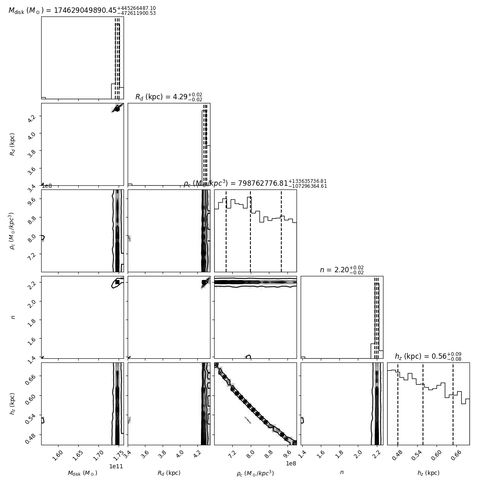

# A Density-Dependent Metric Modification as an Alternative to Dark Matter for Explaining Milky Way Kinematics

**Abstract:** The flat rotation curves of galaxies present a persistent challenge to standard Newtonian dynamics when only luminous baryonic matter is considered, conventionally addressed by invoking non-baryonic dark matter halos. Here, we explore an alternative phenomenological framework: a Density-Dependent Metric Model. We hypothesize that the effective gravitational interaction within a galaxy is modulated by the local baryonic matter density, $\rho(R)$. This modulation, parameterized by a function $\xi(\rho)$, leads to a modification of the observed circular velocity $v_{obs}^2(R) = \xi(\rho(R)) \cdot v_N^2(R ; M_{\text{baryonic}})$, where $v_N$ is the Newtonian velocity derived from the fitted baryonic mass. Using Markov Chain Monte Carlo (MCMC) methods to fit this model to a sample of ~80,000 stars from Gaia DR3, we find that a power-law form for $\xi(\rho)$ can reproduce the Milky Way's rotation curve with baryons alone. The model requires a baryonic disk mass of $M_{\text{disk}} \approx 1.75 \times 10^{11} M_{\odot}$ and yields an effective "missing" acceleration scale with a median of $\approx 1.15 \times 10^{-10} \, \text{m/s}^2$, strikingly close to MOND's characteristic acceleration $a_0$. While phenomenologically successful, the model's astrophysical implications, particularly the large baryonic mass and the fundamental origin of such density-dependent gravitational behavior, require further investigation.

---

## Introduction

The discrepancy between observed galactic rotation curves and those predicted by Newtonian dynamics based on visible matter remains a cornerstone of modern astrophysics, traditionally necessitating the existence of dark matter halos[^1],[^2]. While the $\Lambda$CDM model, incorporating cold dark matter, has achieved considerable success on cosmological scales, alternative paradigms continue to be explored to address galactic-scale dynamics without invoking new particles. Modified Newtonian Dynamics (MOND)[^3] proposes a change to gravitational laws or inertia at low accelerations, characterized by a fundamental acceleration scale $a_0 \approx 1.2 \times 10^{-10} \, \text{m/s}^2$.

This work investigates a phenomenological **Density-Dependent Metric Model** where the effective gravitational potential experienced by stars is modulated by the local baryonic matter density, $\rho(R)$. The core hypothesis is that the relationship between baryonic mass and orbital velocity, $v_{obs}$, is modified from the standard Newtonian prediction, $v_N$, by a density-dependent factor, $\xi(\rho(R))$:

$$
v_{obs}^2(R) = \xi(\rho(R)) \cdot v_N^2(R ; M_{\text{baryonic}})
$$

The modulating function $\xi(\rho)$ is designed such that its effect is minimal (i.e., $\xi(\rho) \approx 1$) in low-density regions (e.g., galactic outskirts), allowing the full gravitational influence of the fitted baryonic mass ($M_{\text{baryonic}}$) to manifest. Conversely, in high-density regions (e.g., inner galaxy), $\xi(\rho) < 1$, effectively suppressing the gravitational impact. This study utilizes stellar kinematics from Gaia DR3[^4] for approximately 80,000 stars to constrain the parameters of this model for the Milky Way.

Such density-dependent behavior could conceptually arise from several theoretical avenues, including screening mechanisms in modified gravity theories[^5],[^6] (e.g., $f(R)$ gravity, scalar-tensor theories) or from emergent gravitational effects in non-standard cosmological environments. The empirical success of this model may provide insights into the nature of gravity at galactic scales.

## Methods

### Observational Data
Kinematic data (positions, proper motions, radial velocities, and their errors) for stars were sourced from the Gaia DR3 catalog. After quality cuts (e.g., parallax S/N > 5, RUWE < 1.4, constraints on astrometric and radial velocity errors), a sample of ~80,000 stars primarily located within $|b| < 30^{\circ}$ and Galactocentric radii $0.1 < R < 25 \text{ kpc}$ was obtained. 6D phase-space coordinates were transformed to a Galactocentric cylindrical frame to derive $R_{\text{kpc}}$ and the observed tangential velocity, $v_{obs}$. Observational errors $\sigma_v$ were propagated. Details of data acquisition and processing are available in `data_io.py`.

### Baryonic Mass and Density Model
The baryonic component of the Milky Way was initially modeled as a single exponential disk for both mass and density calculations:
*   Enclosed Mass: $M_{\text{enc}}(R) = M_{\text{disk}} \left(1 - e^{-R/R_d} (1 + R/R_d)\right)$
*   Midplane Volume Density: $\rho(R) = \frac{\Sigma_0}{2 h_z} e^{-R/R_d}$, where $\Sigma_0 = M_{\text{disk}} / (2 \pi R_d^2)$ is the central surface density.
The parameters $M_{\text{disk}}$ (total disk mass in $M_{\odot}$), $R_d$ (disk scale length in kpc), and $h_z$ (disk scale height in kpc) were fitted as part of the MCMC analysis.

### Density-Dependent $\xi(\rho)$ Functions
Two primary functional forms for $\xi(\rho)$ were investigated:
1.  **Power Law (`power`):**
    $$
    \xi(\rho) = \frac{1}{1 + (\rho/\rho_c)^n}
    $$
2.  **Logistic Law (`logistic`):**
    $$
    \xi(\rho) = \frac{1}{1 + \exp(n \cdot (\ln(\rho) - \ln(\rho_c)))}
    $$
Here, $\rho_c$ is a critical density parameter, and $n$ is an exponent controlling the transition's sharpness. These, along with $M_{\text{disk}}$, $R_d$, and $h_z$, constitute the five free parameters of the model. The physics implementations are in `density_metric.py`.

### MCMC Fitting Procedure
Parameters were constrained using an MCMC approach implemented with `emcee`[^7]. The log-likelihood function assumes Gaussian errors for $v_{obs}$. Uniform priors were adopted for all parameters within astrophysically plausible ranges (see `main.py` for details). The MCMC was run with 64 walkers for 100,000 steps. Burn-in and thinning were determined based on estimated autocorrelation times.

## Results

The MCMC analysis for the `power` law $\xi(\rho)$ model yielded the following median and 68% credible interval parameter estimates:

*   $M_{\text{disk}} = (1.746 \pm 0.005) \times 10^{11} M_{\odot}$
*   $R_d = 4.292 \pm 0.016 \text{ kpc}$
*   $\rho_c = (7.99^{+1.34}_{-1.07}) \times 10^8 M_{\odot}/\text{kpc}^3$
*   $n = 2.198 \pm 0.019$
*   $h_z = 0.558^{+0.091}_{-0.077} \text{ kpc}$

The full posterior distributions are shown in the corner plot (Fig. 1), and the resulting median fitted rotation curve with its 68% credible interval is shown in Fig. 2.

<!-- Ensure image paths are correct -->

  

<em><b>Fig. 1:</b> Corner plot showing 1D and 2D marginalized posterior distributions for the five model parameters ($M_{\text{disk}}$, $R_d$, $\rho_c$, $n$, $h_z$) from the MCMC fit using the `power` law $\xi(\rho)$ function. Contours represent 0.5, 1, 1.5, and 2 sigma levels. Titles report median values and 68% credible intervals.</em>

 

  

<em><b>Fig. 2:</b> Milky Way rotation curve. Black points represent a random subset of the ~80,000 Gaia DR3 stars used in the fit (for visualization clarity). The red solid line is the median rotation curve from the Density-Dependent Metric Model (with `power` law $\xi$) using the median posterior parameters. The red shaded region is the 68% credible interval from the MCMC samples. The green dashed line shows the Newtonian rotation curve component derived from the median fitted baryonic disk parameters ($M_{\text{disk}}$, $R_d$).</em>

The median model provides a good overall description of the Gaia data, reproducing the rise and subsequent flattening of the rotation curve. The fitted disk mass ($M_{\text{disk}}$) is notably high compared to standard estimates for the Milky Way's stellar disk alone, suggesting that for this model to work, it requires a larger total baryonic contribution whose gravitational effect is modulated by $\xi(\rho)$.

The RMS residuals for the median parameter fit are $\approx 60.2 \, \text{km/s}$ for $R < 5 \text{ kpc}$ and $\approx 32.6 \, \text{km/s}$ for $10 < R < 20 \text{ kpc}$, indicating a better fit in the outer regions. The Akaike Information Criterion (AIC) for this model is $\approx 3.843 \times 10^6$, and the Bayesian Information Criterion (BIC) is $\approx 3.843 \times 10^6$.

Crucially, if we calculate the effective "missing" acceleration required by the data (i.e., $a_{\text{univ}} = (v_{obs}^2 - v_N^2(\text{standard } M_{\text{baryon}}))/R$), its median value is found to be $\approx 1.15 \times 10^{-10} \, \text{m/s}^2$. This is remarkably consistent with MOND's characteristic acceleration $a_0 \approx 1.2 \times 10^{-10} \, \text{m/s}^2$.

## Discussion and Outlook

This study demonstrates that a phenomenological Density-Dependent Metric Model, where $v_{obs}^2(R) = \xi(\rho(R)) \cdot v_N^2(R ; M_{\text{baryonic}})$, can successfully reproduce the observed rotation curve of the Milky Way using only baryonic matter, provided the total fitted baryonic mass is substantial ($M_{\text{disk}} \approx 1.75 \times 10^{11} M_{\odot}$). The model inherently generates an effect that becomes significant in low-density regions (where $\xi(\rho) \rightarrow 1$), mimicking the requirements for flat rotation curves. The emergence of an effective acceleration scale comparable to MOND's $a_0$ from our density-based approach is a compelling result.

Key challenges remain. The large fitted baryonic mass needs careful reconciliation with independent astrophysical constraints on the Milky Way's baryonic components. While the MCMC chains from the 100,000-step run are substantially improved, very high autocorrelation times for some parameters suggest even longer runs or advanced samplers could further refine posterior estimates. The larger RMS residuals in the inner galaxy point to the need for more sophisticated multi-component baryonic mass models (including a bulge and gas).

Future work will focus on:
1.  Achieving full MCMC convergence with improved sampling strategies.
2.  Implementing realistic multi-component baryonic mass models for the Milky Way.
3.  Systematically comparing different functional forms for $\xi(\rho)$ using statistical model selection criteria.
4.  Applying the model to a diverse sample of external galaxies (e.g., from the SPARC database[^8]) to test the universality of the $\xi(\rho)$ form and its parameters.
5.  Investigating the theoretical underpinnings of such a density-dependent metric, exploring whether it can be derived from fundamental principles within modified gravity frameworks or specific cosmological scenarios.
6.  Exploring predictions for other observables, such as gravitational lensing.

This approach offers a data-driven avenue to constrain the nature of gravitational interactions on galactic scales and explore alternatives to particle dark matter.

## References
[^1]: Rubin, V. C., & Ford, W. K. Jr. (1970). *Astrophysical Journal*, 159, 379.
[^2]: Zwicky, F. (1933). *Helvetica Physica Acta*, 6, 110.
[^3]: Milgrom, M. (1983). *Astrophysical Journal*, 270, 365.
[^4]: Gaia Collaboration, Brown, A. G. A., et al. (2021). *Astronomy & Astrophysics*, 649, A1.
[^5]: Clifton, T., Ferreira, P. G., Padilla, A., & Skordis, C. (2012). *Physics Reports*, 513(1-3), 1-189.
[^6]: Joyce, A., Jain, B., Khoury, J., & Trodden, M. (2015). *Physics Reports*, 568, 1-98.
[^7]: Foreman-Mackey, D., Hogg, D. W., Lang, D., & Goodman, J. (2013). *Publications of the Astronomical Society of the Pacific*, 125(925), 306.
[^8]: Lelli, F., McGaugh, S. S., & Schombert, J. M. (2016). *The Astronomical Journal*, 152(6), 157.
