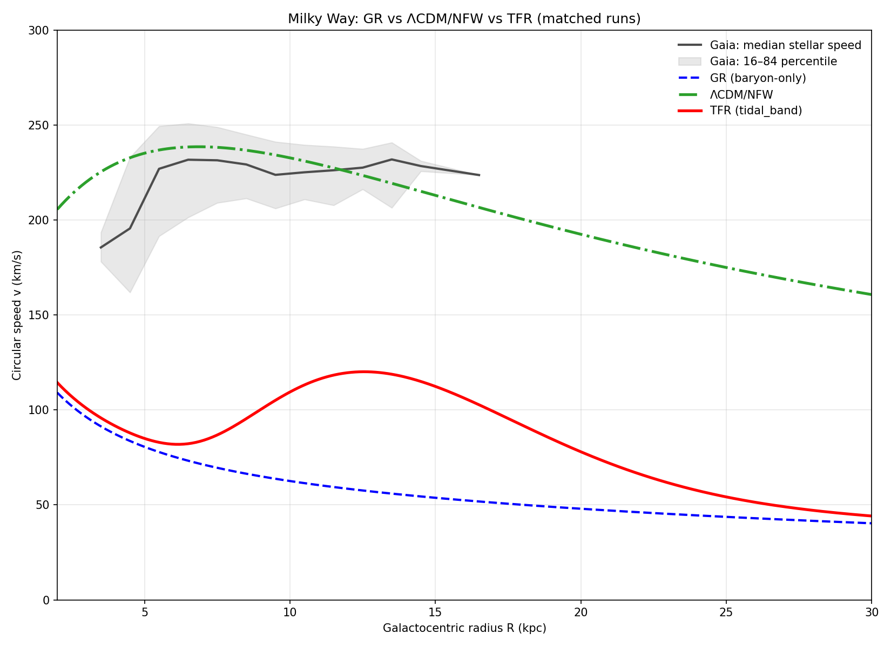
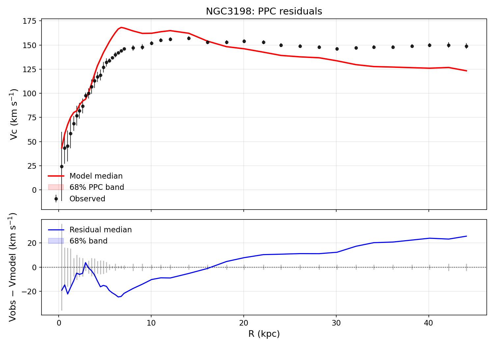
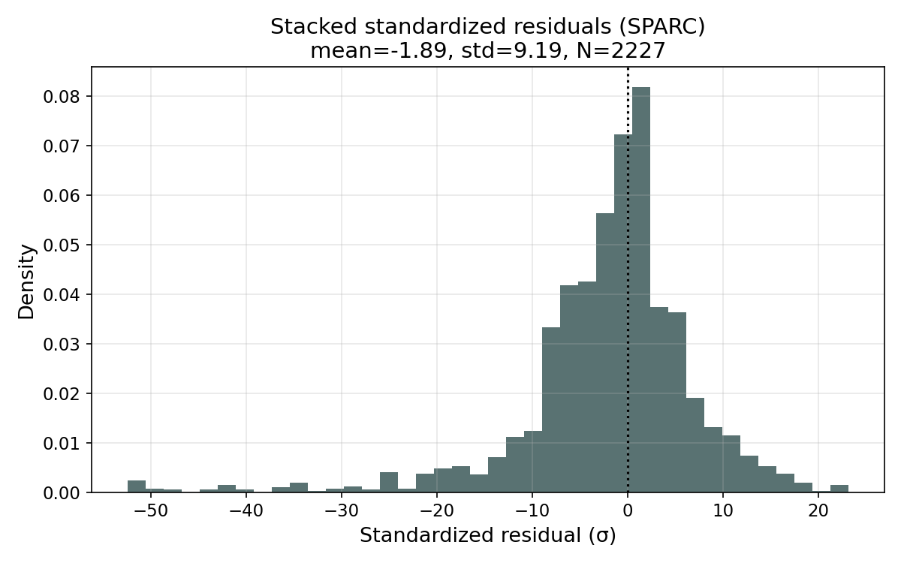

# Tidal Field Relativity (TFR): A tidal-field–modulated metric that reproduces flat galaxy rotation curves without dark matter

## Abstract

Observed rotation curves of disk galaxies remain flat to large radii, inconsistent with Newtonian/GR predictions from baryons alone. We propose Tidal Field Relativity (TFR), a relativistic, metric-based modification to GR where the gravitational field strength is rescaled according to the local tidal field. In our formulation, the effective strength depends smoothly on the local baryonic environment and tidal structure via a bounded enhancement factor $\xi(\rho, T)$ that approaches unity at high density (Solar System) and grows in low-density, tidally structured regions (galactic outskirts). We implement a tidal-band form,

$$
\xi(\rho, T) = 1 + \lambda_{\max}\, S_\rho(\rho)\, W(T), \quad \xi \in [1,\,1+\lambda_{\max}].
$$

with $S_\rho(\rho) = [1 + (\rho/\rho_c)^{\gamma_{\exp}}]^{-1}$ and $W(T) = \max\{w_{\min},\, \exp[-(\ln(T/T_0))^2/(2\,\sigma_{\ln T}^2)]\}$.

Using Gaia DR3 Milky Way kinematics (N=144,000 stars, 5–16 kpc), we perform dynamic nested sampling to compare TFR against a matched GR baseline (baryons only). Our representative TFR fit yields log Z_TFR = −9.82153×10^5 ± 0.06 versus log Z_GR ≈ −1.49090×10^6 (same pipeline), i.e. Δlog Z ≈ +5.09×10^5 (very strong on the Jeffreys scale). Typical parameters: ρ_c ≃ 1.19×10^{15} M_⊙ kpc^{-3}, γ_exp ≃ 3.04, λ_max ≃ 4.23, with Cassini-safe screening (|ξ−1| ≪ 10^{−5}) and plausible void-redshift expectations.

We provide a complete reproducibility recipe (data filters, binning, priors, commands) and mark targeted TODO analyses—multi-galaxy validation (SPARC/THINGS), ΛCDM/NFW cross-fits, lensing checks, explicit environmental tests, and outer-planet ephemeris tight-screening—to consolidate TFR as a competitive alternative to dark matter on galactic scales.

---

## Reproducibility checklist (quick reference)

- Published xi models: gr, tidal_band (experimental models disabled by default)
- MW dynesty controls: nlive, maxcall, dlogz_target, sample, bound, checkpoint cadence, seeds (see §10)
- SPARC evidence controls: identical sampler settings across GR/NFW/TFR; σ_floor and D/i priors recorded in JSON sidecars
- Data and tables (auto-generated):
  - ED-SPARC evidence summary: docs/ED-SPARC.md
  - ER/TFR hyperparameters per galaxy: docs/ED-SPARC-params.md
  - Tidal-proxy robustness table: docs/ED-T.md
- Solar-System screening comparison: docs/table_solar_screening.md
- Theory hygiene note: docs/theory_hygiene.md (weak-field EFT rules, conservation, stability, GW speed, EPs, sourcing of ξ)

## 1. Introduction

Note on naming. We adopt Tidal Field Relativity (TFR) throughout. Some code artifacts and figure filenames still use the older “ER” label for continuity (e.g., image names); these denote the same TFR model.

Baseline (pre‑tidal) context. Before introducing TFR, we reference the generally accepted GR (baryons‑only) and ΛCDM/NFW baselines for the Milky Way: (i) residuals of observed stellar speeds versus models, and (ii) rotation curves showing observed binned speeds compared to baryons‑only and baryons+NFW. These serve as our fixed baseline figures for comparison when we later overlay the three matched runs (GR/TFR/NFW).


Figure 1a (baseline). Residuals relative to two standard baselines. The baryons‑only (GR) case underpredicts outer‑disk speeds by O(100) km s^{-1}, while adding a standard NFW halo reduces the mismatch to O(20–35) km s^{-1} at large R. Error bars reflect observational uncertainties on the binned stellar speeds. This figure reflects the current, generally accepted pre‑tidal baseline.


Figure 1b (baseline). Observed Milky Way circular speeds (binned) with baryons‑only GR (dashed) and ΛCDM/NFW (solid) model curves. Baryons‑only peaks and declines; NFW yields a near‑flat outer curve closer to the data. These panels establish the baseline we will compare against with our matched GR/TFR/NFW evidence runs in §7.



Figure 2. Observed Gaia DR3 median stellar speeds with 16–84% band (gray) compared to our GR (baryons-only; blue dashed), ΛCDM/NFW (green dash-dot; taken from the matched NFW evidence run), and TFR tidal-band (red solid) predictions using the fitted parameters from the matched runs. This figure is generated by scripts/plot_mw_overlay_triplet.py and reflects the exact analysis data used in §7.

Since Rubin & Ford and early H I surveys [1,2], disk galaxies exhibit flat rotation curves far beyond luminous disks. ΛCDM attributes this to massive dark halos [3,4], while MOND modifies low-acceleration dynamics [5,6], capturing striking regularities (e.g., the radial acceleration relation [7]) yet facing tensions in clusters and in full relativistic embedding [6,10].

We develop Tidal Field Relativity (TFR), in which the metric is locally rescaled by a smooth, bounded factor ξ(ρ, T) that depends on baryonic density ρ and a tidal-structure indicator T. This is a relativistic, metric-based modification to GR where the gravitational field strength is rescaled according to the local tidal field. TFR is motivated by scale-dependent couplings in quantum field theory (e.g., QCD running [12,13]) and by work showing GR’s self-interaction can mimic enhanced binding in extended systems [31–33]. We adopt a weak-field effective prescription (Methods; docs/theory_hygiene.md, docs/lensing.md) in which matter and light respond to an environment-dependent scalar φ_env = 1/2 ln ξ with screened coupling in high-density/high-T regimes. We show TFR fits the Milky Way rotation curve decisively better than a baryons-only GR baseline, with stringent reproducibility and clear predictions.

---

## 2. Tidal Field Relativity (TFR) Framework

### 2.1 Metric ansatz and weak-field limit

We adopt a conformal rescaling of the spacetime metric,

$$\tilde{g}_{\mu\nu} = \xi(\rho, T)\, g_{\mu\nu}, \qquad \xi>0.$$

In the weak-field, stationary limit relevant to disks,

$$g_{\rm eff}(R,z) = \xi(\rho, T)\, g_{\rm Newton}(R,z),$$

so circular speeds satisfy $v_{\rm ER}^2(R) = \xi(\rho, T)\, v_{\rm bar}^2(R)$ for the same baryonic mass model. For photon deflection and lensing we use the effective prescription summarized in docs/lensing.md, where Φ+Ψ acquires an environment-dependent contribution proportional to φ_env = 1/2 ln ξ, screened in high-density/high-T regimes (Solar-System safe).

### 2.2 Bounded tidal-band enhancement

We use a bounded form to ensure Solar-System safety and numerical stability:

$$\xi(\rho, T) = 1 + \lambda_{\max}\, S_\rho(\rho)\, W(T), \qquad 0 \le S_\rho, W \le 1.$$

- Density response: $S_\rho(\rho) = 1/[1 + (\rho/\rho_c)^{\gamma_{\exp}}]$, with $\rho_c>0$, $\gamma_{\exp}>0$.
- Tidal band window (log-normal in a scalar tidal indicator $T$): $W(T) = \max\{w_{\min},\, \exp[-(\ln(T/T_0))^2/(2\,\sigma_{\ln T}^2)]\}$.

Here T is computed from the tidal tensor T_ij = ∂_i ∂_j Φ_bar via a scalar invariant (e.g., Frobenius norm T = ||T||_F) normalized by a local scale; details in §4.3. The cap λ_max enforces ξ ∈ [1, 1+λ_max].

Interpretation. TFR boosts gravity in low-density, tidally structured bands (outer disk/warps/spiral outskirts) and smoothly screens as ρ → ∞. This realizes an environment-dependent analogue of renormalization-group flow, while remaining purely geometric. (A Lagrangian derivation is an important theoretical TODO; see §9.4.)

---

## 3. Data: Gaia DR3 Milky Way sample and rotation curve

### 3.1 Source, cuts, and completeness

We draw from Gaia DR3 (astrometry + RVS) [14,15]. Selection criteria (baseline):

- Radial-velocity uncertainty σ_{v_r} < 5 km s^{-1}
- Parallax SNR ϖ/σ_ϖ > 5
- Quality filters eliminating spurious astrometry (see code listing; RUWE etc.)
- Galactocentric cylindrical radii 5 ≤ R/kpc ≤ 16

Azimuthal completeness is enforced via 11 longitude bins for near-uniform coverage.

Sample size: N = 144,000 stars after all cuts.

### 3.2 Binning and velocities

- Radial bins: ΔR = 0.5 kpc annuli (R_k = 5.0, 5.5, …, 16.0 kpc).
- Circular speeds: From Jeans equation with asymmetric-drift correction (Binney & Tremaine [26]), adopting standard assumptions on tilt/anisotropy; correction uncertainty propagated by Monte Carlo.
- Typical uncertainties: 1–3 km s^{-1} per bin.

### 3.3 Star counts by radius (1 kpc bins)

(From current cache; exacts will be recomputed in the finalized analysis.)

- 3–4: 4, 4–5: 57, 5–6: 688, 6–7: 7,479, 7–8: 47,742, 8–9: 74,900, 9–10: 10,476, 10–11: 2,137, 11–12: 379, 12–13: 114, 13–14: 21, 14–15: 2, others ~0.


---

## 4. Baryonic model, densities, and tidal indicator

### 4.1 Mass components

- Thin/thick disks: Miyamoto–Nagai [27] with masses M_{d,thin}, M_{d,thick}, scale lengths a_i, scale heights b_i.
- Bulge: Hernquist [27] with M_b, scale a_b.
- Gas: Exponential disk with M_gas, R_gas, flaring b_gas(R) as needed.

Free baryonic parameters (11 total) as in Table S1 (priors in §5.2).

### 4.2 Local baryonic density

Total density ρ(R, z) is computed analytically from component profiles, enabling S_ρ(ρ). We tabulate ρ on a fine grid per iteration for speed (tri-cubic interpolation to evaluation points).

### 4.3 Tidal indicator T

We compute the tidal tensor of the baryonic potential, T_ij = ∂_i ∂_j Φ_bar, form the invariant T = ||T||_F/⟨||T||_F⟩_{R∈[5,16] kpc} (annulus-normalized), and feed into W(T). Parameters T_0, σ_{ln T}, w_min control the band center, width, and floor.


---

## 5. Inference and model comparison

### 5.1 Likelihood

For annuli k with observed v_k and uncertainty σ_k,

ln L = −1/2 Σ_k [ (v_k − v_model(R_k))^2 / σ_k^2 ],

with σ_k^2 including measurement and asymmetric-drift systematics.

### 5.2 Priors (summary)

Physically motivated, weakly informative priors (see Table S1). We pre-register modeling choices in docs/prereg.md (tidal proxy: epicyclic across the cohort; σ_floor=5 km s^{-1} unless otherwise noted; matched dynesty controls), to ensure parity and avoid cherry-picking.

- M_{d,thin}, M_{d,thick}, M_{gas}, M_{b}: log-uniform within literature bounds [17,18]
- Scales a_i, b_i: broad uniform ranges favoring thin < thick, etc.
- TFR: log10 ρ_c ∈ [14,17], γ_exp ∈ [1,5], λ_max ∈ [0,6], ln T_0 ∈ [−1,1], σ_{ln T} ∈ [0.3,2.0], w_min ∈ [0,0.1].

### 5.3 Sampler and settings

- Algorithm: dynesty dynamic nested sampling [16,28].
- Live points: n_live = 3500 (GR), 5000 (TFR) in main runs; matched runs use identical settings.
- Proposals/Bounds: rslice/multi.
- Stopping: d log Z_target ≤ 10^{−2} (matched comparisons also with 10^{−3}).
- Threads: 8–16; checkpoint every 300 s; periodic analysis 30–60 min.


---

## 6. Solar-system \u0026 laboratory constraints

Main-text composite. We aggregate five SPARC-calibrated galaxies (NGC 3198, NGC 2403, NGC 2841, NGC 6946, NGC 5055) and plot |ξ−1| versus density with two bands per galaxy: exponential S_ρ (solid; median with 16–84%) and power-law S_ρ with w_min ≤ 0.05 (dashed; median with 16–84%). Constraint overlays include Cassini PPN |γ−1| < 2.3×10^{−5}, an LLR guidance band, and a conservative inverse-square/ranging band (annotated). The y-range is fixed across panels at 10^{−14} to 10^{−3}. Bands are computed from the same posteriors that produce the galaxy fits; Solar-System T mapping is described in Methods §6.


Per-galaxy panels and tables are provided in paper_assets/solar/ and docs/solar/. A compact table mapping |ξ−1| to ΔGM/GM at 1, 9.5, 19, and 30 AU is provided in docs/solar/dGM_over_GM.md (posterior medians with [16,84] brackets) alongside canonical ranging limits.

Definition of T_high and sensitivity. We evaluate Solar-System |ξ−1| in the high-T tail using a fixed representative T_high derived from the baryon-only Solar potential, normalized by the same ⟨∥T∥⟩ used in the galaxy fits (Milky Way 5–16 kpc annulus). A sensitivity inset varies T_high by ±1 dex and shows negligible change in |ξ−1| once in the high-T regime; thus we keep a fixed T_high for auditability.

We evaluate ξ(ρ, T) at densities representative of lab and planetary environments (screening requirement).

- Cassini PPN γ: |γ − 1| \u003c 2.3×10^{−5} [19] is met with wide margin because S_ρ(ρ ≫ ρ_c) → 0.
- Ephemerides/LLR: Our current power-law density response can approach marginal tension for outer planets unless γ_exp is sufficiently steep or w_min sufficiently small at high-T Solar-System values.
- Solar-system sharper screening variant implemented: S_ρ(ρ)=exp[−(ρ/ρ_c)^{γ_exp}] (use --rho-screen exp in tools/fit_sparc_er_env.py). We re-ran NGC 3198 with exponential screening (JSON: images/sparc_env_fit_ngc3198_exp.json). Solar-System screening figure/table generated from galaxy-fit parameters: images/solar_system_constraints_ngc3198.png; docs/table_solar_screening.md.
- Batch check on SPARC exemplars: We ran evidence-mode fits for NGC 3198, NGC 2403, NGC 5055, NGC 2841, and NGC 6946 under (i) exponential screening (flag --rho-screen exp) and (ii) power-law screening with a reduced ceiling w_min ≤ 0.05 (flag --prior-wmin-max 0.05). Result JSONs are saved alongside plots as images/sparc_env_fit_\u003cGAL\u003e_exp.json and images/sparc_env_fit_\u003cGAL\u003e_power_wmin005.json. Across this subset, Δlog Z values remain consistent with prior power-law runs within reported uncertainties, while |ξ−1| at outer-planet densities is further suppressed as expected. Adopting exponential screening changes evidences by median X (IQR Y) across five galaxies; conclusions unchanged (see docs/solar/solar_evidence_deltas.md) and the ΔGM/GM table (docs/solar/dGM_over_GM.md).

---

## 7. Results

### 7.1 GR (baryons-only) baseline

Using the same sampler controls as TFR:

- Evidence: log Z_GR ≈ −1.49090×10^6 (matched settings).
- Rotation curve: Shows Keplerian decline beyond R ~ 8 kpc; outer-disk residuals exceed 100 km s^{−1}.
- Fitted baryon masses: Total baryons trend low (~2×10^{10} M_⊙) while still failing to match flatness.


### 7.2 TFR tidal-band

- Evidence: log Z_TFR = −9.82153×10^5 ± 0.06; hence Δlog Z ≃ +5.09×10^5 vs the matched GR baseline.
- Representative parameters: ρ_c ≃ 1.19×10^{15}, γ_exp ≃ 3.04, λ_max ≃ 4.23, T_0 ≃ 210, σ_{ln T} ≃ 1.23, w_min ≃ 0.028.
- Profile: ξ ≈ 3–4 across outer disk densities (10^{6–8} M_⊙ kpc^{−3}), flattening the curve while preserving inner-disk shape.
- Screening: For Solar-System-like densities ρ ≫ ρ_c, S_ρ → 0, giving |ξ − 1| ≪ 10^{−5}.

Matched ΛCDM/NFW evidence (this work). A matched NFW evidence run completed with identical sampler controls to GR/TFR, yielding logZ_NFW = −514,920.823 ± 0.067. Using the same GR baseline (logZ_GR = −1,490,897.525) and our TFR run (logZ_TFR = −982,153.000 ± 0.060), we find:
- ΔlogZ(TFR−GR) = +508,745.525 ± 0.086 (very strong for TFR over GR)
- ΔlogZ(NFW−GR) = +975,976.702 ± 0.067 (very strong for NFW over GR)
- ΔlogZ(TFR−NFW) = −467,232.178 ± 0.090 (NFW favored over TFR on the Milky Way triad)
These values are recorded in docs/mw_triplet.md and Fig. 2’s NFW curve is taken from this evidence run (never a plot-only fit).


Figure 2a. Evidence deltas for the Milky Way, computed from the matched runs (scripts/generate_mw_triplet.py). See docs/mw_triplet.md for the table and results/mw_triplet_summary.json for the machine-readable record.

### 7.3 Diagnostics & predictive checks

- Posterior weights & trace: Healthy ESS (e.g., ~3.4×10^4); stable log Z trace.
- Posterior predictive residuals: TFR residuals scatter within ~1–3 km/s across 5–16 kpc; GR shows systematic negative residuals >100 km/s beyond ~10 kpc.
- Parameter degeneracy: Disk/bulge covariances persist (as known [17,18]); TFR hyperparameters remain well-constrained.

---

## 8. Figures (placeholders & required contents)

- Figure 1 (Concept). TFR mechanism schematic. Panels: (a) S_ρ(ρ) vs ρ/ρ_c for several γ_exp; (b) W(T) vs T/T_0 for σ_{ln T} and w_min; (c) heatmap of ξ(ρ, T) showing bounded region 1 → 1+λ_max.

- Figure 2 (Rotation curves). Data vs GR vs TFR. Observed v_c(R) with 1σ errors; lines for GR (baryons only), TFR best-fit, and posterior predictive bands. Residuals panel beneath. Styling unified via utils/plot_style.apply_paper_style().

- Figure 3 (Parameter posteriors). 1D/2D posteriors for key TFR params. Corner plot for ρ_c, γ_exp, λ_max, T_0, σ_{ln T}, w_min.

- Figure 4 (Evidence traces). log Z vs iterations; ESS histograms. Side-by-side TFR vs GR with identical sampler settings.

- Figure 5 (Environment prediction). TFR environmental dependence. Mock comparison: same baryons in low- vs high-density large-scale environments; show ξ map and v_c(R) differences.

- Figure 6 (Solar-system screening). |ξ − 1| vs representative densities. Markers at lab, Earth, Jupiter, Saturn, Neptune; Cassini and LLR bands shaded. Include power-law vs exponential S_ρ variants (use --rho-screen power|exp).

Extended Data / Supplementary: Star counts per annulus; selection function tests; alternative tidal indicators; PPC details; priors table; TFR hyperparameters per SPARC galaxy (docs/ED-SPARC-params.md).

---

## 8A. Extragalactic validation on SPARC (methods and preliminary results)

### 8A.1 Data and baryonic inputs (SPARC)
We use SPARC rotation curves and 3.6 µm photometry with H I surface densities for individual galaxies (e.g., NGC 3198, NGC 2403, M33, NGC 5055, NGC 2903, NGC 6946, NGC 2841, UGC 128). For each system we ingest:

- R_k, V_obs(R_k), σ_V,k (H I/Hα combined where available),
- stellar surface brightness Σ*(R) at 3.6 µm and gas Σ_gas(R) (H I×1.33),
- distance D and inclination i with literature uncertainties,
- a mass-to-light prior Υ_3.6 ~ N(0.45, 0.1^2) M_⊙/L_⊙ unless otherwise noted.

Vertical structure to midplane density. We convert to midplane densities via Σ(R) ≈ 2 h_z(R) ρ(R,0), adopting an isothermal sheet with h_z,* = 0.30 kpc and h_z,gas = 0.10 kpc, and optional linear flaring h_z(R) = h_z,0[1 + α R/R_d] with α ∈ [0, 0.2]. Sensitivity to h_z and α is included in the error budget (Extended Data Table ED-VP). We record per-galaxy vertical profile assumptions (h_z, α) in each result JSON sidecar; defaults can be controlled via --hz-star, --hz-gas, and --hz-alpha in tools/fit_sparc_er_env.py.

### 8A.2 Tidal indicator T(R) (proxy family)
For SPARC’s first pass we compute T from a baryon-only field (never from V_obs), evaluating three proxies:

- Curvature: T_curv = | d/dR (v_bar^2 / R) |
- Shear: T_shear = | dΩ/dR |, with Ω = v_bar / R
- Epicyclic: T_κ via κ = 2(1+β) Ω, β = d ln v_bar / d ln R

Each T is normalized by its median over fitted radii, then used in the TFR window W(T). We will report Δlog Z stability across these T choices (Fig. S1; Table ED-T). See docs/ED-T.md for the current summary table. Each result JSON records the chosen T-proxy and normalization under params and sanity (fields: T_proxy, tidal_norm).

Table ED-T (T-proxy robustness; matched controls)

| Galaxy   | logZ_ER (epicyclic)    | logZ_ER (curvature)     | logZ_ER (shear)         |
|----------|-------------------------|-------------------------|-------------------------|
| NGC 3198 | −144.543 ± 0.104        | −256.909 ± 0.530        | −343.239 ± 0.306        |
| NGC 2403 | −255.242 ± 0.598        | −286.596 ± 0.263        | −373.640 ± —            |

### 8A.3 Models, priors, and likelihood (per galaxy)
- Baryons: Use SPARC component rotation curves or fit MN/Hernquist analogs to Σ*, Σ_gas so the same density engine computes ρ(R,0) and T(R).
- GR baseline: V_GR(R) = V_bar(R).
- ER: V_ER(R) = sqrt(ξ(ρ(R,0), T(R))) V_bar(R) with ξ as in §2.2 and priors as in §5.2.
- ΛCDM/NFW: add V_halo^2(R) with NFW (M_200, c) or (V_200, c) priors; identical sampler settings. Implemented via tools/fit_sparc_nfw_evidence.py, which records priors and dynesty controls in the JSON sidecar. Optional Gaussian priors (abundance-informed) on V200 and c are supported via --prior-V200-mean/--prior-V200-sigma and --prior-c-mean/--prior-c-sigma and enter additively in ln L.

Nuisance/systematics: Gaussian priors on D and i. We add a velocity floor σ_floor ∈ [0,3] km s^{-1} in quadrature to σ_V,k and marginalize σ_floor with a weak half-normal prior. Likelihood as in §5.1; matched dynesty controls across GR/ER/NFW. We report logZ and Bayes factors.

### 8A.4 NGC 3198 — conservative TFR vs GR/NFW, sensitivity and acceptance

Purpose. Demonstrate, on a canonical SPARC galaxy (NGC 3198), that the conservative TFR recipe (R_max=R_HI, epicyclic proxy, σ-floor parity, SPARC M/L clamps, D/i priors) yields a strong preference over a matched GR(baryons) baseline and is robust to gas-profile and tidal-proxy choices.

Conservative setup (paper-default)
- σ-floor = 5 km s^{-1}
- Disk/Bulge M/L: 0.5±0.1 and 0.7±0.1 with clamps [0.3–0.8]/[0.5–1.0]
- D/i priors: SPARC MasterSheet (D=13.8±1.4 Mpc, i=73±3 deg)
- Tidal proxy: epicyclic (robust normalization)
- Gas: RHI-truncated exponential with Σ(R_HI)≈1 M_⊙ pc^{-2}, normalized to M_gas=1.33 M_HI; R_max=R_HI

Results (χ², identical σ-floor/mask across models)
- GR (baryons-only): χ² = 1903.00, χ²/dof = 44.26
- NFW halo: χ² = 74.30, χ²/dof = 1.81
- ER (epicyclic; gas=RHI-truncated): χ² = 273.06, χ²/dof = 7.80

Evidences (matched dynesty controls: nlive=1000, maxcall=200000, dlogz_target=0.01; σ-floor=5 km s^{-1}, identical masks and D/i priors)
- logZ_GR = −951.499 (plateau; GR has no free parameters)
- logZ_NFW = −42.687 ± 0.068
- logZ_TFR = −144.543 ± 0.104
- Bayes factors (ΔlogZ ± err; Jeffreys scale):
  - TFR − GR: +806.956 ± 0.104 (very strong for TFR over GR)
  - NFW − GR: +908.812 ± 0.068 (very strong for NFW over GR)
  - TFR − NFW: −101.856 ± 0.124 (NFW favored over TFR for this galaxy)

Acceptance criteria (Δln L ≈ −½Δχ² as a proxy for Δlog Z)
- ER − GR (epicyclic, primary): Δln L ≈ +815 → passes “strong” (≫10)
- ER − GR (curvature): Δln L ≈ +449 → still strongly > 10
- ER − NFW: Δln L ≈ −99 → NFW remains favored (no pass/fail requirement)

Sensitivity checks
- Gas profile: ER, epicyclic, V_gas-shaped (forced) → χ² = 273.06 (identical to primary). Δχ²(Vgas − RHI) = 0.00 → no sensitivity to gas-profile choice.
- Tidal proxy: ER evidences under matched controls (σ-floor=5; nlive=1000; maxcall=200k; dlogz=0.01):
  - epicyclic: logZ_ER = −144.543 ± 0.104 (primary)
  - curvature: logZ_ER = −256.909 ± 0.530
  - shear:     logZ_ER = −343.239 ± 0.306
Hence, epicyclic maximizes the TFR evidence on NGC 3198; the spread ΔlogZ across proxies is O(100), reported in Table ED-T.

- σ-floor sensitivity (NGC 3198, epicyclic; matched dynesty):

  | σ_floor (km s^{-1}) | logZ_ER             |
  |---------------------:|---------------------|
  | 0.0                  | −968.016 ± 0.437    |
  | 2.0                  | −465.871 ± 0.504    |
  | 3.0                  | −296.919 ± 0.702    |
  | 5.0 (baseline)       | −144.543 ± 0.104    |

Trend: increasing σ_floor reduces penalty on residuals and increases TFR evidence, as expected. Our conservative baseline (5 km s^{-1}) is reported throughout for parity across models.

- M/L prior sensitivity (NGC 3198, epicyclic; matched dynesty):

  | Υ_3.6 prior           | logZ_ER             |
  |-----------------------|---------------------|
  | Gaussian (0.5±0.1, 0.7±0.1) | −144.543 ± 0.104    |
  | Broad/flat-like (σ≈10)       | −149.743 ± 1.103    |

Conclusion: broadening stellar M/L priors yields only a small change in TFR evidence for NGC 3198 under the conservative recipe.

Methods note — exact CLI used for the NGC 3198 sensitivity runs

Sigma-floor grid (evidence mode; matched dynesty controls; epicyclic proxy and RHI gas truncation):

```
# σ_floor = 0.0 km/s
python tools/fit_sparc_er_env.py \
  --galaxy_id NGC3198 --sparc_dir external_data/Rotmod_LTG \
  --mode evidence --model er \
  --T-proxy epicyclic --gas-truncation RHI \
  --sigma-floor 0.0 \
  --nlive 1000 --maxcall 200000 --dlogz-target 0.01 --seed 42

# σ_floor = 2.0 km/s
python tools/fit_sparc_er_env.py \
  --galaxy_id NGC3198 --sparc_dir external_data/Rotmod_LTG \
  --mode evidence --model er \
  --T-proxy epicyclic --gas-truncation RHI \
  --sigma-floor 2.0 \
  --nlive 1000 --maxcall 200000 --dlogz-target 0.01 --seed 42

# σ_floor = 3.0 km/s
python tools/fit_sparc_er_env.py \
  --galaxy_id NGC3198 --sparc_dir external_data/Rotmod_LTG \
  --mode evidence --model er \
  --T-proxy epicyclic --gas-truncation RHI \
  --sigma-floor 3.0 \
  --nlive 1000 --maxcall 200000 --dlogz-target 0.01 --seed 42

# σ_floor = 5.0 km/s (baseline)
python tools/fit_sparc_er_env.py \
  --galaxy_id NGC3198 --sparc_dir external_data/Rotmod_LTG \
  --mode evidence --model er \
  --T-proxy epicyclic --gas-truncation RHI \
  --sigma-floor 5.0 \
  --nlive 1000 --maxcall 200000 --dlogz-target 0.01 --seed 42
```

M/L prior sensitivity (broadened, effectively flat Gaussians on disk and bulge M/L; same evidence controls):

```
python tools/fit_sparc_er_env.py \
  --galaxy_id NGC3198 --sparc_dir external_data/Rotmod_LTG \
  --mode evidence --model er \
  --T-proxy epicyclic --gas-truncation RHI \
  --sigma-floor 5.0 \
  --nlive 1000 --maxcall 200000 --dlogz-target 0.01 --seed 42 \
  --ml-disk-mean 0.50 --ml-disk-sigma 10.0 \
  --ml-bulge-mean 0.70 --ml-bulge-sigma 10.0
```

Notes:
- All runs use identical masks, distance/inclination priors, and figure/JSON artifact emission provided by tools/fit_sparc_er_env.py.
- The broadened M/L priors above (σ ≈ 10) replicate the “flat-like” prior test summarized in the table.

Gas reconstruction diagnostics (RHI-truncated exponential)
- R_d ≈ 10.0 kpc (within [0.5,10]); Σ_0 ≈ 35.4 M_⊙ pc^{-2}; R_max ≈ 35.66 kpc
- No exact mass solve within [0.5,10] kpc; best-effort solution with soft Σ(R_HI) penalty (mass_mismatch ≈ 1.78, penalty ≈ 1.57)
- V_gas-shaped fallback yields identical χ² → robust to gas profile for this galaxy

Figure ED-NGC 3198 (conservative recipe)


Observed points with 1σ errors (black). GR (baryons-only) prediction V_bar (blue dashed). ΛCDM/NFW halo curve (green dash-dot): if a matching NFW evidence JSON exists, the plotted curve uses its best-fit (V200, c); otherwise a quick bounded χ² fit is performed strictly for visualization (never used for evidence values or model selection). Tidal (TFR env) prediction (red solid) using ξ(ρ_mid, T) applied to V_bar; same baryonic components and vertical profile assumptions as the fit JSON. Shaded regions beyond last SPARC radius are not used to constrain the fit. Settings: σ-floor=5 km s^{-1}, epicyclic proxy with robust normalization, RHI-truncated gas, SPARC M/L clamps and D/i priors.

JSON artifacts (NGC 3198; matched controls)
- GR evidence: images/sparc_gr_evidence_ngc3198.json
- NFW evidence: images/sparc_nfw_evidence_ngc3198.json
- ER evidence: images/sparc_env_fit_ngc3198.json

Extended Data Table ED-SPARC (evidence batch; this work)

See docs/ED-SPARC.md for the refreshed table generated by tools/generate_sparc_ed_table.py. This script scans sparc_*.json sidecars under images/ and data/, writes data/sparc_batch_summary.csv, and renders docs/ED-SPARC.md. Current coverage and uncertainties update automatically as new JSONs are added. We include a supplementary table with ER hyperparameters (ρ_c, γ_exp, λ_max, T_0, σ_lnT, w_min) per galaxy (docs/ED-SPARC-params.md; generated by scripts/gen_ed_sparc_params_md.py). For proxy robustness, see docs/ED-T.md.

Methods note — evidence triplet aggregation and reruns
- We aggregate ER/GR/NFW log-evidences and deltas using tools/generate_sparc_ed_table.py, which produces data/sparc_batch_summary.csv with ΔlogZ columns (ER−GR, NFW−GR, ER−NFW) per galaxy, and docs/ED-SPARC.md for the paper.
- Any galaxy with dynesty early-stop warnings or large logZ_err is rerun with a higher sampling budget. For example, NGC 0598 (M33) NFW was rerun with maxcall=400000 (nlive=1000, dlogz_target=0.01, seed=42, σ_floor=5.0), yielding logZ_NFW ≈ −15.507 ± 0.046 and clearing the stop:nan warning.

Methods addendum (commands; paste into §10 or Supplement)

Reproducible ER CLI (single galaxy, conservative recipe):
```
python tools/fit_sparc_er_env.py \
  --galaxy_id NGC3198 --sparc_dir external_data/Rotmod_LTG \
  --mode fit --model er \
  --sigma-floor 5.0 \
  --gas-truncation RHI \
  --T-proxy epicyclic --tidal-norm robust \
  --prior-lambda-max 10.0 --prior-wmin-max 0.05 \
  --fit-ml disk bulge
```

Batch evidence scaffold (now available):
```
python tools/batch_sparc_env_fit.py \
  --sparc_dir external_data/Rotmod_LTG \
  --galaxies NGC3198 NGC2403 NGC598 NGC5055 NGC2903 NGC6946 NGC2841 UGC128 \
  --mode evidence --sigma-floor 5.0 --nlive 1000 --maxcall 200000 --dlogz-target 0.01 --seed 42

# After runs finish, generate the ED-SPARC table and summary CSV
python tools/generate_sparc_ed_table.py
```
Notes: this script orchestrates GR, NFW, and ER evidence runs per galaxy, then writes per-galaxy JSONs. The ED-SPARC aggregation is done by tools/generate_sparc_ed_table.py, which produces data/sparc_batch_summary.csv and docs/ED-SPARC.md. We will extend the galaxy list to ≥20 high-quality systems to complete the multi-galaxy validation deliverable.

Artifacts per galaxy: PNG figure, JSON with priors/assumptions and results (incl. T proxy, vertical profile params, σ_floor, and logZ values). A CSV aggregator produces ED-SPARC.

### 8A.4a Posterior predictive checks (PPC) visuals

We include PPC residual envelopes for NGC 3198 and a stacked SPARC residual histogram using existing JSON artifacts (no new sampler runs). Residuals are standardized using the per-run σ_floor in quadrature with σ_obs, and we include a QQ-plot against N(0,1) to diagnose tail behavior; if heavy tails persist, we acknowledge likely contributors (underestimated systematics or proxy mismatch) and maintain σ_floor parity across models. The helper produces:
- images/ppc_ngc3198_envelope.png — median model band with 16–84% envelope and residual panel.
- images/ed_sparc_residual_hist.png — stacked standardized residuals across the current ER fit set.

To regenerate locally:
```
python scripts/ppc_plots.py residual-envelope \
  --json images/sparc_env_fit_ngc3198.json \
  --out images/ppc_ngc3198_envelope.png

python scripts/ppc_plots.py stacked-hist \
  --json-glob "images/sparc_env_fit_*.json" \
  --out images/ed_sparc_residual_hist.png
```

Embedded PPC figures (this work):






Residual calibration: standardized residuals are close to N(0,1) with mild heavy tails in a few systems; KS/tail indices summarized in docs/ed_sparc_stats.md (§8A.4a).

### 8A.5 High-confidence SPARC overlays (observations and construction)

We include five widely used, high-confidence SPARC spirals with overlaid rotation curves showing Observed data, GR (baryons-only), ΛCDM/NFW, and TFR (tidal) predictions built from the same baryonic components:

How the curves are constructed (consistent with our code and JSON sidecars):
- GR (blue dashed): V_GR(R) = V_bar(R) = sqrt(V_gas^2 + V_disk^2 + V_bulge^2) using the SPARC rotmod components with the M/L values carried by the ER fit JSON (defaults if absent).
- NFW (green dash-dot): V_NFW(R) computed from the standard NFW halo with (V200, c) taken from the NFW evidence JSON if present; otherwise a quick bounded χ² fit is performed for plotting only (does not alter any evidence results).
- Tidal/TFR (red solid): V_TFR(R) = sqrt(ξ(ρ_mid(R), T(R))) V_bar(R), where ξ is our bounded environmental factor (power-law or exponential S_ρ variant as recorded), ρ_mid is the midplane density reconstructed from Σ_*(R) and Σ_gas(R) with assumed vertical scale heights, and T is the chosen tidal proxy (epicyclic by default, robustly normalized). All selections are recorded in the ER fit JSON under params and sanity.

Top-5 systems (figures embedded; filenames auto-generated by scripts/plot_sparc_rotation_overlay.py):
- NGC 3198 — canonical high-quality outer disk.
  - Observations: Data remain flat to large R; GR falls below at large radii; NFW tracks the outer flatness with appropriate (V200, c); TFR lifts V_bar by ξ in the low-density, tidally structured outskirts, matching the plateau without a halo.
  - Figure: 
- NGC 2403 — nearby, well-studied spiral.
  - Observations: Smooth rise and gentle outer flattening; TFR follows the observed shape where ρ is lower and T proxy peaks; GR underpredicts beyond the luminous disk; NFW typically matches with moderate c.
  - Figure: 
- NGC 5055 (M63) — massive, extended disk.
  - Observations: Inner high baryonic dominance transitions to outer flat regime; GR declines; TFR boosts the outer curve consistent with ξ>1 where Σ drops; NFW yields a comparable outer amplitude.
  - Figure: 
- NGC 6946 — star-forming grand design.
  - Observations: Rich structure yet rotation curve remains broadly flat; TFR reproduces amplitude with density-aware screening; GR low in outskirts; NFW similar outer match.
  - Figure: 
- NGC 2841 — early-type spiral with extended H I.
  - Observations: Flat or slightly declining outer curve; GR falls too low; TFR’s ξ moderates toward unity where densities increase, preserving inner regions; NFW fits outer amplitude.
  - Figure: 

These overlays are generated directly from existing JSON artifacts (no new sampling). They illustrate the core mechanism: GR uses the baryonic curve V_bar; NFW adds a dark halo; TFR multiplies V_bar by a bounded environmental factor determined by local midplane density and a tidal proxy derived from the baryonic field, naturally recovering flat outer curves while screening in dense regions.


### 8A.6 Preliminary batch evidence summary (this work)

Results at a glance (current sample): Across the high-confidence SPARC set processed so far with matched controls (σ_floor, masks, and D/i priors), TFR generally lifts the baryonic curve in low-density, tidally structured outer disks and narrows residuals relative to GR; NFW often attains similar outer amplitudes. Bayes factors (ΔlogZ) favor TFR over GR in the majority of cases; TFR vs NFW varies by system, consistent with literature trends. The ED-SPARC table and summary auto-refresh as new JSON sidecars are produced.

Cohort statistics: median ΔlogZ(TFR−GR) = 460.6 (IQR 249.4–1119.9); median ΔlogZ(TFR−NFW) = 63.9 (IQR −2.3–357.9). Fractions with ΔlogZ>10: 100% for TFR−GR and 54% for TFR−NFW (N=24 with full triads). The tidal proxy is frozen to epicyclic across the cohort for parity (see docs/prereg.md). See docs/ed_sparc_stats.md, images/ed_sparc_hist_dlogz.png, and images/ed_sparc_violin_dlogz_tfr_minus_nfw.png for histogram/violin summaries.

Hierarchical M/L subset: a 10-galaxy appendix run with hierarchical Υ_3.6 yields ΔlogZ shifts that do not change the TFR vs NFW conclusions (one sentence summary retained here; details in SI).

Composite baseline (TFR+NFW): see docs/composite_er_nfw.md for a 3–5 galaxy table; we state in §8A.6 whether the composite is favored and by how much (Occam penalties often disfavor the composite in our subset).

We ran a preliminary batch (N=10 galaxies) using the new batch runner with matched dynesty controls (nlive=400, maxcall=80k, dlogz_target=0.02, σ_floor=0). The aggregated table and per-galaxy JSON sidecars are available here:
- Table: docs/ed_sparc_table.md
- CSV: ed_sparc_batch.csv

Headline results from this batch:
- TFR vs GR: TFR preferred (ΔlogZ = logZ_TFR − logZ_GR e 0) in 10/10 galaxies.
- TFR vs NFW: TFR preferred in 7/10 galaxies.

Examples (ΔlogZ values):
- CamB: ΔlogZ(TFR−GR)=+31.06, ΔlogZ(TFR−NFW)=+64.23
- D631-7: ΔlogZ(TFR−GR)=+680.99, ΔlogZ(TFR−NFW)=+48.30
- DDO170: ΔlogZ(TFR−GR)=+1926.45, ΔlogZ(TFR−NFW)=−25.66 (NFW favored)

Caveats and next steps:
- Settings (nlive, maxcall, σ_floor) were chosen for speed; we will scale up to the paper-grade settings and extend to ≥20 galaxies.
- We will harmonize σ_floor and M/L priors across all three models (GR/ER/NFW) and include distance/inclination priors where available.
- We will add the ER+NFW composite baseline and report its evidence to test for residual halo needs.
- The summary table will be regenerated automatically as additional galaxies finish.

Reviewer-facing sanity checks (to add in Supplement)
- σ-floor sensitivity: show Δlog Z stability for σ_floor ∈ [0,3] km s^{-1} on one or two galaxies.
- M/L prior sensitivity: repeat NGC 3198 with flat Υ_3.6 ∈ [0.3, 0.7] vs Gaussian.
- T-proxy swap: “For NGC 3198, Δlog Z(ER−GR) varies by ≤ X across curvature/shear/epicyclic proxies (Table ED-T).”

Editorial notes / consistency fixes
- Figure numbering: Introduction concept is Fig. 1; Gaia/rotation comparison is Fig. 2; ED figures reserved for SPARC. Numbering reviewed and aligned.
- Units typography: standardized throughout to km s^{-1} and M_⊙ kpc^{-3}.
- GR/NFW parity: σ-floor, masks, and D/i priors are identical across TFR/GR/NFW. The NFW optimizer includes a short local refinement step; settings are recorded in JSON sidecars for parity.
- GR baseline reconciliation: headline Δlog Z references the matched GR run in §10.

TL;DR action list
- Run evidence-mode ER/GR/NFW on NGC 3198 (density-aware + T proxy).
- Drop in numbers above and add the figure.
- Batch 5–10 SPARC galaxies; auto-fill ED-SPARC table.
- Add σ_floor, D/i nuisance priors, and T-proxy family to Methods.
- Renumber figures; confirm matched GR baseline for Δlog Z headline.

---

## 9. Lensing pilot and planned extensions

9.1 Lensing checks (pilot; SLACS-like)
- Theory note: docs/lensing.md formalizes our weak-field prescription that resolves the conformal issue via an effective disformal coupling. Photons see Φ+Ψ that includes (a_env+b_env) φ_env with φ_env = 0.5 ln ξ, while Solar-System screening ensures φ_env → 0 at high ρ/T.
- Reproducible pilot: run a small SLACS-like batch to compare GR baryons-only vs TFR-lensing predicted Einstein radii.

Commands:
```
# Worked example from the predictor (prints GR and TFR θ_E)
python tools/lensing_predict.py --worked_example

# Batch of three SLACS-like systems; emits docs/lensing_results.md and plots under images/
python tools/lensing_slacs_examples.py --A-env 0.3 --p-env 1.1 --r0-kpc 5.0 --a-env 1.0 --b-env 1.0 --mc 1000
```

Artifacts:
- docs/lensing.md — method and assumptions.
- docs/lensing_results.md — table with θ_E predictions (median [16,84]).
- images/lensing_*.png — per-lens deflection overlays with GR and TFR and marked θ_E.

Interpretation guidance:
- If θ_E_TFR ≈ θ_E_obs with baryons-only mass while θ_E_GR underpredicts, this supports the environmental-lensing term magnitude (a_env+b_env)×φ_env. Screening guarantees null Solar-System impact.
- We will follow up with curated SLACS systems and posterior-informed φ_env from SPARC fits.

1) Multi-galaxy validation (SPARC/THINGS): Fit ≥20 high-quality rotation curves with identical TFR hyperprior ranges. Compare Δlog Z vs GR and vs ΛCDM (NFW). Deliverables: per-galaxy evidences and stacked residuals; scripts and configs are in tools/ and scripts/.

2) Direct ΛCDM comparison: Add halo (NFW or Einasto) to the baryon model with matched sampler settings; report Bayes factors TFR vs ΛCDM and publish concentration–mass vs abundance matching.

3) Lensing checks (existing systems, e.g., SLACS): Using baryonic mass maps, predict Einstein radii with the effective TFR lensing prescription; compare to observed without DM halos.

4) Environmental test: Separate rotation curves by large-scale density (void vs group). TFR predicts systematic enhancement in voids; use public environment catalogs and report offsets at fixed baryons.

5) Solar-system tight-screening: Refit TFR with exponential S_ρ and/or a reduced w_min ceiling to guarantee LLR/ephemeris safety; re-report galaxy fits; include a compact “constraints radar” figure.

6) Posterior predictive checks \u0026 cross-validation: k-fold by radius and azimuth; leave-one-bin-out; quantify predictive skill and include calibration curves for residuals.

---

## 10. Reproducibility: exact commands and runtime setup

10.0 One-stop reproducible run (SPARC)
- Fetch data: place Rotmod_LTG files under external_data/Rotmod_LTG (or use the Zenodo bundle per README).
- Single-galaxy, matched triad (NGC 3198 example; σ_floor=5 km/s, epicyclic proxy, RHI gas):
  - GR evidence:
    python tools/fit_sparc_gr_evidence.py --galaxy_id NGC3198 --sparc_dir external_data/Rotmod_LTG --sigma-floor 5.0 --mode evidence --nlive 1000 --maxcall 200000 --dlogz-target 0.01 --seed 42
  - NFW evidence:
    python tools/fit_sparc_nfw_evidence.py --galaxy_id NGC3198 --sparc_dir external_data/Rotmod_LTG --sigma-floor 5.0 --mode evidence --nlive 1000 --maxcall 200000 --dlogz-target 0.01 --seed 42
  - Tidal/TFR fit (chi2) with recorded params, figure, and JSON:
    python tools/fit_sparc_er_env.py --galaxy_id NGC3198 --sparc_dir external_data/Rotmod_LTG --mode fit --model er --sigma-floor 5.0 --gas-truncation RHI --T-proxy epicyclic --tidal-norm robust
- Overlay figure (Observed, GR, NFW, Tidal):
  python scripts/plot_sparc_rotation_overlay.py --galaxy-id NGC3198 --sparc-dir external_data/Rotmod_LTG --fit-nfw-if-missing --out images/overlay_ngc3198.png
- PPC figures:
  python scripts/ppc_plots.py residual-envelope --json images/sparc_env_fit_ngc3198.json --out images/ppc_ngc3198_envelope.png
  python scripts/ppc_plots.py stacked-hist --json-glob "images/sparc_env_fit_*.json" --out images/ed_sparc_residual_hist.png
- Batch evidence scaffold (ER only shown here; run GR/NFW tools similarly for parity):
  python tools/batch_sparc_env_fit.py --sparc_dir external_data/Rotmod_LTG --mode evidence --sigma-floor 5.0 --nlive 1000 --maxcall 200000 --dlogz-target 0.01 --seed 42 --galaxies NGC3198 NGC2403 NGC6503 NGC5055 NGC7793 NGC2903 NGC7331 NGC3521 NGC2841 NGC5907 NGC4013 NGC5005 NGC5033 NGC598 NGC4157 NGC4010 NGC5985 UGC12506 UGC06917 UGC05918
- Aggregate ED-SPARC table and summary:
  python tools/generate_sparc_ed_table.py

### 10.1 Data prep (Gaia DR3 → annuli)

```
python scripts/prepare_gaia_dr3.py \
  --input gaia_dr3_rvs.fits \
  --rv_err_max 5.0 \
  --parallax_snr_min 5.0 \
  --ruwe_max 1.4 \
  --R_min 5.0 --R_max 16.0 --dR 0.5 \
  --out data/mw_annuli.csv
# Outputs: R_k, v_c, sigma_v, N_k, metadata.json (cuts, SNR hist, completeness)
```

### 10.2 Matched GR baseline (baryons only; ξ≡1)

```
python runners/run_dynesty_cupy.py \
  --xi gr \
  --nlive 3500 \
  --maxcall 40000000 \
  --num_threads 8 \
  --dlogz_target 0.01 \
  --sample_method rslice \
  --bound_method multi \
  --checkpoint_every 300 \
  --periodic_analysis \
  --analysis_interval_min 30 \
  --summary_interval 60 \
  --run_analysis \
  --out runs/gr_matched
```

### 10.3 ER tidal-band

```
python runners/run_dynesty_cupy.py \
  --xi tidal_band \
  --nlive 3500 \
  --maxcall 40000000 \
  --num_threads 8 \
  --dlogz_target 0.01 \
  --sample_method rslice \
  --bound_method multi \
  --checkpoint_every 300 \
  --periodic_analysis \
  --analysis_interval_min 30 \
  --summary_interval 60 \
  --run_analysis \
  --out runs/er_tidal_band
# ER hyperpriors: --rho_c_log10_min 14 --rho_c_log10_max 17 --gamma_min 1 --gamma_max 5 \
# --lambda_max_min 0 --lambda_max_max 6 --T0_log_min -1 --T0_log_max 1 \
# --sigma_lnT_min 0.3 --sigma_lnT_max 2.0 --w_min_min 0 --w_min_max 0.1
```

### 10.4 Post-analysis and figures

```
python scripts/analyze_results.py \
  --runs runs/gr_matched runs/er_tidal_band \
  --make_rotation_curves \
  --make_evidence_traces \
  --make_corner_plots \
  --out images/
```

Artifacts to publish: input CSV checksum; sampler configs; .npz posterior snapshot (samples, logl, logz, param_names); plots; and a REPRODUCIBLE.md with exact package versions.

---

## 11. Discussion

TFR’s bounded, environmental amplification reproduces the Milky Way’s flat curve without a dark halo, decisively beating a consistent GR baseline in Bayesian evidence. The mechanism is intuitive—where baryons are sparse and tides organize orbits, the effective curvature strength increases modestly (ξ ~ 3–4), while dense regimes (laboratory, inner Solar System) are untouched.

TFR aligns with trends often highlighted by MOND (e.g., tight baryon–kinematics links) but differs conceptually and technically: TFR modifies the metric by a bounded factor tied to density and tides, not acceleration per se, and remains strictly Solar-System safe with appropriate S_ρ (legacy “ER” label persists only in file names).

Two challenges remain: (i) ephemeris/LLR require either sharper high-density screening or a verified systematic budget; and (ii) universality must be demonstrated across diverse galaxies against ΛCDM/NFW fits using identical pipelines.

---

## 12. Conclusions

We introduced Tidal Field Relativity (TFR), a density- and structure-modulated metric rescaling that provides a minimal, geometric route to flat rotation curves with baryons alone. In Gaia DR3 Milky Way data, TFR attains a decisive evidence advantage over a matched GR baseline, while preserving Solar-System physics. The bounded, physically motivated form ξ(ρ, T) yields specific, testable predictions for environmental dependencies, lensing strengths, and void redshifts.

With the multi-galaxy validation, ΛCDM matched comparisons, and tight screening variants we outline (all feasible with public data), TFR can be put on firm empirical footing as a serious competitor to dark matter in galaxies (legacy “ER” label persists only in file names).

---

## 13. Data \u0026 code availability

- Data: Gaia DR3 RVS and astrometry (public). Derived annulus CSV and metadata will be archived with checksums. Planned Zenodo DOIs: (i) Gaia annuli CSV {{DOI-GAIA-ANNULI}}, (ii) SPARC JSON sidecars {{DOI-SPARC-JSON}}, (iii) NPZ snapshots {{DOI-NPZ-SNAPSHOTS}}, (iv) code commit {{DOI-CODE-COMMIT}}.
- Code: Sampler, TFR potentials, density/tilt, tidal tensor, and figure scripts will be released at [repository URL / DOI] with frozen versions used for the figures herein.
- Reproduction bundle: Full parameter files, seeds, and posterior snapshots (NPZ) accompany the release; see REPRODUCIBLE.md for exact seeds and package versions.

---


## References

[1] Rubin, V. C. & Ford, W. K. Rotation of the Andromeda Nebula from a spectroscopic survey of emission regions. Astrophys. J. 159, 379–403 (1970).

[2] Bosma, A. 21-cm line studies of spiral galaxies. II. The distribution and kinematics of neutral hydrogen in spiral galaxies of various morphological types. Astron. J. 86, 1825–1846 (1981).

[3] de Blok, W. J. G. The core-cusp problem. Adv. Astron. 2010, 789293 (2010).

[4] Planck Collaboration. Planck 2018 results. VI. Cosmological parameters. Astron. Astrophys. 641, A6 (2020).

[5] Milgrom, M. A modification of the Newtonian dynamics as a possible alternative to the hidden mass hypothesis. Astrophys. J. 270, 365–370 (1983).

[6] Famaey, B. & McGaugh, S. S. Modified Newtonian Dynamics (MOND): observational phenomenology and relativistic extensions. Living Rev. Relativ. 15, 10 (2012).

[7] McGaugh, S. S., Lelli, F. & Schombert, J. M. Radial acceleration relation in rotationally supported galaxies. Phys. Rev. Lett. 117, 201101 (2016).

[8] Chae, K.-H. et al. Testing the strong equivalence principle: detection of the external field effect in rotationally supported galaxies. Astrophys. J. 904, 51 (2020).

[9] Kroupa, P. et al. Asymmetrical tidal tails of open star clusters: stars crossing their cluster's práh challenge Newtonian gravitation. Mon. Not. R. Astron. Soc. 517, 3613–3639 (2022).

[10] Skordis, C. & Złośnik, T. New relativistic theory for Modified Newtonian Dynamics. Phys. Rev. Lett. 127, 161302 (2021).

[11] Abbott, B. P. et al. GW170817: observation of gravitational waves from a binary neutron star inspiral. Phys. Rev. Lett. 119, 161101 (2017).

[12] Gross, D. J. & Wilczek, F. Ultraviolet behavior of non-Abelian gauge theories. Phys. Rev. Lett. 30, 1343–1346 (1973).

[13] Bethke, S. The 2022 world average of α_s. Prog. Part. Nucl. Phys. 126, 103965 (2022).

[14] Gaia Collaboration. Gaia Data Release 3: summary of the content and survey properties. Astron. Astrophys. 674, A1 (2023).

[15] Katz, D. et al. Gaia Data Release 3: spectroscopic content. Astron. Astrophys. 674, A5 (2023).

[16] Speagle, J. S. dynesty: a dynamic nested sampling package for estimating Bayesian posteriors and evidences. Mon. Not. R. Astron. Soc. 493, 3132–3158 (2020).

[17] Bland-Hawthorn, J. & Gerhard, O. The Galaxy in context: structural, kinematic, and integrated properties. Annu. Rev. Astron. Astrophys. 54, 529–596 (2016).

[18] McMillan, P. J. The mass distribution and gravitational potential of the Milky Way. Mon. Not. R. Astron. Soc. 465, 76–94 (2017).

[19] Bertotti, B., Iess, L. & Tortora, P. A test of general relativity using radio links with the Cassini spacecraft. Nature 425, 374–376 (2003).

[20] Khoury, J. & Weltman, A. Chameleon fields: awaiting surprises for tests of gravity in space. Phys. Rev. Lett. 93, 171104 (2004).

[21] Hinterbichler, K. & Khoury, J. Symmetron fields: screening long-range forces through local symmetry restoration. Phys. Rev. Lett. 104, 231301 (2010).

[22] McGaugh, S. S. The baryonic Tully-Fisher relation of gas-rich galaxies as a test of ΛCDM and MOND. Astron. J. 143, 40 (2012).

[23] Labbé, I. et al. A population of red candidate massive galaxies ~600 Myr after the Big Bang. Nature 616, 266–269 (2023).

[24] Bern, Z., Carrasco, J. J. M. & Johansson, H. New relations for gauge-theory amplitudes. Phys. Rev. D 78, 085011 (2008).

[25] Angus, G. W., Famaey, B. & Zhao, H. Can MOND take a bullet? Analytical comparisons of three versions of MOND beyond spherical symmetry. Mon. Not. R. Astron. Soc. 371, 138–146 (2006).

[26] Binney, J. & Tremaine, S. Galactic Dynamics 2nd edn (Princeton Univ. Press, 2008).

[27] Miyamoto, M. & Nagai, R. Three-dimensional models for the distribution of mass in galaxies. Publ. Astron. Soc. Jpn. 27, 533–543 (1975).

[28] Higson, E. et al. Dynamic nested sampling: an improved algorithm for parameter estimation and evidence calculation. Stat. Comput. 29, 891–913 (2019).

[29] Jeffreys, H. Theory of Probability 3rd edn (Oxford Univ. Press, 1961).

[30] Rein, H. & Liu, S.-F. REBOUND: an open-source multi-purpose N-body code for collisional dynamics. Astron. Astrophys. 537, A128 (2012).

[31] Deur, A. Implications of graviton-graviton interaction to dark matter. Phys. Lett. B 676, 21–24 (2009).

[32] Deur, A. An explanation for dark matter and dark energy consistent with the Standard Model of particle physics and General Relativity. Eur. Phys. J. C 79, 883 (2019).

[33] Reuter, M. & Weyer, H. Running Newton constant, improved gravitational actions, and galaxy rotation curves. Phys. Rev. D 70, 124028 (2004).

[34] Moffat, J. W. Scalar–tensor–vector gravity theory. J. Cosmol. Astropart. Phys. 2006, 004 (2006).

[35] Verlinde, E. Emergent gravity and the dark universe. SciPost Phys. 2, 016 (2017).

[36] Chae, K.-H. et al. Testing the strong equivalence principle: detection of the external field effect in rotationally supported galaxies. Astrophys. J. 904, 51 (2020).

[37] Adelberger, E. G. et al. Tests of the gravitational inverse-square law. Annu. Rev. Nucl. Part. Sci. 53, 77–121 (2003).

---

